# 本科毕业论文（设计）概要设计说明书

## 文档信息

| 项目 | 内容 |
|------|------|
| 课题名称 | 基于区块链的学术会议匿名审稿与版权存证系统设计与实现 |
| 系统名称 | ConfChain（Conference Chain） |
| 学生姓名 | 张馨文 |
| 学号 | 2022131116 |
| 专业 | 区块链工程 |
| 年级班级 | 2022级4班 |
| 指导教师 | 汪凌锋（副教授） |
| 所在学院 | 区块链产业学院 |
| 提交日期 | 2026-03-19 |

2026 年 3 月  
成都信息工程大学 区块链产业学院

---

## 目录

1 引言  
1.1 编写目的  
1.2 背景  
1.3 术语  
1.4 参考资料  
2 总体设计  
2.1 系统体系结构  
2.2 系统总体功能结构  
2.3 运行环境  
2.3.1 硬件环境  
2.3.2 软件环境  
2.4 系统的关键技术  
3 功能模块设计说明  
3.1 功能模块列表  
3.2 稿件管理模块  
3.2.1 模块编号和功能描述  
3.2.2 操作者  
3.2.3 与本模块相关的码表和表  
3.2.4 界面设计与说明  
3.2.5 输入信息  
3.2.6 输出信息  
3.2.7 算法  
3.2.8 对象时序图  
3.2.9 模块各对象的封装  
3.2.10 类设计  
3.3 匿名审稿模块  
3.4 用户管理模块  
3.5 区块链管理模块  
3.6 系统配置模块  
4 视图设计  
4.1 界面风格设计  
4.2 主界面设计  
5 内部接口设计  
5.1 接口1：稿件投稿接口  
5.2 接口2：稿件裁定接口  
6 系统出错处理设计  
6.1 出错信息  
6.2 补救措施  
7 工作小结（阶段性）

---

## 1 引言

### 1.1 编写目的

本文档用于说明 ConfChain 系统的概要设计方案，明确系统架构、模块划分、关键接口、数据交互、视图设计和异常处理策略，作为后续详细设计、编码实现、测试验证和论文答辩的基础文档。

预期读者包括：
- 指导教师与评审专家
- 系统分析与开发人员
- 测试与运维人员
- 项目交接与维护人员

### 1.2 背景

1) 系统名称及缩写
- 中文名：基于区块链的学术会议匿名审稿与版权存证系统
- 英文名：Academic Conference Anonymous Review and Copyright Certification System
- 缩写：ConfChain

2) 项目任务提出者与开发者
- 任务提出者：成都信息工程大学区块链产业学院毕业设计课题
- 指导教师：汪凌锋（副教授）
- 主要开发者：张馨文

3) 应用范围与用户
- 应用范围：学术会议投稿、版权存证、匿名审稿、结果裁定、链上追溯与运维管理
- 用户角色：管理员（ADMIN）、作者（AUTHOR）、审稿人（REVIEWER）

### 1.3 术语

| 术语 | 英文 | 说明 |
|------|------|------|
| 实体-关系图 | ER Diagram | 用于描述实体、属性和联系的数据建模图 |
| 联盟链 | Consortium Blockchain | 多机构共同维护的许可链网络 |
| FISCO BCOS | Financial Blockchain Shenzhen Consortium | 国产联盟链底层平台 |
| WeBASE-Front | Webank Blockchain Application Software Extension | FISCO BCOS 的接口与管理中间件 |
| 交易哈希 | Transaction Hash / TxHash | 链上交易唯一标识 |
| 元数据哈希 | Metadata Hash | 标题、摘要、关键词组合的 SHA-256 摘要 |
| RBAC | Role-Based Access Control | 基于角色的权限控制模型 |
| Prisma | - | TypeScript ORM 和数据库迁移工具 |
| JWT | JSON Web Token | 无状态鉴权令牌 |

### 1.4 参考资料

1. `docs/05需求规格说明书_2022131116_张馨文_基于区块链的学术会议匿名审稿与版权存证设计与实现.txt`  
2. `docs/开发交接_表结构与API说明.md`  
3. `docs/数据库设计说明书.md`  
4. `apps/api/prisma/schema.prisma` 与迁移脚本  
5. `contracts/src/ConfChainCore.sol`  
6. FISCO BCOS 官方文档、WeBASE-Front 接口文档  
7. GB/T 8567-2006《计算机软件文档编制规范》

---

## 2 总体设计

### 2.1 系统体系结构

系统采用前后端分离 + 联盟链协同的分层架构，业务数据落 MySQL，关键凭证上链；架构图中已标注各模块所属层级。

<iframe src="./confchain-system-architecture.html" title="ConfChain 系统架构图" style="width:100%;height:700px;border:1px solid #dcdfe6;border-radius:10px;"></iframe>

> 如当前阅读器不支持 `iframe` 渲染，请直接打开：`docs/confchain-system-architecture.html`。

架构分层说明（与图中标签一致）：
- 用户接入层：作者、审稿人、管理员。
- 表现层：Vue3 + Element Plus，按角色呈现菜单和页面。
- 接口层：NestJS Controller 提供 REST API，统一 `/api` 前缀。
- 业务层：Service 处理存证、审稿、裁定、统计等流程。
- 数据访问层：Prisma ORM 负责模型映射与数据读写。
- 数据存储层：MySQL、uploads、ChainTransaction 持久化业务数据与链回执。
- 区块链适配层：`BlockchainService + FiscoService` 对接 WeBASE。
- 合约与链网络层：`ConfChainCore.sol` + FISCO BCOS 提供链上存证、审稿、裁定方法。

运行原理（核心流程）：
1. 用户经前端调用 API，完成注册登录与业务操作。
2. 版权存证、审稿提交、裁定等关键动作先落业务库，再发起链调用。
3. 链回执（`txHash`、`blockHeight`）回写业务表并记录 `ChainTransaction`。
4. 管理员通过链运维接口查看节点状态与交易溯源。

### 2.2 系统总体功能结构

系统功能按需求划分为 5 个一级子系统：

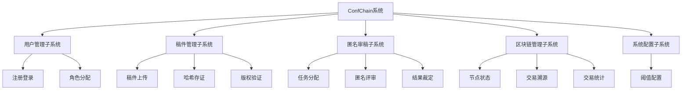

功能结构一览：

| 子系统 | 功能目标 | 关键接口 |
|--------|----------|----------|
| 用户管理 | 账号生命周期与 RBAC | `/api/auth/*`, `/api/users/*` |
| 稿件管理 | 稿件上传、哈希登记、公开验证、下载 | `/api/papers/*` |
| 匿名审稿 | 分配、提交、裁定 | `/api/reviews/*` |
| 区块链管理 | 节点与交易查询统计 | `/api/blockchain/*` |
| 系统配置 | 会议裁定阈值维护 | `/api/conf-config/*` |

### 2.3 运行环境

系统支持本地开发与跨主机联调（Windows/macOS 开发机 + Ubuntu 链环境）。

网络拓扑如下（HTML 图）：

<iframe src="./confchain-network-topology.html" title="ConfChain 网络拓扑图" style="width:100%;height:780px;border:1px solid #dcdfe6;border-radius:10px;"></iframe>

> 如当前阅读器不支持 `iframe` 渲染，请直接打开：`docs/confchain-network-topology.html`。

建议环境参数：
- API 服务：`localhost:3000`
- 前端服务：`localhost:5173`（开发）
- MySQL 宿主机端口：`3307`
- WeBASE-Front：`http://<ubuntu-ip>:5002/WeBASE-Front`
- FISCO RPC：`http://<ubuntu-ip>:20200`

### 2.3.1 硬件环境

服务器端建议配置：
- CPU：4 核及以上（x86_64）
- 内存：16 GB 及以上
- 磁盘：SSD 500 GB 及以上
- 网络：千兆网络，链节点间低延迟通信

客户端建议配置：
- CPU：双核及以上
- 内存：8 GB 及以上（最低 4 GB）
- 分辨率：1920×1080（推荐）
- 浏览器：Chrome 最新稳定版

外围设备与资源：
- 文件存储目录：`apps/api/uploads/`
- Docker 数据卷：`mysql_data`
- 区块链节点主机（可分布部署）

### 2.3.2 软件环境

| 类别 | 版本/说明 |
|------|-----------|
| 操作系统 | 服务端 Ubuntu 20.04+；客户端 Windows 11 / macOS |
| 后端框架 | NestJS 11 + TypeScript |
| 前端框架 | Vue 3 + Vite + Element Plus |
| 数据库 | MySQL 8.0 |
| ORM | Prisma 6.5 |
| 区块链 | FISCO BCOS 3.x + WeBASE 3.x |
| 合约语言 | Solidity 0.8.11 |
| 通信协议 | HTTP/HTTPS, JSON, JSON-RPC |
| 容器工具 | Docker / Docker Compose |

### 2.4 系统的关键技术

1. JWT + RBAC 组合鉴权
- `JwtAuthGuard` + `RolesGuard` 控制接口级访问。
- 路由层与前端菜单双重约束，降低越权风险。

2. Prisma 数据建模与迁移
- 用 `schema.prisma` 管理模型，迁移脚本保证结构可追踪。
- 通过唯一约束保障关键数据（邮箱、哈希、交易）不重复。

3. 文件哈希与元数据哈希
- 文件内容 `SHA-256` 作为确权指纹。
- `metadataHash = SHA-256(title|abstract|keywords)` 提升语义一致性验证能力。

4. WeBASE 适配与链路降级
- 链调用通过 `FiscoService` 统一封装。
- 当链或合约不可用时，返回模拟结果并记录 `simulated` 标识，保证流程可演示、可回放。

5. 智能合约核心能力
- `submitCopyright`、`submitReview`、`finalizeDecision` 三类写入方法。
- 事件机制便于审计与追踪。

6. 前后端协同体验设计
- 前端 Axios 拦截器统一处理鉴权异常与业务提示。
- 公开验证页（`/verify`）支持免登录访问。

---

## 3 功能模块设计说明

### 3.1 功能模块列表

表3-1 功能模块列表

| 模块编号 | 模块名称 | 对应需求功能编号 | 对应需求功能 | 实现优先级 |
|----------|----------|------------------|--------------|------------|
| DS_YHGL01 | 用户管理 | SRS_YHGL01.1~01.3 | 实名注册、钱包生成、角色分配 | 高 |
| DS_GJGL02 | 稿件管理 | SRS_YHGL02.1~02.3 | 稿件上传、哈希登记、公开验证 | 高 |
| DS_NMSG03 | 匿名审稿 | SRS_YHGL03.1~03.3 | 任务分配、匿名评审、结果裁定 | 高 |
| DS_QKGL04 | 区块链管理 | SRS_QKLGL04.1~04.3 | 节点监控、交易溯源、合约信息 | 中 |
| DS_XTPZ05 | 系统配置 | SRS_XTPZ05.1~05.2 | 参数设定、权限映射 | 中 |

> 注：当前版本“权限映射”以 RBAC 固定角色策略实现，未开放可视化细粒度权限编辑器。

### 3.2 稿件管理模块

#### 3.2.1 模块编号和功能描述

- 模块编号：`DS_GJGL02`
- 核心功能：
  1) 作者上传稿件并计算文件哈希  
  2) 调用链服务完成版权存证  
  3) 保存链回执并支持公开验证  
  4) 支持稿件下载与修订稿再存证

#### 3.2.2 操作者

- 作者（投稿、存证、查看）
- 管理员（查看全部稿件）
- 公开访问者（版权验证）
- 审稿人（下载已分配稿件）

#### 3.2.3 与本模块相关的码表和表

表3-2 模块功能表（DS_GJGL02）

| 名称 | 中文注释 | 类型 | 作用 |
|------|----------|------|------|
| `Paper` | 稿件表 | 表 | input/output/update |
| `ChainTransaction` | 链交易流水表 | 表 | output |
| `User` | 用户表 | 表 | input（作者地址） |
| `PaperStatus` | 稿件状态枚举 | 码表（逻辑） | update |

#### 3.2.4 界面设计与说明

1、投稿界面（`/author/submit`）：
提供论文标题、摘要、关键词输入框和论文文件上传区，支持拖拽上传。页面使用 `el-form` 进行必填校验，上传文件限制为 `.pdf/.doc/.docx` 且不超过 20MB。点击“提交并存证”后展示上传进度条，提交成功后在结果区显示文件哈希、交易哈希、区块高度、存证时间，并在链降级时显示“模拟”标识。

2、我的稿件界面（`/author/papers`）：
以表格展示作者稿件列表，包含标题、关键词、稿件状态、交易哈希摘要、存证时间、投稿时间。操作区提供“存证详情”“导出证书”“裁定结果”等按钮。详情通过抽屉展示完整元数据；当稿件状态为“需修改”时可弹出修订稿上传对话框，完成重新登记。

3、公开验证界面（`/verify`）：
提供“输入哈希值查询”和“上传文件验证”两个页签。用户可输入 SHA-256 哈希或上传原始文件进行比对。结果区采用成功/警告状态展示，存在记录时输出论文标题、哈希、TxHash、区块高度、作者地址、稿件状态；未命中时返回友好提示。支持通过 URL 参数 `fileHash` 自动触发查询（用于证书二维码跳转）。

#### 3.2.5 输入信息

1.稿件提交输入信息（作者端）：
标题：字符串，必填，长度不超过 200；
摘要：字符串，必填，长度不超过 2000；
关键词：字符串，必填，前端按逗号分隔；
文件：二进制，必填，支持 `.pdf/.doc/.docx`，单文件不超过 20MB；
身份令牌：JWT，必填，角色必须为 AUTHOR。

2.稿件修订信息（作者端）：
稿件ID：字符串，必填；
修订文件：二进制，必填，支持 `.pdf/.doc/.docx`，单文件不超过 20MB；
身份令牌：JWT，必填，需与稿件作者身份一致。

3.公开验证输入信息（公开页）：
文件哈希：字符串，可选，使用哈希查询时必填，建议为 64 位十六进制；
验证文件：二进制，可选，使用文件验证时必填，单文件不超过 20MB。

#### 3.2.6 输出信息

1.投稿成功输出：
返回稿件ID、稿件状态、文件哈希、交易哈希、区块高度、存证时间、是否模拟存证等信息；前端提示“投稿并链上存证成功”或“投稿成功（链为模拟模式）”。

2.验证成功输出：
当链上存在记录时返回 `found=true`，并输出论文标题、文件哈希、TxHash、区块高度、作者地址、稿件状态、存证时间等信息。

3.验证未命中输出：
当未找到记录时返回 `found=false`，前端展示“未找到稿件管理记录”的提示信息。

4.失败输出：
无权限访问返回 `401/403`；
重复文件哈希返回冲突异常（`ConflictException`）；
文件缺失或记录不存在返回 `NotFoundException`；
链调用异常时系统自动降级为 `simulated=true` 并返回可追踪结果。

#### 3.2.7 算法

1) 文件哈希算法
- `fileHash = SHA256(fileBytes)`

2) 元数据哈希算法
- `metadataHash = SHA256(title + '|' + abstract + '|' + keywordsCsv)`

3) 投稿存证主流程算法

```text
输入: authorId, title, abstract, keywords, file/fileContent
输出: 存证后的Paper记录

Step1 参数校验与文件读取
Step2 计算 fileHash 与 metadataHash
Step3 写 Paper(status=UPLOADED)
Step4 调用 blockchainService.certifyCopyright()
Step5 回写 Paper(status=CERTIFIED, txHash, blockHeight, certifiedAt, certifySimulated)
Step6 写 ChainTransaction(bizType=COPYRIGHT_CERTIFY)
Step7 返回结果
```

4) 重复检测
- 当 `Paper.fileHash` 触发唯一约束冲突时，立即终止，删除临时上传文件并返回冲突提示。

#### 3.2.8 对象时序图

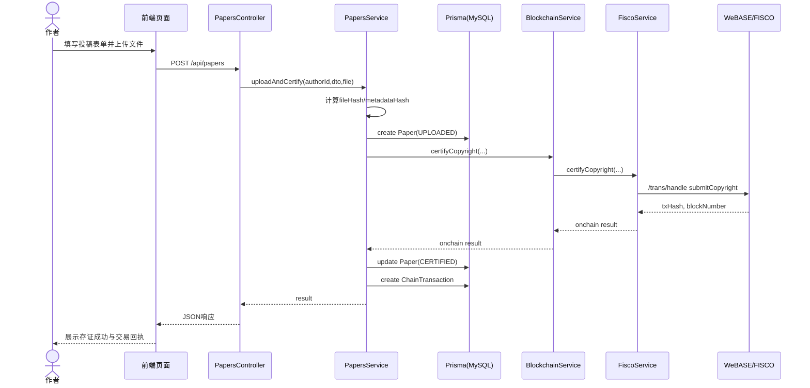

#### 3.2.9 模块各对象的封装

表3-3 稿件管理模块对象封装

| 模块对象 | 程序文件 | 功能说明 | 封装方法 |
|----------|----------|----------|----------|
| 投稿页面 | `apps/web/src/views/author/PaperSubmitView.vue` | 投稿表单、上传文件、触发提交 | `submit()` |
| 稿件列表页面 | `apps/web/src/views/author/PaperListView.vue` | 展示稿件与存证状态 | `loadPapers()` |
| 验证页面 | `apps/web/src/views/VerifyView.vue` | 公开版权验证 | `verifyByHash()`, `verifyByFile()` |
| 控制类 | `apps/api/src/papers/papers.controller.ts` | 路由入口与参数接收 | `create()`, `verify()`, `revise()` |
| 业务类 | `apps/api/src/papers/papers.service.ts` | 存证核心逻辑 | `uploadAndCertify()` |
| 链门面类 | `apps/api/src/blockchain/blockchain.service.ts` | 统一链调用入口 | `certifyCopyright()` |
| 链适配类 | `apps/api/src/blockchain/fisco.service.ts` | WeBASE HTTP 调用与降级 | `sendTransaction()` |
| 持久化类 | `apps/api/src/common/prisma.service.ts` | ORM访问 | `paper.*`, `chainTransaction.*` |

#### 3.2.10 类设计

##### 3.2.10.1 类图

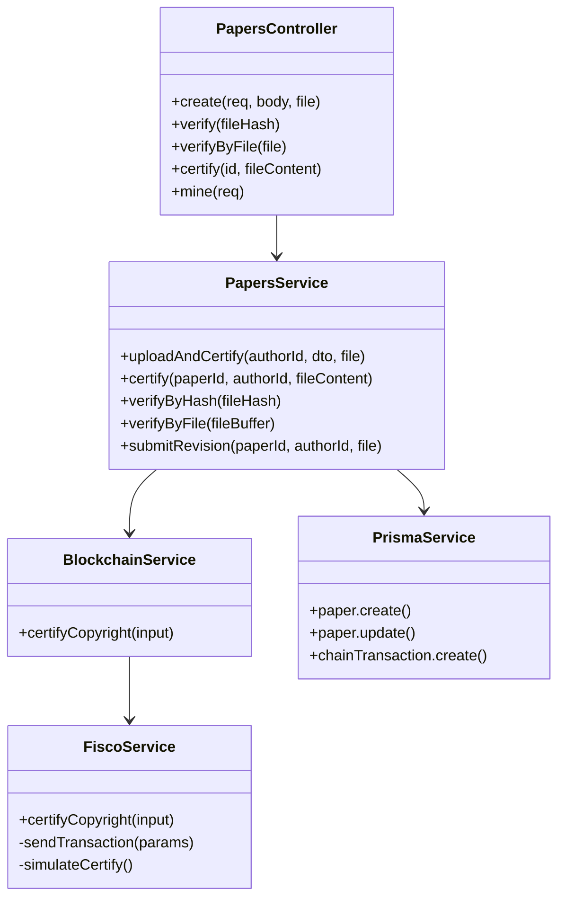

##### 3.2.10.2 类说明

1. `PapersController`
- 功能：接收 HTTP 请求，进行基础参数组装。
- 主要方法：`create()`、`verify()`、`verifyByFile()`。

2. `PapersService`
- 功能：实现投稿、存证、验证、回写链回执等业务编排。
- 主要方法：`uploadAndCertify()`、`submitRevision()`、`getAdjudication()`。

3. `BlockchainService`
- 功能：为业务层提供统一链服务入口。
- 主要方法：`certifyCopyright()`。

4. `FiscoService`
- 功能：封装 WeBASE 调用细节，处理异常与模拟降级。
- 主要方法：`sendTransaction()`、`certifyCopyright()`。

### 3.3 匿名审稿模块

#### 3.3.1 模块编号和功能描述

- 模块编号：`DS_NMSG03`
- 核心功能：
  1) 管理员手动/自动分配审稿任务  
  2) 审稿人查看脱敏稿件并提交评审意见  
  3) 系统汇总评分并执行裁定，结果写链并回写状态

#### 3.3.2 操作者

- 管理员：分配任务、查看审稿意见、发起裁定
- 审稿人：查看任务、下载稿件、提交评审
- 作者：通过稿件模块查看最终裁定结果

#### 3.3.3 与本模块相关的码表和表

表3-4 模块功能表（DS_NMSG03）

| 名称 | 中文注释 | 类型 | 作用 |
|------|----------|------|------|
| `ReviewTask` | 审稿任务表 | 表 | input/output/update |
| `ReviewResult` | 审稿结果表 | 表 | output |
| `Paper` | 稿件表 | 表 | update（状态） |
| `ConferenceConfig` | 会议配置表 | 表 | input（阈值） |
| `ChainTransaction` | 链交易流水 | 表 | output |

#### 3.3.4 界面设计与说明

1、管理员审稿分配与裁定界面（`/admin/reviews`）：
页面以稿件表格为主，展示论文标题、作者、状态和操作按钮。管理员可通过“手动分配”弹窗选择审稿人并设置截止日期，也可通过“自动分配”弹窗设置人数（1~10）由系统按负载均衡分配。页面支持查看审稿汇总、查看稿件详情和执行裁定，关键结果通过标签和提示消息进行可视化反馈。

2、审稿任务界面（`/reviewer/tasks`）：
审稿人可查看待办任务列表、截止时间和任务状态。点击“查看稿件”后进入双盲抽屉页面，系统隐藏作者信息，仅展示标题、关键词、摘要和投稿时间，并提供审稿文件下载功能。点击“提交评审”打开表单对话框，填写评分、录用建议和评语后提交上链。

3、审稿相关界面交互约束：
管理员端只有在稿件处于审稿中时才显示“查看意见/裁定”操作；审稿人端任务一旦提交，按钮切换为“已完成”并禁止重复提交。

#### 3.3.5 输入输出信息

1.管理员分配输入信息：
稿件ID：字符串，必填；
审稿人ID列表：数组，手动分配时必填，至少 1 人；
自动分配人数：整数，自动分配时必填，范围 1~10；
截止日期：日期字符串，必填。

2.审稿提交输入信息：
任务ID：字符串，必填；
综合评分：整数，必填，范围 0~100；
录用建议：枚举，必填（`STRONG_ACCEPT/ACCEPT/WEAK_ACCEPT/REJECT`）；
审稿意见：字符串，必填，提交后会进行哈希登记。

3.裁定触发输入信息：
稿件ID：字符串，必填，由管理员在分配页或汇总弹窗触发。

4.成功输出信息：
分配成功：返回任务列表，稿件状态更新为 `UNDER_REVIEW`；
提交成功：返回审稿结果、交易哈希、是否模拟上链标记；
裁定成功：返回平均分、阈值、最终状态、交易哈希，并提示裁定完成。

5.失败输出信息：
分配参数缺失时提示“请选择审稿人和截止日期”或“请填写截止日期”；
自动分配无可用审稿人时返回“自动分配失败”；
审稿提交失败或详情读取失败时返回对应错误提示。

#### 3.3.6 核心算法

1) 自动分配算法（轻量负载均衡）
- 排除已分配到当前稿件的审稿人
- 按审稿任务数量升序选取 `count` 名审稿人

2) 评语摘要算法
- `commentCipher = SHA256(comment)`

3) 裁定算法

```text
avg = round(sum(score) / n, 2)
threshold = ConfConfigService.getThreshold()
if avg >= threshold + 10 => ACCEPTED
else if avg >= threshold => REVISION
else => REJECTED
```

#### 3.3.7 对象时序图（审稿提交）

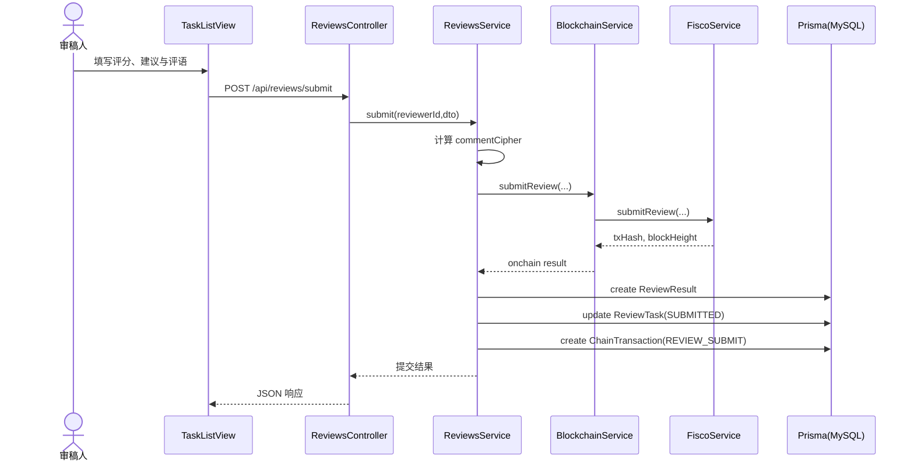

#### 3.3.8 类设计（核心）

##### 3.3.8.1 类图

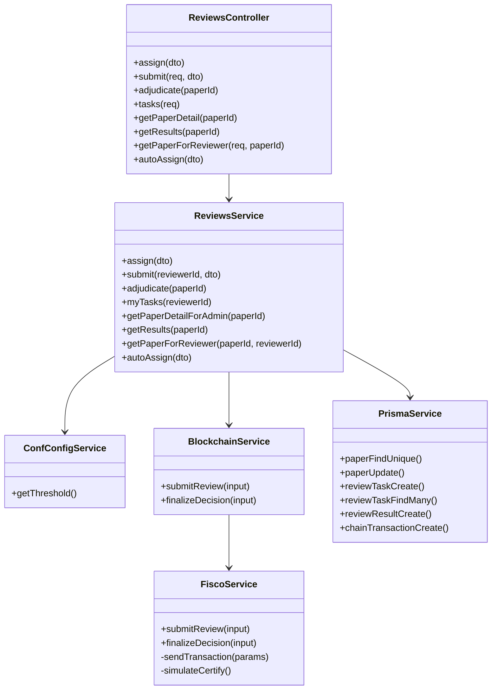

##### 3.3.8.2 类说明

1. `ReviewsController`
- 功能：匿名审稿模块接口入口，负责参数接收、角色受限路由分发。
- 主要方法：`assign()`、`submit()`、`adjudicate()`、`tasks()`。

2. `ReviewsService`
- 功能：实现审稿任务分配、意见提交、裁定计算与状态更新等核心业务。
- 主要方法：`assign()`、`submit()`、`adjudicate()`、`autoAssign()`。

3. `ConfConfigService`
- 功能：提供裁定阈值，供裁定算法动态读取。
- 主要方法：`getThreshold()`。

4. `BlockchainService` / `FiscoService`
- 功能：封装审稿提交与裁定结果上链，屏蔽链适配和降级细节。
- 主要方法：`submitReview()`、`finalizeDecision()`、`sendTransaction()`。

5. `PrismaService`
- 功能：负责 `ReviewTask`、`ReviewResult`、`Paper`、`ChainTransaction` 的持久化访问。
- 主要方法：`reviewTaskCreate()`、`reviewTaskFindMany()`、`reviewResultCreate()`、`paperUpdate()`、`chainTransactionCreate()`。


### 3.4 用户管理模块

#### 3.4.1 模块编号和功能描述

- 模块编号：`DS_YHGL01`
- 核心功能：
  1) 用户注册与登录鉴权（JWT）  
  2) 登录态用户信息获取（`/auth/me`）  
  3) 管理员查询用户列表与角色调整

#### 3.4.2 操作者

- 游客：注册、登录
- 登录用户：查看个人信息
- 管理员：查看所有用户并修改角色

#### 3.4.3 与本模块相关的码表和表

表3-5 模块功能表（DS_YHGL01）

| 名称 | 中文注释 | 类型 | 作用 |
|------|----------|------|------|
| `User` | 用户表 | 表 | input/output/update |
| `Role` | 角色枚举（ADMIN/AUTHOR/REVIEWER） | 码表（逻辑） | update |

#### 3.4.4 界面设计与说明

1、登录界面（`/login`）：
提供邮箱和密码输入框，以及登录按钮。页面顶部显示系统名称“ConfChain 登录”和副标题“基于区块链的学术会议平台”，底部提供“立即注册”链接，引导未注册用户跳转注册页。密码输入框支持可见性切换，支持回车直接提交。

2、注册界面（`/register`）：
提供姓名、邮箱、密码、角色选择输入项，以及注册按钮。角色采用下拉选择（作者/审稿人），表单基于 Element Plus 校验规则实时校验姓名长度、邮箱格式和密码复杂度。页面底部提供“立即登录”链接，便于用户返回登录。

3、用户管理界面（`/admin/users`）：
管理员可查看用户列表，页面展示姓名、邮箱、角色、钱包地址、注册时间。角色字段使用颜色标签区分，钱包地址采用缩略显示并支持悬浮查看完整地址。点击“修改角色”弹出对话框，可将用户调整为作者、审稿人或管理员。

#### 3.4.5 输入输出信息

1.用户注册输入信息：
姓名：字符串，必填，长度 2-20 字符；
邮箱：字符串，必填，需符合邮箱格式；
密码：字符串，必填，长度 8-20，需包含大小写字母和数字；
角色：字符串，必选（`AUTHOR` 或 `REVIEWER`）。

2.用户登录输入信息：
邮箱：字符串，必填；
密码：字符串，必填。

3.用户角色调整输入信息（管理员）：
用户ID：字符串，必填；
角色：字符串，必选（`ADMIN/AUTHOR/REVIEWER`）。

4.注册成功输出信息：
返回用户ID、邮箱、角色、钱包地址等用户基础信息，并提示“注册成功，请登录”。

5.注册失败输出信息：
邮箱已存在时返回冲突提示；
密码不符合规则时返回格式校验提示；
必填项缺失时返回“请填写必填项”提示。

6.登录成功输出信息：
返回 `accessToken`、`refreshToken` 和用户信息，前端保存登录态后跳转主页面。

7.登录失败输出信息：
邮箱不存在或密码错误时返回认证失败提示；
表单校验不通过时前端阻止提交并提示对应字段错误。

8.角色调整输出信息：
更新成功返回“角色已更新”提示并刷新用户列表；
权限不足时返回 `403/401`。

#### 3.4.6 核心算法

1) 注册算法
- 按邮箱查重，已存在则抛出冲突异常
- 密码使用 `bcrypt.hash(password, 10)` 加密存储
- 生成钱包地址、公私钥并写入用户表

2) 登录算法
- 按邮箱查询用户，使用 `bcrypt.compare` 校验密码
- 生成 `accessToken` 与 `refreshToken`
- 前端持久化 Token 与用户信息

3) 角色调整算法
- 管理员校验通过后，更新 `User.role`

#### 3.4.7 对象时序图（登录鉴权）

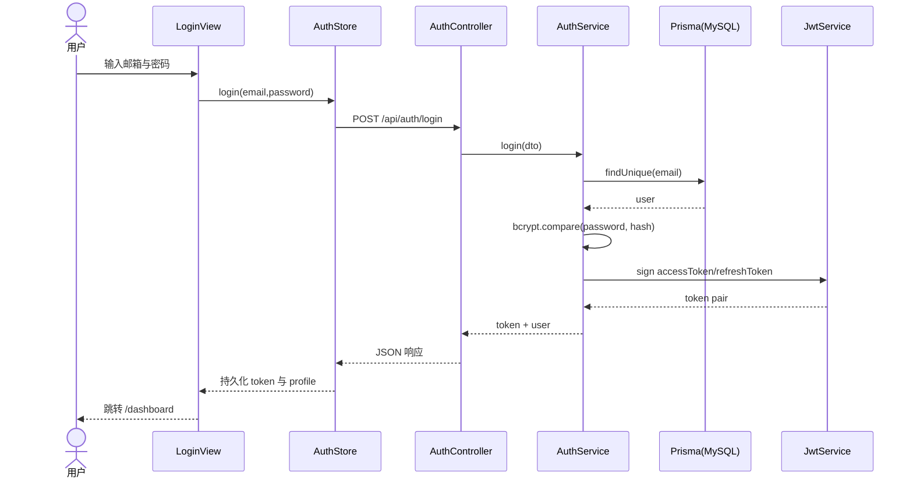

#### 3.4.8 类设计（核心）

##### 3.4.8.1 类图

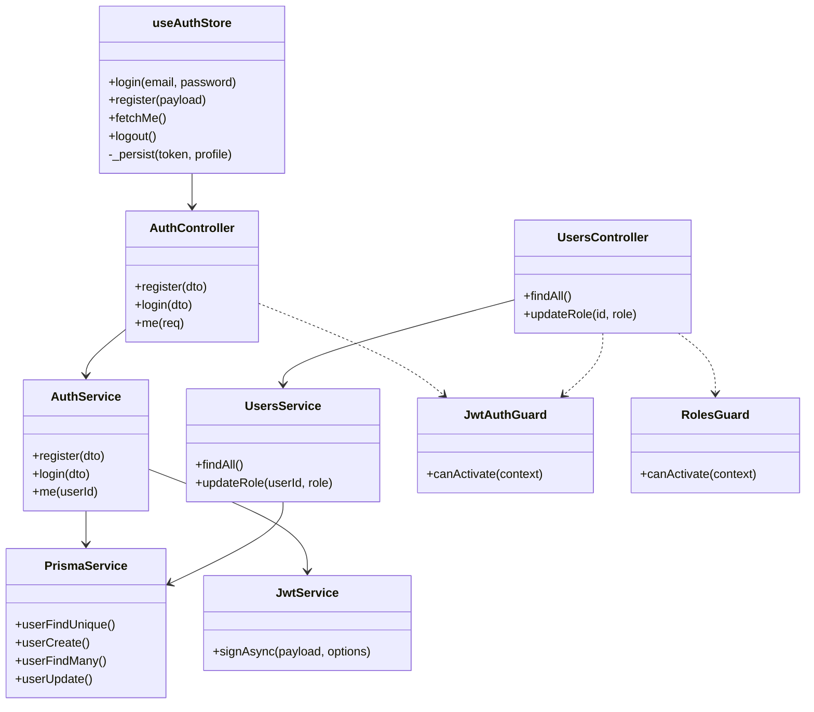

##### 3.4.8.2 类说明

1. `AuthController` / `AuthService`
- 功能：实现注册、登录和当前用户信息查询。
- 主要方法：`register()`、`login()`、`me()`。

2. `UsersController` / `UsersService`
- 功能：管理员用户列表查询与角色更新。
- 主要方法：`findAll()`、`updateRole()`。

3. `JwtAuthGuard` / `RolesGuard`
- 功能：前者负责 JWT 身份校验，后者负责角色授权控制。
- 主要方法：`canActivate()`。

4. `useAuthStore`
- 功能：前端登录态维护、Token 本地持久化、用户信息拉取。
- 主要方法：`login()`、`register()`、`fetchMe()`、`logout()`。

5. `PrismaService` / `JwtService`
- 功能：分别提供用户数据持久化与 JWT 签发能力。
- 主要方法：`userFindUnique()`、`userCreate()`、`userFindMany()`、`userUpdate()`、`signAsync()`。


### 3.5 区块链管理模块

#### 3.5.1 模块编号和功能描述

- 模块编号：`DS_QKGL04`
- 核心功能：
  1) 节点状态监控与链连通性检查  
  2) 按 `txHash`/`bizId` 追踪链上交易  
  3) 交易统计、分页列表与合约信息展示

#### 3.5.2 操作者

- 管理员：查看节点状态、交易溯源、合约信息

#### 3.5.3 与本模块相关的码表和表

表3-6 模块功能表（DS_QKGL04）

| 名称 | 中文注释 | 类型 | 作用 |
|------|----------|------|------|
| `ChainTransaction` | 链交易流水表 | 表 | output/query |
| `BIZ_TYPE_LABEL` | 业务类型映射 | 码表（逻辑） | output（展示） |
| WeBASE-FISCO 接口 | 链节点与交易查询接口 | 外部接口 | query |

#### 3.5.4 界面设计与说明

1、区块链监控界面（`/admin/blockchain`）：
页面顶部显示交易统计卡片（总数、稿件登记、审稿上链、裁定结果）。中部展示节点状态信息，包括连接状态、节点数量、区块高度、链ID，并支持手动刷新和 30 秒自动刷新。页面下方提供交易溯源检索区，支持输入 `txHash` 或 `bizId` 查询链上详情和本地业务流水，结果使用标签、描述列表和分页表格呈现。

2、合约管理界面（`/admin/contracts`）：
页面按合约分块展示合约名称、合约地址、审稿合约地址、群组ID、链ID、WeBASE-Front 地址和函数清单。未配置地址会使用红色标签高亮提示。页面底部展示部署/调用历史列表，支持按业务类型筛选和分页查询。

3、区块链管理界面交互特点：
交易哈希和业务ID支持点击后快速回填查询；链服务降级时界面会显示“模拟”标记，便于运维快速识别环境状态。

#### 3.5.5 输入输出信息

1.链状态与统计查询输入信息：
无业务参数或使用分页参数 `page/pageSize`、类型筛选参数 `bizType`。

2.交易溯源输入信息：
交易哈希：字符串，查询单笔链上交易时必填；
业务ID：字符串，查询某业务关联交易时必填。

3.成功输出信息：
节点状态输出：`connected`、`nodeCount`、`blockNumber`、`chainId`、`simulated`；
交易详情输出：`txHash`、`status`、`blockHeight`、`from`、`to`、`timestamp`、`simulated`；
统计输出：`total`、`certifyCount`、`reviewCount`、`adjudicateCount`；
列表输出：交易分页数据、业务类型标签、区块高度、创建时间。

4.失败或降级输出信息：
链上查询失败时返回降级结果（如 `status=UNKNOWN`、`simulated=true`）；
未命中查询条件时界面显示“未找到该交易记录”。

#### 3.5.6 核心算法

1) 节点状态查询算法
- 组合多种 WeBASE 路径前缀逐一探测
- 任一路径成功即返回真实状态
- 全部失败返回 `simulated=true` 的降级状态

2) 交易追踪算法
- 根据 `txHash` 查询 WeBASE 交易详情
- 若链查询失败，返回 `status=UNKNOWN` 且 `simulated=true`

3) 本地交易分页算法
- `ChainTxService.listTxs(page,pageSize,bizType)`
- 同时查询 `count` 与 `findMany`，并映射 `bizTypeLabel`

#### 3.5.7 对象时序图（交易溯源查询）

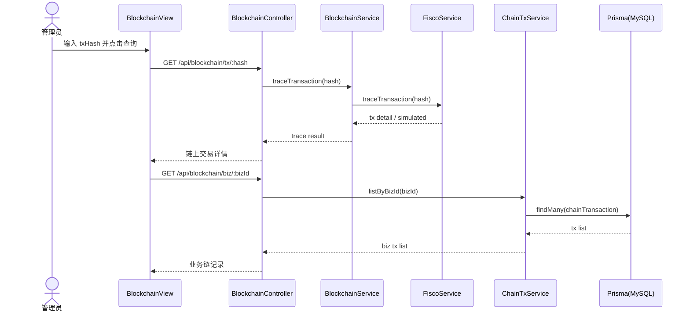

#### 3.5.8 类设计（核心）

##### 3.5.8.1 类图

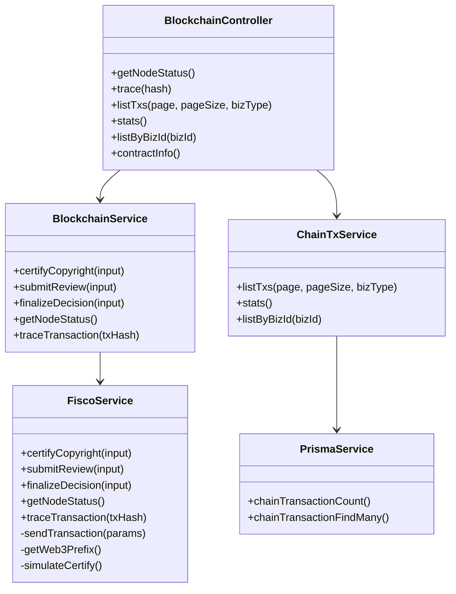

##### 3.5.8.2 类说明

1. `BlockchainController`
- 功能：区块链管理模块 API 入口，提供节点、交易、统计与合约信息查询。
- 主要方法：`getNodeStatus()`、`trace()`、`listTxs()`、`stats()`。

2. `BlockchainService`
- 功能：链服务门面，向业务层提供统一方法并隐藏适配细节。
- 主要方法：`traceTransaction()`、`getNodeStatus()`、`submitReview()`。

3. `FiscoService`
- 功能：对接 WeBASE-Front，处理交易发送、路径兼容和链不可达降级。
- 主要方法：`sendTransaction()`、`getWeb3Prefix()`、`simulateCertify()`。

4. `ChainTxService`
- 功能：本地交易流水分页查询、按业务检索、统计汇总。
- 主要方法：`listTxs()`、`listByBizId()`、`stats()`。

5. `PrismaService`
- 功能：交易流水持久化查询与计数。
- 主要方法：`chainTransactionFindMany()`、`chainTransactionCount()`。


### 3.6 系统配置模块

#### 3.6.1 模块编号和功能描述

- 模块编号：`DS_XTPZ05`
- 核心功能：
  1) 维护会议裁定阈值（`acceptThreshold`）  
  2) 为匿名审稿裁定算法提供动态阈值  
  3) 在无配置记录时提供默认值

#### 3.6.2 操作者

- 管理员：查看并调整系统裁定阈值

#### 3.6.3 与本模块相关的码表和表

表3-7 模块功能表（DS_XTPZ05）

| 名称 | 中文注释 | 类型 | 作用 |
|------|----------|------|------|
| `ConferenceConfig` | 会议配置表 | 表 | input/output/update |

#### 3.6.4 界面设计与说明

1、系统配置界面（`/admin/config`）：
页面用于维护审稿裁定阈值。顶部显示“裁定阈值配置”说明标签，正文展示当前裁定规则。阈值输入采用滑块控件（0~100，步长 5，支持直接输入），可实时看到“录用/需修改/拒绝”分界线变化。页面底部提供“保存阈值”和“重置”按钮，保存后提示“阈值已保存”。

2、系统配置界面交互特点：
首次加载显示骨架屏，避免空白闪烁；重置操作恢复到当前已加载配置值；该页面仅管理员可访问。

#### 3.6.5 输入输出信息

1.阈值配置输入信息：
`acceptThreshold`：数值型，必填，范围 0~100，前端输入步长为 5。

2.配置读取输出信息：
返回当前配置对象，包含阈值、会议信息及时间字段；若数据库无记录，返回默认阈值（70）。

3.配置保存输出信息：
保存成功返回更新后的配置对象，并提示“阈值已保存”。

4.失败输出信息：
参数非法时返回校验错误；权限不足时返回 `403/401`。

#### 3.6.6 核心算法

1) 获取配置算法
- 查询 `ConferenceConfig` 最新记录
- 若不存在，返回默认配置（阈值默认 70）

2) 保存配置算法
- 若存在历史记录，更新最新一条
- 若不存在记录，创建默认会议配置并写入阈值

3) 阈值读取算法
- 审稿裁定前读取 `getThreshold()`，若为空则回退到 70

#### 3.6.7 对象时序图（管理员更新阈值）

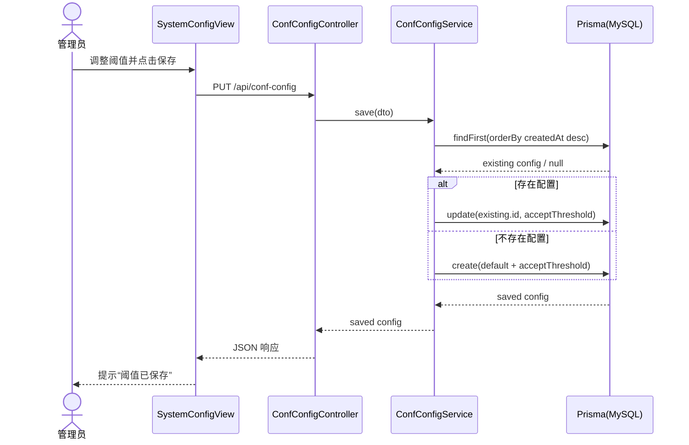

#### 3.6.8 类设计（核心）

##### 3.6.8.1 类图

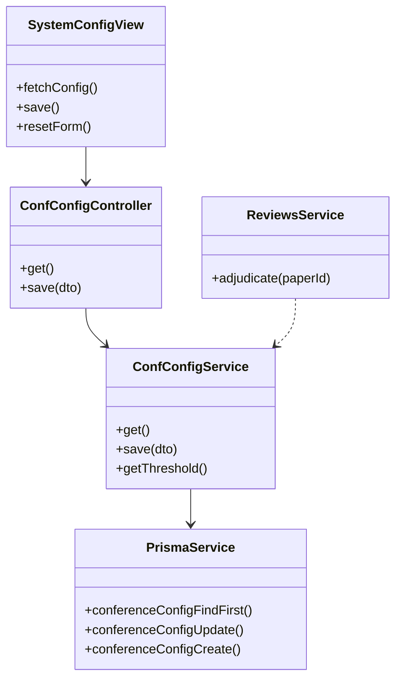

##### 3.6.8.2 类说明

1. `SystemConfigView`
- 功能：管理员阈值配置页面，负责加载、编辑、保存与重置交互。
- 主要方法：`fetchConfig()`、`save()`、`resetForm()`。

2. `ConfConfigController`
- 功能：系统配置接口入口，承接查询和保存请求。
- 主要方法：`get()`、`save()`。

3. `ConfConfigService`
- 功能：会议配置读写与裁定阈值提供。
- 主要方法：`get()`、`save()`、`getThreshold()`。

4. `PrismaService`
- 功能：会议配置数据持久化，负责查找最新配置并更新/创建。
- 主要方法：`conferenceConfigFindFirst()`、`conferenceConfigUpdate()`、`conferenceConfigCreate()`。

5. `ReviewsService`（跨模块依赖）
- 功能：匿名审稿裁定时调用配置模块读取阈值。
- 主要方法：`adjudicate()`（内部依赖 `getThreshold()`）。


---

## 4 视图设计

### 4.1 界面风格设计

前端采用 Vue 3 + Element Plus，整体风格为学术管理后台：
- 布局：左侧导航 + 顶部状态栏 + 主内容区
- 主题：深色侧栏 + 浅色内容区，重点操作高亮
- 统一组件：表单、表格、弹窗、消息提示统一规范
- 反馈机制：提交时显示 loading，失败时显示错误原因

交互设计原则：
- 可见性：核心状态（稿件状态、任务状态、交易哈希）可见
- 一致性：同类页面交互一致
- 安全性：敏感操作二次确认（如退出登录、裁定）

### 4.2 主界面设计

主界面由角色驱动：

| 角色 | 主菜单 | 关键页面 |
|------|--------|----------|
| ADMIN | 用户管理/审稿分配/区块链管理/系统配置 | `/admin/users`, `/admin/reviews`, `/admin/blockchain`, `/admin/config` |
| AUTHOR | 我的稿件/投稿/版权验证 | `/author/papers`, `/author/submit`, `/verify` |
| REVIEWER | 审稿任务/版权验证 | `/reviewer/tasks`, `/verify` |

页面入口：
- 未登录访问受限页面跳转 `/login`
- 已登录访问 `/login` 或 `/register` 跳转 `/dashboard`
- 角色不匹配跳转 `/dashboard`

---

## 5 内部接口设计

表5-1 构件接口列表

| 模块名称 | 接口编号 | 接口名称 | 接口类型 | 说明 |
|----------|----------|----------|----------|------|
| 用户管理 | IF_AUTH_01 | 登录鉴权接口 | 内部（前后端） | 颁发JWT并回传角色信息 |
| 稿件管理 | IF_PAPER_01 | 稿件投稿接口 | 内部（前后端） | 上传文件、哈希登记、回写流水 |
| 匿名审稿 | IF_REVIEW_01 | 审稿提交接口 | 内部（前后端） | 写审稿结果并上链 |
| 匿名审稿 | IF_REVIEW_02 | 稿件裁定接口 | 内部（后端模块） | 统计评分并写裁定 |
| 区块链管理 | IF_CHAIN_01 | 交易追踪接口 | 内部（前后端） | 查询链交易详情 |
| 区块链适配 | IF_WEBASE_01 | WeBASE交易接口 | 外部 | 向链发交易并接收回执 |

### 5.1 接口1：稿件投稿接口

#### 1) 接口属性设计

表5-2 IF_PAPER_01 接口说明

| 项目 | 内容 |
|------|------|
| 接口编号 | IF_PAPER_01 |
| 接口名称 | 稿件投稿接口 |
| 接口说明 | 接收作者投稿并完成哈希登记，写入业务库与链流水 |
| 数据来源 | 作者前端提交的表单与文件 |
| 调用者 | `PaperSubmitView`（前端） |
| 被调用者 | `POST /api/papers` |
| 输入 | `multipart/form-data`：title, abstract, keywords, file |
| 输出 | 稿件记录（id/status/fileHash/txHash/blockHeight/certifiedAt/simulated） |
| 处理流程 | 参数校验 -> 哈希计算 -> 入库 -> 上链 -> 回写 -> 返回 |

#### 2) 接口处理流程图

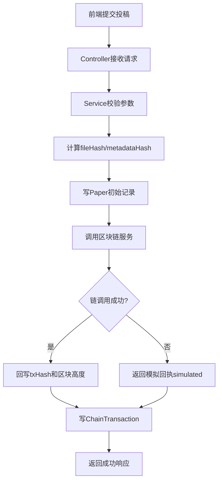

#### 3) 类设计

表5-3 IF_PAPER_01 相关类

| 类名称 | 分类 | 描述 | 使用到的其他类 | 属性及方法描述 | 使用/交互 | 其他 |
|--------|------|------|----------------|----------------|----------|------|
| `PapersController` | 控制类 | 投稿接口入口，负责参数接收与请求分发 | `PapersService` | 属性：`papersService`；方法：`create()`、`certify()`、`verify()`、`verifyByFile()`、`mine()` | 接收前端投稿请求并调用 `PapersService` 返回响应 | 受 JWT 与角色控制 |
| `PapersService` | 业务类 | 实现投稿、存证、验真与回执落库流程 | `PrismaService`、`BlockchainService` | 属性：`prisma`、`blockchainService`；方法：`uploadAndCertify()`、`certify()`、`verifyByHash()`、`verifyByFile()`、`submitRevision()` | 编排数据库写入与链调用，维护稿件状态流转 | 包含重复哈希检测与异常处理 |
| `BlockchainService` | 业务门面类 | 为投稿流程提供统一链调用入口 | `FiscoService` | 属性：`fisco`；方法：`certifyCopyright()` | 接收业务参数后委派 `FiscoService` 执行交易 | 屏蔽链实现差异，降低耦合 |
| `FiscoService` | 链适配类 | 对接 WeBASE-Front，封装交易发送和降级 | `axios` | 属性：`http`、`groupId`、`signUser`；方法：`sendTransaction()`、`certifyCopyright()`、`simulateCertify()` | 向链发起交易并返回 `txHash/blockHeight`，失败时返回模拟回执 | 支持路径兼容与容错 |
| `PrismaService` | 持久化类 | 提供投稿与链流水的 ORM 读写能力 | Prisma Client | 属性：`paper`、`chainTransaction`；方法：`paper.create()`、`paper.update()`、`chainTransaction.create()` | 被 `PapersService` 调用进行持久化 | 统一数据库访问入口 |

### 5.2 接口2：稿件裁定接口

#### 1) 接口属性设计

表5-4 IF_REVIEW_02 接口说明

 内容 |
|-------|
|  IF_REVIEW_02 |
|  稿件裁定接口 |
|  汇总审稿评分，依据阈值生成裁定并上链 |
|  `ReviewResult`、`ConferenceConfig` |
| 管理员页面（审稿分配页） |
|  `POST /api/reviews/adjudicate/:paperId` |
|  `paperId` |
|  `paperId, averageScore, threshold, finalStatus, txHash, simulated` |
|  查询评分 -> 计算平均分 -> 读取阈值 -> 更新状态 -> 上链 -> 回写流水 |

#### 2) 接口处理流程图

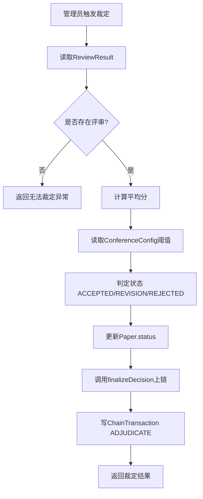

#### 3) 类设计

表5-5 IF_REVIEW_02 相关类

| 类名称 | 描述 | 属性及方法描述 | 使用/交互 | 其他 |
|--------|------|----------------|----------|------|
| `ReviewsController` | 裁定接口入口，接收管理员裁定请求 | 属性：`reviewsService`；方法：`adjudicate()` | 调用 `ReviewsService.adjudicate()` 并返回裁定结果 | 仅管理员可访问 |
| `ReviewsService` | 执行评分汇总、阈值判断、状态更新与裁定上链 | 属性：`prisma`、`confConfigService`、`blockchainService`；方法：`adjudicate()` | 读取评审结果后更新 `Paper.status` 并写 `ChainTransaction` | 裁定规则基于动态阈值 |
| `ConfConfigService` | 提供当前会议阈值 | 属性：`prisma`；方法：`getThreshold()` | 被 `ReviewsService` 调用读取 `ConferenceConfig` | 无配置时回退默认值 |
| `BlockchainService` | 提供裁定结果上链统一入口 | 属性：`fisco`；方法：`finalizeDecision()` | 调用 `FiscoService.finalizeDecision()` 返回链回执 | 屏蔽底层链适配细节 |
| `FiscoService` | 负责调用 WeBASE 执行裁定交易 | 属性：`http`、`reviewContract`；方法：`sendTransaction()`、`finalizeDecision()`、`simulateCertify()` | 与链网络交互并在失败时降级模拟 | 输出 `simulated` 标记 |
| `PrismaService` | 提供裁定流程的数据读写能力 | 属性：`reviewResult`、`paper`、`chainTransaction`；方法：`reviewResult.findMany()`、`paper.update()`、`chainTransaction.create()` | 被 `ReviewsService` 调用执行结果读取和状态落库 | 统一数据库访问入口 |

### 5.3 接口3：登录鉴权接口

#### 1) 接口属性设计

表5-6 IF_AUTH_01 接口说明

| 项目 | 内容 |
|------|------|
| 接口编号 | IF_AUTH_01 |
| 接口名称 | 登录鉴权接口 |
| 接口说明 | 校验用户邮箱与密码，签发访问令牌并返回用户角色信息 |
| 数据来源 | `User` 表（邮箱、密码哈希、角色） |
| 调用者 | `LoginView` + `useAuthStore`（前端） |
| 被调用者 | `POST /api/auth/login` |
| 输入 | `email`, `password` |
| 输出 | `accessToken`, `refreshToken`, `user(id/email/role)` |
| 处理流程 | 参数校验 -> 查询用户 -> 密码比对 -> 令牌签发 -> 返回登录结果 |

#### 2) 接口处理流程图

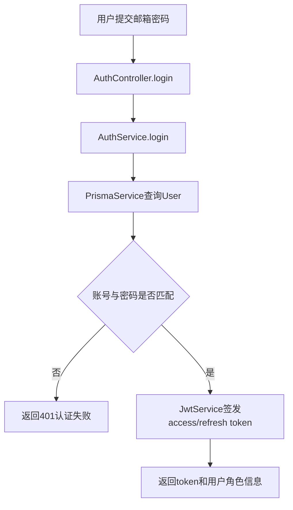

#### 3) 类设计

表5-7 IF_AUTH_01 相关类

| 类名称 | 分类 | 描述 | 使用到的其他类 | 属性及方法描述 | 使用/交互 | 其他 |
|--------|------|------|----------------|----------------|----------|------|
| `AuthController` | 控制类 | 登录接口入口，接收认证参数并返回鉴权结果 | `AuthService` | 属性：`authService`；方法：`login()` | 调用 `AuthService.login()` 处理登录请求 | `/auth/login` 为公开接口 |
| `AuthService` | 业务类 | 执行账户校验与令牌签发 | `PrismaService`、`JwtService` | 属性：`prisma`、`jwtService`；方法：`login()` | 校验密码后签发 `accessToken/refreshToken` | 密码校验使用 `bcrypt.compare` |
| `PrismaService` | 持久化类 | 提供用户查询能力 | Prisma Client | 属性：`user`；方法：`user.findUnique()` | 被 `AuthService` 调用读取用户信息 | 统一数据库访问入口 |
| `JwtService` | 基础服务类 | 提供 JWT 签发能力 | - | 属性：签名配置；方法：`signAsync()` | 被 `AuthService` 调用生成 token | 有效期由环境变量配置 |
| `useAuthStore` | 前端状态类 | 管理登录态持久化与用户信息缓存 | `AuthController` | 属性：`token`、`profile`；方法：`login()`、`_persist()` | 调用登录接口并将结果写入本地存储 | 基于 Pinia 实现 |

### 5.4 接口4：审稿提交接口

#### 1) 接口属性设计

表5-8 IF_REVIEW_01 接口说明

| 项目 | 内容 |
|------|------|
| 接口编号 | IF_REVIEW_01 |
| 接口名称 | 审稿提交接口 |
| 接口说明 | 审稿人提交评分与意见，系统写入审稿结果并上链存证 |
| 数据来源 | `ReviewTask`、审稿表单输入、链回执 |
| 调用者 | `TaskListView`（审稿人前端） |
| 被调用者 | `POST /api/reviews/submit` |
| 输入 | `taskId`, `score`, `recommendation`, `comment` |
| 输出 | 审稿结果记录 + `txHash` + `simulated` |
| 处理流程 | 校验任务归属 -> 计算评语哈希 -> 提交上链 -> 写审稿结果 -> 更新任务状态 -> 写流水 |

#### 2) 接口处理流程图

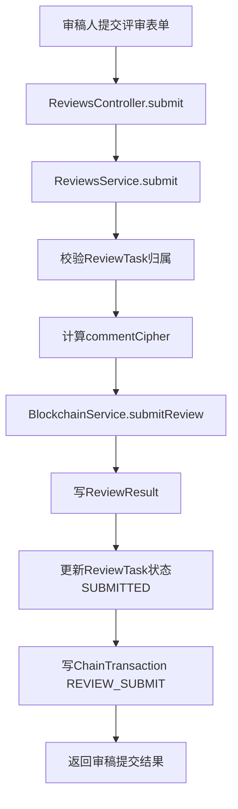

#### 3) 类设计

表5-9 IF_REVIEW_01 相关类

| 类名称 | 分类 | 描述 | 使用到的其他类 | 属性及方法描述 | 使用/交互 | 其他 |
|--------|------|------|----------------|----------------|----------|------|
| `ReviewsController` | 控制类 | 审稿提交接口入口，接收审稿参数 | `ReviewsService` | 属性：`reviewsService`；方法：`submit()` | 调用 `ReviewsService.submit()` 返回提交结果 | 仅 `REVIEWER` 角色可调用 |
| `ReviewsService` | 业务类 | 执行任务校验、评语哈希、上链与数据落库编排 | `PrismaService`、`BlockchainService` | 属性：`prisma`、`blockchainService`；方法：`submit()` | 串联审稿结果入库、任务状态更新和流水记录 | 写入 `simulated` 便于补链 |
| `BlockchainService` | 业务门面类 | 提供审稿上链调用入口 | `FiscoService` | 属性：`fisco`；方法：`submitReview()` | 转发审稿上链请求并返回链回执 | 对业务层屏蔽链细节 |
| `FiscoService` | 链适配类 | 负责执行审稿交易并处理降级 | `axios` | 属性：`http`、`reviewContract`；方法：`sendTransaction()`、`submitReview()`、`simulateCertify()` | 调用 WeBASE 发送交易，失败时返回模拟回执 | 支持路径兼容与容错 |
| `PrismaService` | 持久化类 | 提供审稿任务、结果、流水读写能力 | Prisma Client | 属性：`reviewTask`、`reviewResult`、`chainTransaction`；方法：`reviewTask.findFirst()`、`reviewResult.create()`、`reviewTask.update()`、`chainTransaction.create()` | 被 `ReviewsService` 调用完成事务性持久化 | 统一数据库访问入口 |

### 5.5 接口5：交易追踪接口

#### 1) 接口属性设计

表5-10 IF_CHAIN_01 接口说明

| 内容 |
|------|
| IF_CHAIN_01 |
| 交易追踪接口 |
| 按交易哈希查询链上交易详情，并用于前端追踪展示 |
| WeBASE 交易查询结果 |
| `BlockchainView`（管理员前端） |
| `GET /api/blockchain/tx/:hash` |
| `txHash` |
| `txHash`, `status`, `blockHeight`, `from`, `to`, `timestamp`, `simulated` |
| 接收哈希 -> 调用链门面 -> 适配层请求 WeBASE -> 返回交易详情/降级结果 |

#### 2) 接口处理流程图

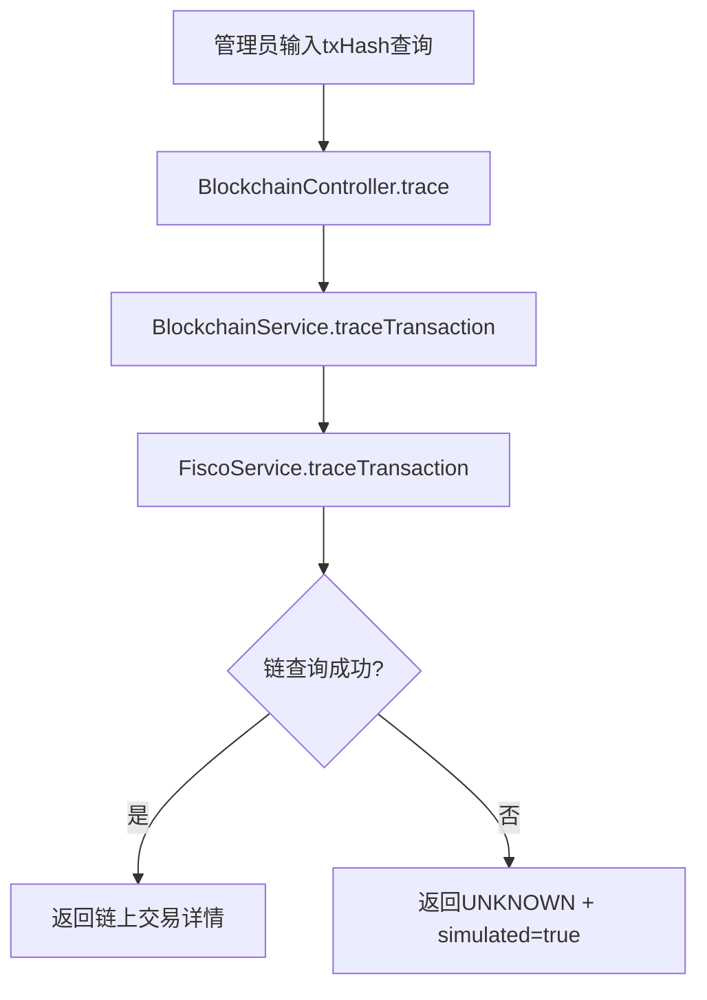

#### 3) 类设计

表5-11 IF_CHAIN_01 相关类

| 类名称 | 描述 | 属性及方法描述 | 使用/交互 | 其他 |
|--------|------|----------------|----------|------|
| `BlockchainController` | 交易追踪接口入口，接收 `txHash` 查询请求 | 属性：`blockchainService`；方法：`trace()` | 调用 `BlockchainService.traceTransaction()` 返回追踪结果 | 仅 `ADMIN` 可访问 |
| `BlockchainService` | 提供交易追踪统一入口 | 属性：`fisco`；方法：`traceTransaction()` | 将查询请求委派给 `FiscoService` | 屏蔽底层链实现细节 |
| `FiscoService` | 执行 WeBASE 交易查询与降级处理 | 属性：`http`、`groupId`；方法：`traceTransaction()`、`getWeb3Prefix()` | 读取链上交易详情，失败时返回模拟状态 | 支持多路径兼容 |

### 5.6 接口6：WeBASE交易接口

#### 1) 接口属性设计

表5-12 IF_WEBASE_01 接口说明

| 项目 | 内容 |
|------|------|
| IF_WEBASE_01 |
| WeBASE交易接口 |
| 由链适配层调用 WeBASE-Front 发送合约交易并接收回执 |
| 业务模块组装的合约调用参数 |
| `FiscoService`（后端适配层） |
| `POST /WeBASE-Front/trans/handle`（外部） |
| `groupId`, `contractName`, `contractAddress`, `funcName`, `funcParam`, `user`, `contractAbi` |
 `transactionHash`, `blockNumber` |
| 组装请求体 -> 调用 WeBASE -> 解析回执 -> 返回结果；失败时记录日志并由上层决定降级 |

#### 2) 接口处理流程图

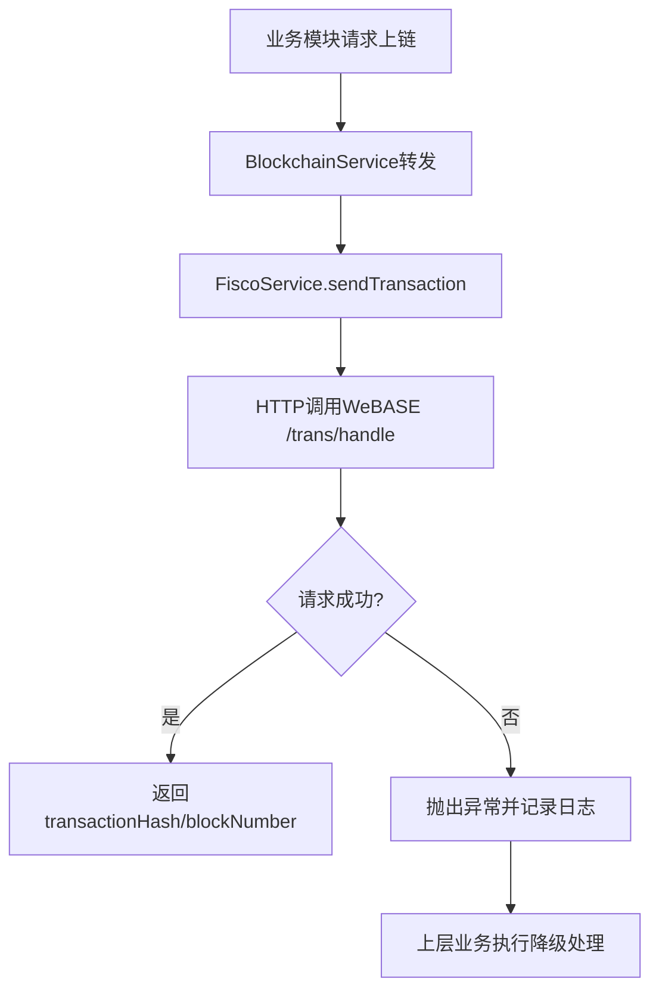

#### 3) 类设计

表5-13 IF_WEBASE_01 相关类

| 类名称 | 描述 | 属性及方法描述 | 使用/交互 | 其他 |
|--------|------|----------------|----------|------|
| `BlockchainService` | 作为业务层与链适配层的中间门面 | 属性：`fisco`；方法：`certifyCopyright()`、`submitReview()`、`finalizeDecision()` | 将上链请求统一委派给 `FiscoService` | 降低业务层对外部接口依赖 |
| `FiscoService` | 直接对接 WeBASE，封装交易发送与回执解析 | 属性：`http`、`groupId`、`signUser`、`contractAbi`；方法：`sendTransaction()` | 调用外部 WeBASE 接口并返回标准交易结果 | 内置 422 日志提示与异常处理 |
| `axios` | 提供 HTTP 客户端能力 | 属性：请求配置；方法：`post()` | 被 `FiscoService` 调用发送请求 | 外部三方库依赖 |

---

## 6 系统出错处理设计

### 6.1 出错信息

| 序号 | 出错或故障情况 | 系统输出信息及处理 |
|------|----------------|--------------------|
| 1 | 用户名/密码为空 | 前端表单校验，阻止提交并提示必填 |
| 2 | 注册邮箱已存在 | 返回 409，提示“该邮箱已被注册” |
| 3 | 登录密码错误 | 返回 401，提示“账号或密码不正确” |
| 4 | 角色权限不足 | 返回 403/401，提示“权限不足”并阻止访问 |
| 5 | 投稿未提供文件内容 | 返回业务异常，提示“未提供文件内容” |
| 6 | 文件哈希重复 | 返回冲突异常，提示勿重复提交 |
| 7 | 审稿任务不存在或无权限 | 返回 404，提示任务不存在或无权操作 |
| 8 | 裁定时无评审记录 | 返回 404，提示无法执行裁定 |
| 9 | 链服务不可用 | 自动降级模拟回执，`simulated=true` |
| 10 | 数据库写入异常 | 返回统一错误信息，记录服务端日志 |

### 6.2 补救措施

1. 输入与参数补救
- 前端实时校验 + 后端 DTO 校验双保险。
- 对关键字段设置范围与格式约束（评分、邮箱、文件大小）。

2. 事务与一致性补救
- 审稿分配采用 `prisma.$transaction` 保证批量写入一致性。
- 关键链操作统一写 `ChainTransaction`，支持后续人工对账。

3. 链路容错补救
- WeBASE 调用失败时自动降级，保证演示与主流程可继续。
- 后续可通过重试任务扫描 `simulated=true` 记录并补链。

4. 权限与安全补救
- JWT 失效自动跳转登录，清理本地令牌。
- 统一角色守卫，避免越权读写。

5. 运维与监控补救
- 保存接口异常日志、链路警告日志。
- 建议增加告警（节点离线、链调用异常率升高、数据库连接失败）。

6. 数据恢复补救
- 建议每日逻辑备份 MySQL（`mysqldump`）
- 建议对 `uploads` 与数据库备份做时间点一致性管理

---

## 7 工作小结（阶段性）

前期已完成 ConfChain 的总体架构设计及稿件管理、匿名审稿、用户管理、区块链管理、系统配置等核心模块的实现与文档化，系统已形成注册登录、投稿存证、审稿裁定、链路追踪的业务闭环，整体质量达到可演示、可联调、可交接水平；当前主要问题集中在数据库迁移与 Schema 一致性、部分状态字段与索引优化、敏感数据保护以及链路降级后的补链机制，后续将通过补齐迁移脚本、关键状态枚举化与索引增强、敏感数据加密治理和告警补链对账流程逐步解决。

---

## 附：当前实现边界说明

- 已实现核心闭环：注册登录、投稿存证、匿名审稿、裁定、链查询、系统阈值配置。
- 链接口已支持真实调用，但在链不可达时允许模拟降级。
- 可视化权限映射（细粒度 ACL UI）尚未实现，当前采用固定 RBAC。
- 存储过程与数据库触发器未使用，业务逻辑在应用层实现。