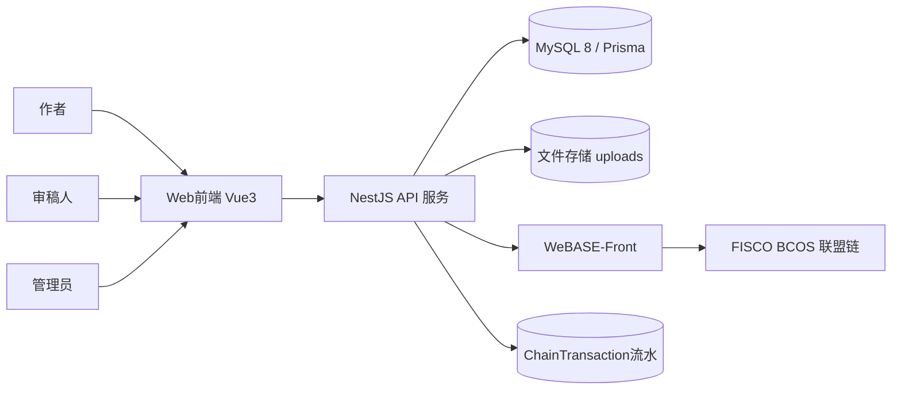
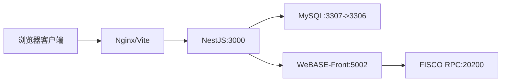
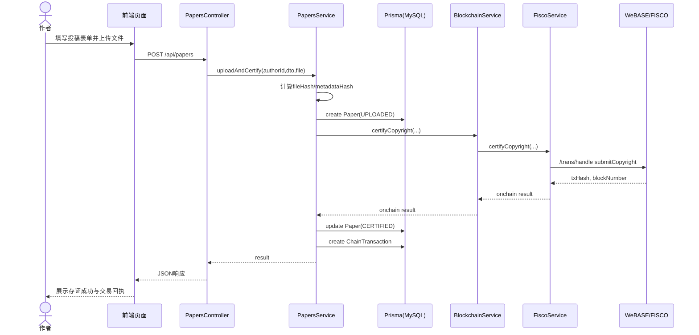
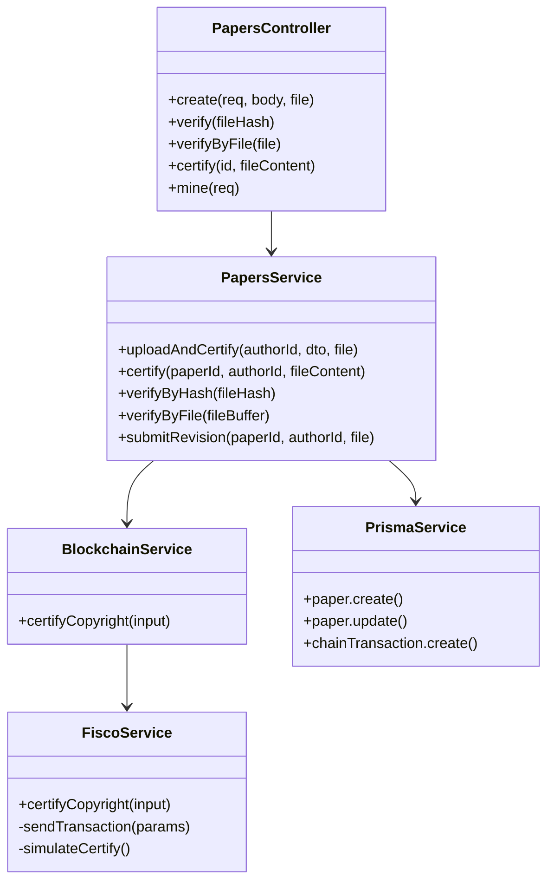
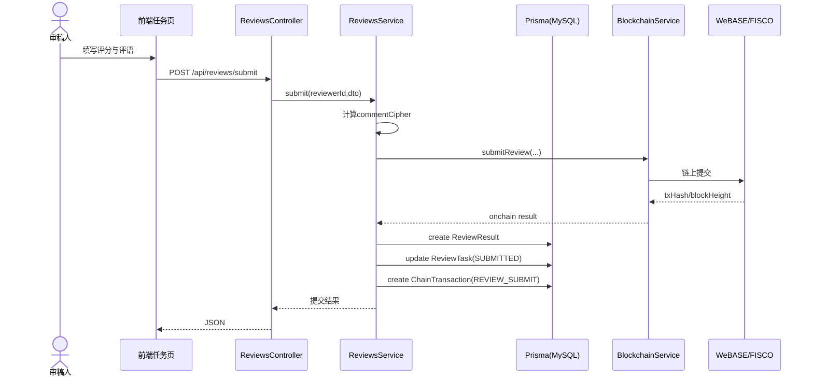
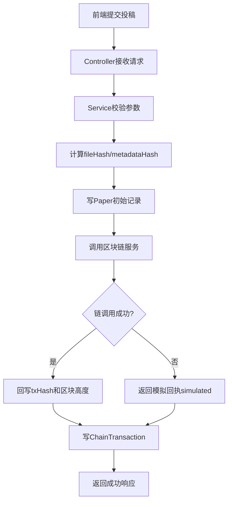
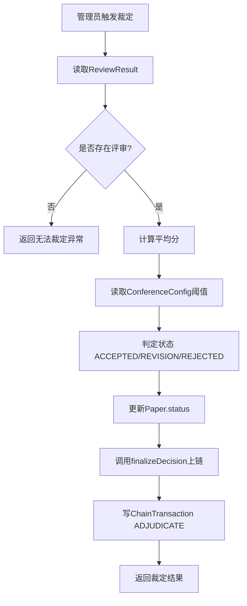

# 本科毕业论文（设计）概要设计说明书

## 文档信息

| 项目 | 内容 |
|------|------|
| 课题名称 | 基于区块链的学术会议匿名审稿与版权存证系统设计与实现 |
| 系统名称 | ConfChain（Conference Chain） |
| 学生姓名 | 张馨文 |
| 学号 | 2022131116 |
| 专业 | 区块链工程 |
| 年级班级 | 2022级4班 |
| 指导教师 | 汪凌锋（副教授） |
| 所在学院 | 区块链产业学院 |
| 提交日期 | 2026-03-19 |

2026 年 3 月  
成都信息工程大学 区块链产业学院

---

## 目录

1 引言  
1.1 编写目的  
1.2 背景  
1.3 术语  
1.4 参考资料  
2 总体设计  
2.1 系统体系结构  
2.2 系统总体功能结构  
2.3 运行环境  
2.3.1 硬件环境  
2.3.2 软件环境  
2.4 系统的关键技术  
3 功能模块设计说明  
3.1 功能模块列表  
3.2 版权存证模块  
3.2.1 模块编号和功能描述  
3.2.2 操作者  
3.2.3 与本模块相关的码表和表  
3.2.4 界面设计与说明  
3.2.5 输入信息  
3.2.6 输出信息  
3.2.7 算法  
3.2.8 对象时序图  
3.2.9 模块各对象的封装  
3.2.10 类设计  
3.3 匿名审稿模块  
4 视图设计  
4.1 界面风格设计  
4.2 主界面设计  
5 内部接口设计  
5.1 接口1：投稿并存证接口  
5.2 接口2：稿件裁定接口  
6 系统出错处理设计  
6.1 出错信息  
6.2 补救措施

---

## 1 引言

### 1.1 编写目的

本文档用于说明 ConfChain 系统的概要设计方案，明确系统架构、模块划分、关键接口、数据交互、视图设计和异常处理策略，作为后续详细设计、编码实现、测试验证和论文答辩的基础文档。

预期读者包括：
- 指导教师与评审专家
- 系统分析与开发人员
- 测试与运维人员
- 项目交接与维护人员

### 1.2 背景

1) 系统名称及缩写
- 中文名：基于区块链的学术会议匿名审稿与版权存证系统
- 英文名：Academic Conference Anonymous Review and Copyright Certification System
- 缩写：ConfChain

2) 项目任务提出者与开发者
- 任务提出者：成都信息工程大学区块链产业学院毕业设计课题
- 指导教师：汪凌锋（副教授）
- 主要开发者：张馨文

3) 应用范围与用户
- 应用范围：学术会议投稿、版权存证、匿名审稿、结果裁定、链上追溯与运维管理
- 用户角色：管理员（ADMIN）、作者（AUTHOR）、审稿人（REVIEWER）

### 1.3 术语

| 术语 | 英文 | 说明 |
|------|------|------|
| 实体-关系图 | ER Diagram | 用于描述实体、属性和联系的数据建模图 |
| 联盟链 | Consortium Blockchain | 多机构共同维护的许可链网络 |
| FISCO BCOS | Financial Blockchain Shenzhen Consortium | 国产联盟链底层平台 |
| WeBASE-Front | Webank Blockchain Application Software Extension | FISCO BCOS 的接口与管理中间件 |
| 交易哈希 | Transaction Hash / TxHash | 链上交易唯一标识 |
| 元数据哈希 | Metadata Hash | 标题、摘要、关键词组合的 SHA-256 摘要 |
| RBAC | Role-Based Access Control | 基于角色的权限控制模型 |
| Prisma | - | TypeScript ORM 和数据库迁移工具 |
| JWT | JSON Web Token | 无状态鉴权令牌 |

### 1.4 参考资料

1. `docs/05需求规格说明书_2022131116_张馨文_基于区块链的学术会议匿名审稿与版权存证设计与实现.txt`  
2. `docs/开发交接_表结构与API说明.md`  
3. `docs/数据库设计说明书.md`  
4. `apps/api/prisma/schema.prisma` 与迁移脚本  
5. `contracts/src/ConfChainCore.sol`  
6. FISCO BCOS 官方文档、WeBASE-Front 接口文档  
7. GB/T 8567-2006《计算机软件文档编制规范》

---

## 2 总体设计

### 2.1 系统体系结构

系统采用前后端分离 + 联盟链协同的分层架构，业务数据落 MySQL，关键凭证上链。



架构分层说明：
- 表现层：Vue3 + Element Plus，按角色呈现菜单和页面。
- 接口层：NestJS Controller 提供 REST API，统一 `/api` 前缀。
- 业务层：Service 处理存证、审稿、裁定、统计等流程。
- 数据访问层：Prisma ORM 访问 MySQL。
- 区块链适配层：`BlockchainService + FiscoService` 对接 WeBASE。
- 合约层：`ConfChainCore.sol` 提供存证、审稿、裁定链上方法。

运行原理（核心流程）：
1. 用户经前端调用 API，完成注册登录与业务操作。
2. 版权存证、审稿提交、裁定等关键动作先落业务库，再发起链调用。
3. 链回执（`txHash`、`blockHeight`）回写业务表并记录 `ChainTransaction`。
4. 管理员通过链运维接口查看节点状态与交易溯源。

### 2.2 系统总体功能结构

系统功能按需求划分为 5 个一级子系统：


功能结构一览：

| 子系统 | 功能目标 | 关键接口 |
|--------|----------|----------|
| 用户管理 | 账号生命周期与 RBAC | `/api/auth/*`, `/api/users/*` |
| 版权存证 | 稿件上传、存证、验证、下载 | `/api/papers/*` |
| 匿名审稿 | 分配、提交、裁定 | `/api/reviews/*` |
| 区块链管理 | 节点与交易查询统计 | `/api/blockchain/*` |
| 系统配置 | 会议裁定阈值维护 | `/api/conf-config/*` |

### 2.3 运行环境

系统支持本地开发与跨主机联调（Windows/macOS 开发机 + Ubuntu 链环境）。

网络拓扑如下：



建议环境参数：
- API 服务：`localhost:3000`
- 前端服务：`localhost:5173`（开发）
- MySQL 宿主机端口：`3307`
- WeBASE-Front：`http://<ubuntu-ip>:5002/WeBASE-Front`
- FISCO RPC：`http://<ubuntu-ip>:20200`

### 2.3.1 硬件环境

服务器端建议配置：
- CPU：4 核及以上（x86_64）
- 内存：16 GB 及以上
- 磁盘：SSD 500 GB 及以上
- 网络：千兆网络，链节点间低延迟通信

客户端建议配置：
- CPU：双核及以上
- 内存：8 GB 及以上（最低 4 GB）
- 分辨率：1920×1080（推荐）
- 浏览器：Chrome 最新稳定版

外围设备与资源：
- 文件存储目录：`apps/api/uploads/`
- Docker 数据卷：`mysql_data`
- 区块链节点主机（可分布部署）

### 2.3.2 软件环境

| 类别 | 版本/说明 |
|------|-----------|
| 操作系统 | 服务端 Ubuntu 20.04+；客户端 Windows 11 / macOS |
| 后端框架 | NestJS 11 + TypeScript |
| 前端框架 | Vue 3 + Vite + Element Plus |
| 数据库 | MySQL 8.0 |
| ORM | Prisma 6.5 |
| 区块链 | FISCO BCOS 3.x + WeBASE 3.x |
| 合约语言 | Solidity 0.8.11 |
| 通信协议 | HTTP/HTTPS, JSON, JSON-RPC |
| 容器工具 | Docker / Docker Compose |

### 2.4 系统的关键技术

1. JWT + RBAC 组合鉴权
- `JwtAuthGuard` + `RolesGuard` 控制接口级访问。
- 路由层与前端菜单双重约束，降低越权风险。

2. Prisma 数据建模与迁移
- 用 `schema.prisma` 管理模型，迁移脚本保证结构可追踪。
- 通过唯一约束保障关键数据（邮箱、哈希、交易）不重复。

3. 文件哈希与元数据哈希
- 文件内容 `SHA-256` 作为确权指纹。
- `metadataHash = SHA-256(title|abstract|keywords)` 提升语义一致性验证能力。

4. WeBASE 适配与链路降级
- 链调用通过 `FiscoService` 统一封装。
- 当链或合约不可用时，返回模拟结果并记录 `simulated` 标识，保证流程可演示、可回放。

5. 智能合约核心能力
- `submitCopyright`、`submitReview`、`finalizeDecision` 三类写入方法。
- 事件机制便于审计与追踪。

6. 前后端协同体验设计
- 前端 Axios 拦截器统一处理鉴权异常与业务提示。
- 公开验证页（`/verify`）支持免登录访问。

---

## 3 功能模块设计说明

### 3.1 功能模块列表

表3-1 功能模块列表

| 模块编号 | 模块名称 | 对应需求功能编号 | 对应需求功能 | 实现优先级 |
|----------|----------|------------------|--------------|------------|
| DS_YHGL01 | 用户管理 | SRS_YHGL01.1~01.3 | 实名注册、钱包生成、角色分配 | 高 |
| DS_BQCC02 | 版权存证 | SRS_YHGL02.1~02.3 | 稿件上传、哈希存证、版权查询 | 高 |
| DS_NMSG03 | 匿名审稿 | SRS_YHGL03.1~03.3 | 任务分配、匿名评审、结果裁定 | 高 |
| DS_QKGL04 | 区块链管理 | SRS_QKLGL04.1~04.3 | 节点监控、交易溯源、合约信息 | 中 |
| DS_XTPZ05 | 系统配置 | SRS_XTPZ05.1~05.2 | 参数设定、权限映射 | 中 |

> 注：当前版本“权限映射”以 RBAC 固定角色策略实现，未开放可视化细粒度权限编辑器。

### 3.2 版权存证模块

#### 3.2.1 模块编号和功能描述

- 模块编号：`DS_BQCC02`
- 核心功能：
  1) 作者上传稿件并计算文件哈希  
  2) 调用链服务完成版权存证  
  3) 保存链回执并支持公开验证  
  4) 支持稿件下载与修订稿再存证

#### 3.2.2 操作者

- 作者（投稿、存证、查看）
- 管理员（查看全部稿件）
- 公开访问者（版权验证）
- 审稿人（下载已分配稿件）

#### 3.2.3 与本模块相关的码表和表

表3-2 模块功能表（DS_BQCC02）

| 名称 | 中文注释 | 类型 | 作用 |
|------|----------|------|------|
| `Paper` | 稿件表 | 表 | input/output/update |
| `ChainTransaction` | 链交易流水表 | 表 | output |
| `User` | 用户表 | 表 | input（作者地址） |
| `PaperStatus` | 稿件状态枚举 | 码表（逻辑） | update |

#### 3.2.4 界面设计与说明

对应页面：
- `/author/submit`：投稿表单（标题、摘要、关键词、文件）
- `/author/papers`：我的稿件列表与状态
- `/verify`：公开版权验证页（哈希或上传文件）

界面要点：
- 上传控件限制大小（20MB）
- 提交时展示进度与结果
- 存证结果展示 `txHash`、`blockHeight`、`certifiedAt`
- 公开验证支持“未找到存证记录”的友好提示

#### 3.2.5 输入信息

| 输入项 | 标识 | 类型 | 约束 | 输入方式 |
|--------|------|------|------|----------|
| 标题 | `title` | string | 必填，<=200 | 表单输入 |
| 摘要 | `abstract` | string | 必填，<=2000 | 表单输入 |
| 关键词 | `keywords` | string[] | 必填，逗号分隔 | 表单输入 |
| 文件 | `file` | binary | 可选（若无需提供 fileContent）<=20MB | 文件上传 |
| 文件内容 | `fileContent` | string | 可选，纯 JSON 投稿时必填 | 文本输入 |
| 作者身份 | JWT | token | 必须为 AUTHOR | Header |

#### 3.2.6 输出信息

正常输出：
- 稿件主键、状态、文件哈希、交易哈希、区块高度、存证时间、模拟标识

状态输出：
- `found=true/false`（公开验证）
- `paperStatus`（当前稿件状态）

异常输出示例：
- 邮箱无权限：`401/403`
- 哈希重复：`ConflictException`（重复文件）
- 文件缺失：`NotFoundException`
- 链调用失败：自动降级为 `simulated=true`

#### 3.2.7 算法

1) 文件哈希算法
- `fileHash = SHA256(fileBytes)`

2) 元数据哈希算法
- `metadataHash = SHA256(title + '|' + abstract + '|' + keywordsCsv)`

3) 投稿存证主流程算法

```text
输入: authorId, title, abstract, keywords, file/fileContent
输出: 存证后的Paper记录

Step1 参数校验与文件读取
Step2 计算 fileHash 与 metadataHash
Step3 写 Paper(status=UPLOADED)
Step4 调用 blockchainService.certifyCopyright()
Step5 回写 Paper(status=CERTIFIED, txHash, blockHeight, certifiedAt, certifySimulated)
Step6 写 ChainTransaction(bizType=COPYRIGHT_CERTIFY)
Step7 返回结果
```

4) 重复检测
- 当 `Paper.fileHash` 触发唯一约束冲突时，立即终止，删除临时上传文件并返回冲突提示。

#### 3.2.8 对象时序图



#### 3.2.9 模块各对象的封装

表3-3 版权存证模块对象封装

| 模块对象 | 程序文件 | 功能说明 | 封装方法 |
|----------|----------|----------|----------|
| 投稿页面 | `apps/web/src/views/author/PaperSubmitView.vue` | 投稿表单、上传文件、触发提交 | `submit()` |
| 稿件列表页面 | `apps/web/src/views/author/PaperListView.vue` | 展示稿件与存证状态 | `loadPapers()` |
| 验证页面 | `apps/web/src/views/VerifyView.vue` | 公开版权验证 | `verifyByHash()`, `verifyByFile()` |
| 控制类 | `apps/api/src/papers/papers.controller.ts` | 路由入口与参数接收 | `create()`, `verify()`, `revise()` |
| 业务类 | `apps/api/src/papers/papers.service.ts` | 存证核心逻辑 | `uploadAndCertify()` |
| 链门面类 | `apps/api/src/blockchain/blockchain.service.ts` | 统一链调用入口 | `certifyCopyright()` |
| 链适配类 | `apps/api/src/blockchain/fisco.service.ts` | WeBASE HTTP 调用与降级 | `sendTransaction()` |
| 持久化类 | `apps/api/src/common/prisma.service.ts` | ORM访问 | `paper.*`, `chainTransaction.*` |

#### 3.2.10 类设计

##### 3.2.10.1 类图



##### 3.2.10.2 类说明

1. `PapersController`
- 功能：接收 HTTP 请求，进行基础参数组装。
- 主要方法：`create()`、`verify()`、`verifyByFile()`。

2. `PapersService`
- 功能：实现投稿、存证、验证、回写链回执等业务编排。
- 主要方法：`uploadAndCertify()`、`submitRevision()`、`getAdjudication()`。

3. `BlockchainService`
- 功能：为业务层提供统一链服务入口。
- 主要方法：`certifyCopyright()`。

4. `FiscoService`
- 功能：封装 WeBASE 调用细节，处理异常与模拟降级。
- 主要方法：`sendTransaction()`、`certifyCopyright()`。

### 3.3 匿名审稿模块

#### 3.3.1 模块编号和功能描述

- 模块编号：`DS_NMSG03`
- 核心功能：
  1) 管理员手动/自动分配审稿任务  
  2) 审稿人提交匿名评审结果并上链  
  3) 系统按阈值进行裁定并写链

#### 3.3.2 操作者

- 管理员：分配任务、查看汇总、触发裁定
- 审稿人：查看任务、提交评审
- 作者：查看裁定结果（通过稿件接口）

#### 3.3.3 与本模块相关的码表和表

表3-4 模块功能表（DS_NMSG03）

| 名称 | 中文注释 | 类型 | 作用 |
|------|----------|------|------|
| `ReviewTask` | 审稿任务表 | 表 | input/output/update |
| `ReviewResult` | 审稿结果表 | 表 | output |
| `Paper` | 稿件表 | 表 | update（状态） |
| `ConferenceConfig` | 会议配置表 | 表 | input（阈值） |
| `ChainTransaction` | 链交易流水 | 表 | output |

#### 3.3.4 输入与输出

输入：
- 分配参数：`paperId`, `reviewerIds[]`, `deadlineAt`
- 提交参数：`taskId`, `score(0~100)`, `recommendation`, `comment`

输出：
- 任务创建结果、任务状态
- 审稿提交回执（含 `txHash`）
- 裁定结果（`averageScore`, `finalStatus`, `threshold`）

#### 3.3.5 核心算法

1) 自动分配算法（轻量负载均衡）
- 排除已分配审稿人
- 按审稿任务数升序选择 `count` 名审稿人

2) 评语摘要算法
- `commentCipher = SHA256(comment)`

3) 裁定算法

```text
avg = round(sum(score) / n, 2)
threshold = ConfConfigService.getThreshold()
if avg >= threshold + 10 => ACCEPTED
else if avg >= threshold => REVISION
else => REJECTED
```

#### 3.3.6 对象时序图（审稿提交）



#### 3.3.7 类设计（核心）

核心类与职责：
- `ReviewsController`：审稿路由入口
- `ReviewsService`：分配、提交、裁定业务编排
- `ConfConfigService`：阈值读取
- `BlockchainService/FiscoService`：审稿与裁定上链
- `PrismaService`：任务、结果与流水持久化

---

## 4 视图设计

### 4.1 界面风格设计

前端采用 Vue 3 + Element Plus，整体风格为学术管理后台：
- 布局：左侧导航 + 顶部状态栏 + 主内容区
- 主题：深色侧栏 + 浅色内容区，重点操作高亮
- 统一组件：表单、表格、弹窗、消息提示统一规范
- 反馈机制：提交时显示 loading，失败时显示错误原因

交互设计原则：
- 可见性：核心状态（稿件状态、任务状态、交易哈希）可见
- 一致性：同类页面交互一致
- 安全性：敏感操作二次确认（如退出登录、裁定）

### 4.2 主界面设计

主界面由角色驱动：

| 角色 | 主菜单 | 关键页面 |
|------|--------|----------|
| ADMIN | 用户管理/审稿分配/区块链管理/系统配置 | `/admin/users`, `/admin/reviews`, `/admin/blockchain`, `/admin/config` |
| AUTHOR | 我的稿件/投稿/版权验证 | `/author/papers`, `/author/submit`, `/verify` |
| REVIEWER | 审稿任务/版权验证 | `/reviewer/tasks`, `/verify` |

页面入口：
- 未登录访问受限页面跳转 `/login`
- 已登录访问 `/login` 或 `/register` 跳转 `/dashboard`
- 角色不匹配跳转 `/dashboard`

---

## 5 内部接口设计

表5-1 构件接口列表

| 模块名称 | 接口编号 | 接口名称 | 接口类型 | 说明 |
|----------|----------|----------|----------|------|
| 用户管理 | IF_AUTH_01 | 登录鉴权接口 | 内部（前后端） | 颁发JWT并回传角色信息 |
| 版权存证 | IF_PAPER_01 | 投稿并存证接口 | 内部（前后端） | 上传文件、存证、回写流水 |
| 匿名审稿 | IF_REVIEW_01 | 审稿提交接口 | 内部（前后端） | 写审稿结果并上链 |
| 匿名审稿 | IF_REVIEW_02 | 稿件裁定接口 | 内部（后端模块） | 统计评分并写裁定 |
| 区块链管理 | IF_CHAIN_01 | 交易追踪接口 | 内部（前后端） | 查询链交易详情 |
| 区块链适配 | IF_WEBASE_01 | WeBASE交易接口 | 外部 | 向链发交易并接收回执 |

### 5.1 接口1：投稿并存证接口

#### 1) 接口属性设计

表5-2 IF_PAPER_01 接口说明

| 项目 | 内容 |
|------|------|
| 接口编号 | IF_PAPER_01 |
| 接口名称 | 投稿并存证接口 |
| 接口说明 | 接收作者投稿并完成哈希存证，写入业务库与链流水 |
| 数据来源 | 作者前端提交的表单与文件 |
| 调用者 | `PaperSubmitView`（前端） |
| 被调用者 | `POST /api/papers` |
| 输入 | `multipart/form-data`：title, abstract, keywords, file |
| 输出 | 稿件记录（id/status/fileHash/txHash/blockHeight/certifiedAt/simulated） |
| 处理流程 | 参数校验 -> 哈希计算 -> 入库 -> 上链 -> 回写 -> 返回 |

#### 2) 接口处理流程图



#### 3) 类设计

表5-3 IF_PAPER_01 相关类

| 类名称 | 分类 | 描述 | 使用到的其他类 |
|--------|------|------|----------------|
| `PapersController` | 控制类 | 接口入口、参数接收 | `PapersService` |
| `PapersService` | 业务类 | 存证流程编排 | `PrismaService`, `BlockchainService` |
| `BlockchainService` | 业务类 | 链调用门面 | `FiscoService` |
| `FiscoService` | 适配类 | WeBASE HTTP 调用 | `axios` |
| `PrismaService` | 持久化类 | 数据库读写 | Prisma Client |

### 5.2 接口2：稿件裁定接口

#### 1) 接口属性设计

表5-4 IF_REVIEW_02 接口说明

| 项目 | 内容 |
|------|------|
| 接口编号 | IF_REVIEW_02 |
| 接口名称 | 稿件裁定接口 |
| 接口说明 | 汇总审稿评分，依据阈值生成裁定并上链 |
| 数据来源 | `ReviewResult`、`ConferenceConfig` |
| 调用者 | 管理员页面（审稿分配页） |
| 被调用者 | `POST /api/reviews/adjudicate/:paperId` |
| 输入 | `paperId` |
| 输出 | `paperId, averageScore, threshold, finalStatus, txHash, simulated` |
| 处理流程 | 查询评分 -> 计算平均分 -> 读取阈值 -> 更新状态 -> 上链 -> 回写流水 |

#### 2) 接口处理流程图



#### 3) 类设计

表5-5 IF_REVIEW_02 相关类

| 类名称 | 分类 | 描述 | 使用/交互 |
|--------|------|------|----------|
| `ReviewsController` | 控制类 | 接收裁定请求 | 调用 `ReviewsService.adjudicate()` |
| `ReviewsService` | 业务类 | 执行评分统计与状态更新 | 交互 `PrismaService`、`ConfConfigService`、`BlockchainService` |
| `ConfConfigService` | 业务类 | 提供当前阈值 | 读取 `ConferenceConfig` |
| `BlockchainService` | 业务类 | 统一链调用入口 | 调用 `FiscoService.finalizeDecision()` |

---

## 6 系统出错处理设计

### 6.1 出错信息

| 序号 | 出错或故障情况 | 系统输出信息及处理 |
|------|----------------|--------------------|
| 1 | 用户名/密码为空 | 前端表单校验，阻止提交并提示必填 |
| 2 | 注册邮箱已存在 | 返回 409，提示“该邮箱已被注册” |
| 3 | 登录密码错误 | 返回 401，提示“账号或密码不正确” |
| 4 | 角色权限不足 | 返回 403/401，提示“权限不足”并阻止访问 |
| 5 | 投稿未提供文件内容 | 返回业务异常，提示“未提供文件内容” |
| 6 | 文件哈希重复 | 返回冲突异常，提示勿重复提交 |
| 7 | 审稿任务不存在或无权限 | 返回 404，提示任务不存在或无权操作 |
| 8 | 裁定时无评审记录 | 返回 404，提示无法执行裁定 |
| 9 | 链服务不可用 | 自动降级模拟回执，`simulated=true` |
| 10 | 数据库写入异常 | 返回统一错误信息，记录服务端日志 |

### 6.2 补救措施

1. 输入与参数补救
- 前端实时校验 + 后端 DTO 校验双保险。
- 对关键字段设置范围与格式约束（评分、邮箱、文件大小）。

2. 事务与一致性补救
- 审稿分配采用 `prisma.$transaction` 保证批量写入一致性。
- 关键链操作统一写 `ChainTransaction`，支持后续人工对账。

3. 链路容错补救
- WeBASE 调用失败时自动降级，保证演示与主流程可继续。
- 后续可通过重试任务扫描 `simulated=true` 记录并补链。

4. 权限与安全补救
- JWT 失效自动跳转登录，清理本地令牌。
- 统一角色守卫，避免越权读写。

5. 运维与监控补救
- 保存接口异常日志、链路警告日志。
- 建议增加告警（节点离线、链调用异常率升高、数据库连接失败）。

6. 数据恢复补救
- 建议每日逻辑备份 MySQL（`mysqldump`）
- 建议对 `uploads` 与数据库备份做时间点一致性管理

---

## 附：当前实现边界说明

- 已实现核心闭环：注册登录、投稿存证、匿名审稿、裁定、链查询、系统阈值配置。
- 链接口已支持真实调用，但在链不可达时允许模拟降级。
- 可视化权限映射（细粒度 ACL UI）尚未实现，当前采用固定 RBAC。
- 存储过程与数据库触发器未使用，业务逻辑在应用层实现。