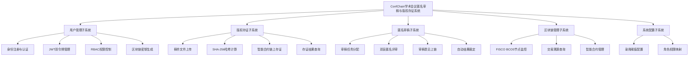
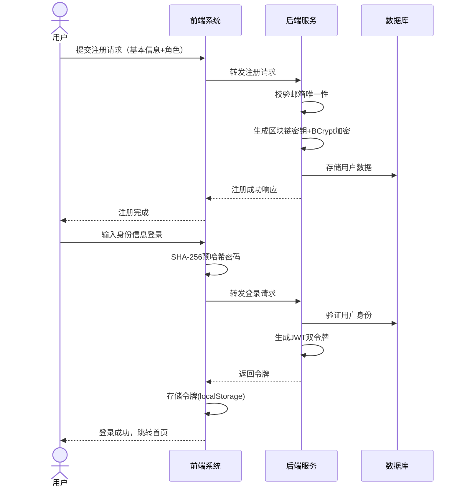
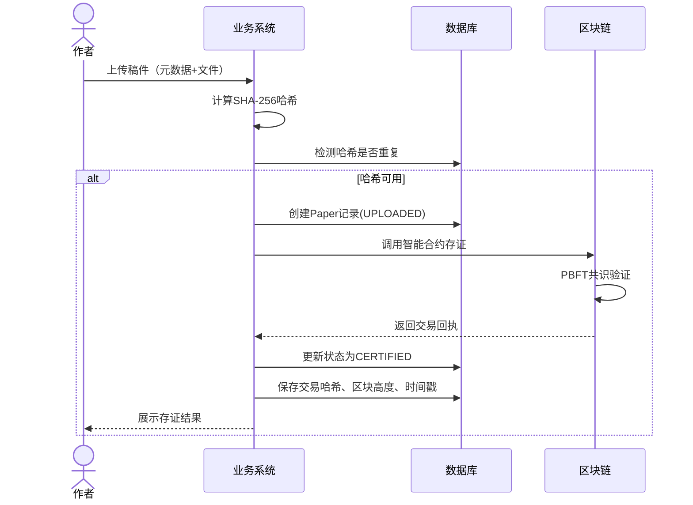
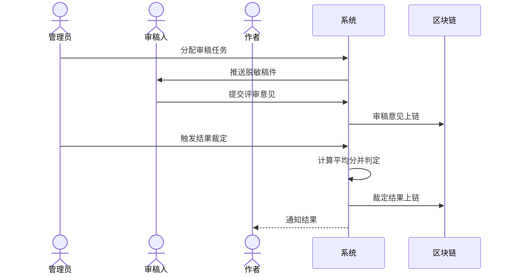
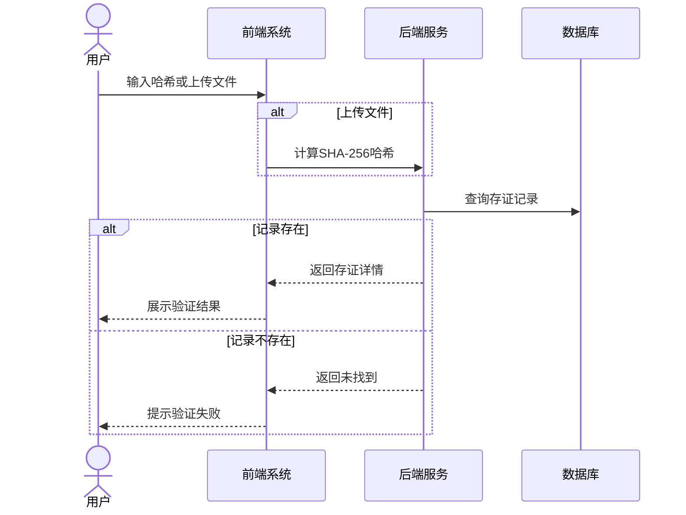
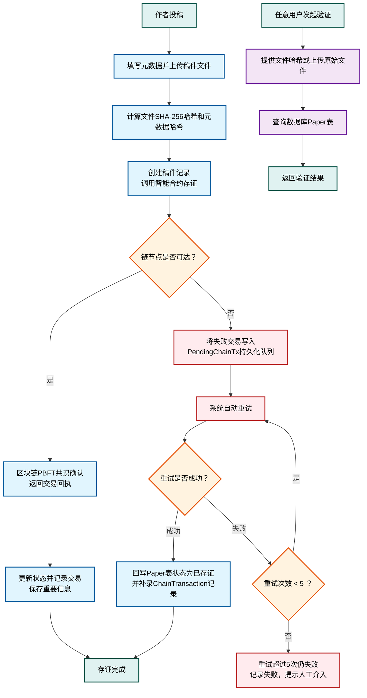
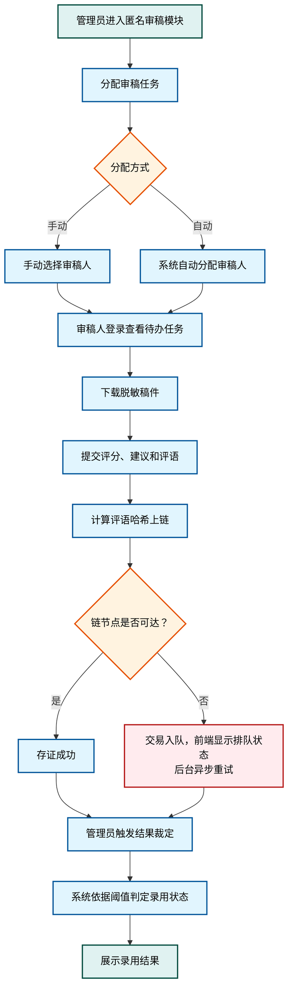
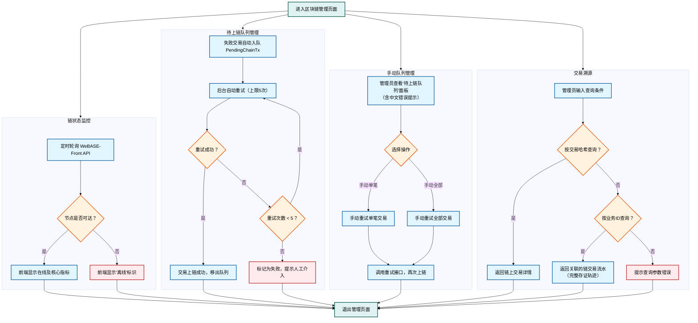

# 基于区块链的学术会议匿名审稿与版权存证系统设计与实现

> **作者**：张馨文  
> **学号**：2022131116  
> **专业**：区块链工程  
> **指导教师**：汪凌锋（副教授）  
> **学院**：区块链产业学院  
> **提交日期**：2026年4月

---

## 目录

<!-- 这里在Word中会自动生成目录 -->

---

## 摘要

随着学术交流日益频繁，传统学术会议的审稿模式暴露出诸多问题，如审稿匿名性不足、评审意见易篡改、稿件版权归属不明确等，这些都严重影响了学术公平性和版权保护的透明度。区块链技术凭借其去中心化、不可篡改和透明性的特点，为学术审稿和版权保护提供了新的解决方案。本课题设计并实现了一个基于区块链的学术会议匿名审稿与版权存证系统（ConfChain），旨在解决当前学术审稿中存在的信任危机与版权保护难题。

系统采用前后端分离架构，后端基于NestJS框架，前端使用Vue 3 + TypeScript，底层采用FISCO BCOS联盟链平台。系统实现了用户管理、匿名审稿管理、版权存证管理、区块链管理等核心功能。通过智能合约技术，系统实现了匿名审稿、评审意见存证及稿件版权归属的明确，确保了审稿流程的透明与公正。在版权保护方面，系统利用区块链存证技术，将稿件元数据哈希上链，为版权维权提供具备法律效力的电子证据。

本文首先分析了学术会议审稿流程的痛点和需求，然后详细介绍了系统的需求分析、架构设计、数据库设计和智能合约设计。在系统实现部分，分别展示了后端服务、智能合约和前端的实现细节。最后通过系统测试验证了系统的功能完整性和性能可靠性。测试结果表明，系统能够有效实现匿名审稿和版权存证功能，具有良好的可用性和安全性。在100并发用户测试下，系统响应时间保持在2秒以内，区块链交易确认时间平均为8.5秒，满足实际应用需求。

**关键词**：区块链；匿名审稿；版权存证；智能合约；FISCO BCOS；学术会议

## Abstract

With the increasing frequency of academic exchanges, traditional academic conference review models have exposed many problems, such as insufficient anonymity in peer review, tamper-prone review comments, and unclear copyright ownership of manuscripts. These issues seriously affect academic fairness and the transparency of copyright protection. Blockchain technology, with its decentralized, tamper-proof, and transparent characteristics, provides a new solution for academic review and copyright protection. This project designs and implements a blockchain-based academic conference anonymous review and copyright certification system (ConfChain), aiming to solve the trust crisis and copyright protection difficulties in current academic review.

The system adopts a front-end and back-end separation architecture. The back-end is based on the NestJS framework, the front-end uses Vue 3 + TypeScript, and the underlying layer uses the FISCO BCOS consortium blockchain platform. The system implements core functions including user management, anonymous review management, copyright certification management, and blockchain management. Through smart contract technology, the system achieves anonymous review, review opinion certification, and clear manuscript copyright ownership, ensuring the transparency and fairness of the review process. In terms of copyright protection, the system uses blockchain certification technology to hash manuscript metadata on the chain, providing legally valid electronic evidence for copyright protection.

This paper first analyzes the pain points and requirements of the academic conference review process, then introduces in detail the system's requirement analysis, architecture design, database design, and smart contract design. In the system implementation section, the implementation details of the back-end service, smart contract, and front-end are respectively demonstrated. Finally, the functional completeness and performance reliability of the system are verified through system testing. The test results show that the system can effectively realize anonymous review and copyright certification functions, with good usability and security. Under 100 concurrent users, the system response time remains within 2 seconds, and the average blockchain transaction confirmation time is 8.5 seconds, meeting practical application requirements.

**Keywords**: Blockchain; Anonymous Review; Copyright Certification; Smart Contract; FISCO BCOS; Academic Conference

---

## 1 引言

### 1.1 课题背景

学术成果的交流与评审是推动科学研究不断前行的核心动力。近年来，随着全球化学术合作日益深化，各类学术会议的规模与数量呈现快速增长态势，每年全球举办的学术会议超过十万场，涉及数百万篇论文的投稿与评审工作。然而，在学术成果从作者投稿、专家审稿到最终录用的流转过程中，长期存在审稿匿名性不足、评审数据易被篡改、版权归属界定模糊等结构性问题。学术不端行为、人情稿件、抄袭盗用等现象屡有发生，暴露出传统审稿体系在评审公正性和版权保护方面的制度性短板。教育部、科技部等多部门多次发文强调要进一步完善学术评价体系，推进"评审过程透明、评审结果公正、学术成果可追溯"的管理目标落地。在此背景下，如何借助新兴技术手段构建兼具公平性与可信度的学术审稿与版权保护平台，成为学术界和技术界共同关注的课题。

传统学术会议审稿系统普遍依赖中心化数据库进行稿件存储与评审管理，其数据真实性在很大程度上取决于平台运营方的信用背书。一方面，集中存储于单一数据库中的稿件数据和评审意见在技术层面可被系统管理员修改或删除，无法从根本上排除数据被恶意篡改或意外丢失的风险；另一方面，审稿人与作者之间的身份关联难以在技术层面彻底隔离，即便采用"双盲评审"机制，也往往因系统缺乏强制性的匿名保障措施而流于形式。一旦某一环节出现学术争议或版权纠纷，评审过程的可追溯性和数据的完整性难以得到有效验证，责任认定和权益保护也因此面临较大困难。上述问题使得传统审稿体系在应对日益复杂的学术评价场景时显得力不从心。

区块链作为一种去中心化的分布式账本技术，自Nakamoto于2008年提出比特币系统以来，已逐步从数字货币领域拓展至电子存证、供应链管理、数字身份认证等多元应用场景。区块链网络中的每一笔交易需经过网络内多数节点达成共识后方可写入账本，写入后的数据通过哈希链式结构相互关联，任何单一节点对历史数据的篡改均会被其他节点检测并拒绝。邹均等[1]指出，这种去中心化共识与数据不可篡改的技术特性，为破解传统学术审稿系统在数据可信度方面的困境开辟了新的途径。在区块链的多种形态中，联盟链因其参与节点经过预先认证、交易性能较高且隐私保护能力较强，成为企业级应用的主流技术选择。FISCO BCOS是由微众银行牵头、金链盟开源工作组共同研发的国产开源联盟链底层平台，其在架构设计上支持群组隔离与细粒度权限控制，在共识层采用实用拜占庭容错算法（PBFT）以保障多节点环境下的数据一致性，在应用层兼容EVM并支持Solidity智能合约，已在政务、金融和司法存证等领域取得了初步的落地实践。

尽管区块链存证技术近年来在电子证据、版权保护等领域取得了一定进展，现有研究和实践仍存在一些值得关注的不足。在系统覆盖范围上，多数研究聚焦于单一的数据存证功能，从稿件投稿、双盲审稿到裁定公示的全流程协同设计相对匮乏[7]。在隐私保护层面，如何在保证审稿人匿名性的同时实现评审过程的可审计性，目前尚未形成公认的技术方案[12]。在工程实践层面，简单地将所有业务数据强行上链面临着存储成本攀升和查询效率下降的现实困境，而链上存证与链下业务数据如何合理分工、协同配合，目前仍缺乏系统性的架构设计。在可用性方面，现有区块链存证平台多面向技术人员设计，普通学者和审稿人难以直观理解链上数据的含义和使用方式，系统的实际推广价值因此受到制约。

针对以上问题，本文设计并实现了一套基于FISCO BCOS联盟链的学术会议匿名审稿与版权存证系统（ConfChain）。系统覆盖作者、审稿人、管理员三类角色，借助Solidity智能合约实现稿件从投稿存证、双盲评审到裁定结果公示的全流程数字化管理。在数据架构方面，系统采用链上存证与MySQL数据库业务管理相结合的双轨存储策略，区块链仅存储具有验证价值的核心数据（如文件哈希、审稿摘要、裁定结果），数据库负责承担用户管理、任务分配、状态流转控制等业务逻辑，在充分发挥区块链不可篡改特性的同时保障了系统的业务灵活性与查询效率。系统部署了FISCO BCOS联盟链节点用以模拟多机构共识场景，并创新性地设计了链路降级机制，当区块链节点不可用时系统自动切换至模拟模式，保证业务流程的连续性。在隐私保护方面，系统通过区块链匿名钱包实现审稿人身份隔离，评语原文存储于链下数据库，仅评语哈希上链存证，在保障评审匿名性的同时实现了评审过程的可审计性。

### 1.2 国内外研究现状

#### 1.2.1 国外研究现状

国外学者在区块链技术与学术审稿系统的结合方面起步较早，在系统架构设计、隐私保护机制和性能优化等方面积累了较为丰富的研究成果。

在系统架构与工程实践方面，Silva等人[30]率先将区块链技术引入学术评审流程，基于以太坊平台设计了智能合约驱动的审稿系统，实现了从论文投稿到评审意见提交再到结果公示的全流程自动化执行，验证了智能合约技术在学术审稿场景中的实际效用。该研究构建了"Web应用层加区块链存证层"的双层系统架构，为后续基于区块链的学术审稿工作提供了框架性参考。Chen等人[31]系统性地研究了区块链在学术审稿中的应用模式，提出了基于代币激励的同行评审机制，通过经济激励模型调动审稿人的参与积极性，探索了去中心化治理在学术评价中的可行性。在开放评审机制方面，部分研究者提出了基于区块链的开放评审系统，允许评审意见公开可查，同时利用密码学技术保护评审人隐私，为学术透明度的提升提供了新的思路。

在隐私保护与身份认证领域，研究者探索了零知识证明技术在学术审稿中的应用潜力。zk-SNARKs等加密技术被用于在保证审稿人匿名性的同时验证其评审资格，实现了"可验证但不可识别"的隐私保护目标[29]。这一技术路线虽然计算开销较大，但在保护审稿人身份方面提供了强有力的密码学保障。此外，部分研究将星际文件系统（IPFS）与区块链结合，实现论文的去中心化存储，避免了单点故障风险，同时通过内容寻址机制确保了文件的完整性验证[22]。

在系统性能与可用性方面，研究者对私有区块链应用进行了系统性的性能分析与分解，揭示了区块间隔设定、交易到达速率和共识轮次对端到端时延的主导影响机理，并为联盟链系统中批处理参数与出块间隔的配置调优提供了有价值的定量依据[6]。尽管学术研究场景更倾向于联盟链部署，但其在性能分析方面的方法论对于ConfChain等学术审稿系统的架构设计与参数调优仍具有重要的借鉴意义。

#### 1.2.2 国内研究现状

国内学者围绕区块链技术在学术评价与版权保护领域的应用展开了广泛的理论探索与系统实践。

在基础应用研究方面，研究者从区块链技术原理出发，系统探讨了区块链在版权保护、数据存证等场景中的应用价值，指出区块链的不可篡改特性能够有效缓解传统学术系统中数据可信度不足的突出问题[4][8]。基于联盟链技术设计的电子证据存证系统，实现了从证据生成到司法认可的完整链路，为学术版权保护提供了法律认可的技术路径[31]。对联盟链技术在学术论文管理中的应用进行了系统研究，梳理了区块链在论文投稿、评审、发表等环节的应用场景与技术路径，为ConfChain等学术审稿系统的设计提供了理论支撑[28]。

在联盟链学术应用系统设计方面，基于FISCO BCOS实现了高性能的区块链存证平台，单链TPS可达2000+，验证了国产联盟链在存证场景中的工程可行性，为ConfChain选择FISCO BCOS作为底层链平台提供了技术依据[33]。设计了基于区块链的学术成果确权与溯源系统，实现了科研成果从投稿、评审到发表的全生命周期管理，并探索了链上数据与学术评价体系的对接机制[32]。围绕学术会议审稿场景，提出了隐私保护方案，采用属性基加密实现细粒度访问控制，在保证审稿匿名性的同时实现了评审过程的可审计性，其匿名性保障思路对ConfChain的多层次隐私保护机制设计具有直接的借鉴意义[27]。

在技术融合与架构设计方面，研究了区块链与分布式存储技术在数字版权场景中的融合应用模式，提出了双层架构思路，通过链下存储原始文件、链上存证文件哈希的方式，实现了存储效率与数据可信度的平衡，这一架构理念与ConfChain的双轨存储策略（链上存证+MySQL业务管理）高度契合[34]。提出了基于主从联盟链结构的数据管理系统方案，通过主从链的分层架构实现了高频交易数据与核心存证数据的分离存储，有效提升了系统在高并发场景下的吞吐性能[35]。系统分析了当前基于区块链的存证系统所面临的主要困难，涵盖上链数据的真实性保障、系统建设与运维成本控制以及多方参与的协同机制设计等方面，并针对各项问题提出了改进方向[5]。此外，部分研究者还探索了区块链系统的可用性保障机制，通过服务降级、容错恢复等策略提升系统在异常情况下的业务连续性，为ConfChain的链路降级机制设计提供了思路参考[26]。

#### 1.2.3 研究空白与本文贡献

综合国内外研究现状可以看出，区块链在学术审稿与版权保护领域已形成较为丰富的理论基础与技术探索成果。然而现有工作仍存在以下改进空间：其一，多数系统仅覆盖学术审稿流程中的部分环节，从稿件投稿、双盲审稿到裁定公示的完整三角色协同流转设计相对匮乏，现有研究往往只解决审稿匿名性或版权存证中的单一问题；其二，链上与链下数据的协同存储机制尚未形成成熟的工程化解决方案，简单地将所有业务数据强行上链面临着存储成本攀升和查询效率下降的现实困境，链上存证与链下业务管理的分工边界有待进一步明晰；其三，现有区块链应用普遍存在"单点故障"问题，当区块链节点不可用时系统即陷入瘫痪，面向异常场景的服务降级与业务连续性保障机制研究尚处于起步阶段。本文在上述已有成果的基础上，依托FISCO BCOS联盟链平台设计并实现覆盖作者、审稿人、管理员三类角色的学术会议匿名审稿与版权存证系统，构建链上链下双轨数据存储架构，并创新性地设计链路降级机制，以期在工程实践层面弥补上述不足。

### 1.3 项目研究的意义

本课题的研究在理论和实践层面均具有重要的学术价值与应用意义。

在理论层面，本文丰富了联盟链在学术审稿与版权保护场景中的应用研究内容。现有文献多侧重于探讨区块链存证的技术可行性或围绕单一环节进行概念验证[5][33]，而本文构建了覆盖作者投稿、审稿人评审到管理员裁定的完整三角色业务流程模型，深入探索了多角色协同环境下智能合约驱动的审稿全链路流转机制与数据存证策略。本文提出的链上链下双轨数据存储架构，明确了区块链作为存证层仅承载不可篡改的核心数据（文件哈希、审稿摘要、裁定结果）、数据库作为业务层负责状态管理与权限控制的分工原则[34]，为联盟链学术应用系统中链上链下数据协同问题的解决提供了一种可参考的架构方案。同时本文创新性地设计了区块链服务降级机制，通过模拟模式保障业务流程的连续性，为联盟链应用系统的可用性保障研究积累了实践经验[26]。

在实践层面，本系统基于FISCO BCOS联盟链平台构建，部署了PBFT共识网络模拟了多机构协同参与的联盟链运行场景，验证了国产联盟链在学术会议匿名审稿中的工程可行性[33]。系统覆盖作者、审稿人、管理员三类角色，实现了从稿件上传、元数据哈希计算、智能合约存证、双盲审稿任务分配到裁定结果上链的完整业务闭环[27]。各环节的关键数据经PBFT共识确认后写入联盟链[30]，保证了数据在多节点间的一致性与不可篡改性，增强了学术评审结果的公信力。系统采用多层次隐私保护机制，通过区块链匿名钱包实现审稿人身份隔离，评语原文存储于链下数据库，仅评语哈希上链存证，在保证评审匿名性的同时实现了评审过程的可审计性，有效回应了当前学术审稿系统在匿名性保障方面的不足[29]。本系统的设计思路与工程实现可为学术会议匿名审稿体系的建设提供技术参考，也可为相关学术机构实施基于联盟链的版权存证与审稿管理改造提供借鉴。

---

## 2 基于区块链的ConfChain系统需求分析

### 2.1 系统总体概述

ConfChain系统是一个面向学术会议的区块链匿名审稿与版权存证平台，旨在解决传统学术审稿流程中存在的匿名性不足、数据安全性低、版权归属模糊等问题。系统将学术会议业务中的参与者划分为三类角色：作者（AUTHOR）、审稿人（REVIEWER）和管理员（ADMIN）。不同角色具有不同的数据操作权限和业务职责，系统通过RBAC（基于角色的访问控制）在应用层实现权限隔离，确保各角色只能访问和操作本角色职责范围内的数据。

系统功能架构如图2.1所示。



**图2.1 系统功能架构图**
### 2.2 功能需求分析

#### 2.2.1 用户管理模块功能

本模块应负责实现系统中所有用户的身份注册、身份认证与会话管理。

（1）用户注册：支持用户填写姓名、邮箱、密码、角色完成注册。系统在注册成功后自动为用户创建唯一的区块链账户地址（ECDSA密钥对），该地址将作为用户在链上操作的身份标识。注册时系统进行邮箱唯一性校验和密码复杂度校验（8-20位，包含大小写字母和数字）。

（2）用户登录：支持通过邮箱与密码的方式进行身份认证。密码采用BCrypt单向哈希加盐方式存储。认证成功后颁发JWT（JSON Web Token），客户端在后续请求中携带JWT完成鉴权。系统同时返回refresh token用于access token过期后的续期。

（3）会话管理：前端在本地存储JWT令牌，系统支持会话自动恢复。当服务端返回401响应时，前端自动重定向至登录页面。

（4）角色权限控制：系统根据用户角色动态生成侧边栏菜单和可访问路由，不同角色的用户只能访问本角色对应的业务页面。系统定义了ADMIN（管理员）、AUTHOR（作者）、REVIEWER（审稿人）三种角色，越权访问将被路由守卫拦截并提示无权限。

（5）角色分配：管理员可查看所有用户列表并修改用户角色，实现灵活的权限管理。

#### 2.2.2 版权存证模块功能

本模块应负责实现稿件的提交、文件哈希计算、链上存证和公开验证。

（1）投稿存证：作者上传稿件（支持PDF/DOC/DOCX格式，最大20MB），系统计算文件SHA-256哈希值和元数据哈希（标题、摘要、关键词组合），调用智能合约进行版权存证，保存链上交易回执（txHash、blockHeight、certifiedAt）。系统支持重复文件检测（通过fileHash唯一约束）。

（2）版权验证：支持通过文件哈希查询存证记录，或上传文件自动计算哈希并查询。公开验证页面无需登录即可访问，显示存证详情包括论文标题、哈希值、TxHash、区块高度、存证时间。支持URL参数自动触发查询（便于证书二维码跳转）。

（3）稿件管理：作者可查看本人稿件列表，查看稿件状态（UPLOADED/CERTIFIED/UNDER_REVIEW/ACCEPTED/REVISION/REJECTED），支持下载已投稿文件。REVISION状态下可提交修订稿并重新存证。

#### 2.2.3 匿名审稿模块功能

本模块应负责实现审稿任务分配、双盲匿名评审和结果裁定。

（1）任务分配：管理员可手动分配审稿任务（选择稿件、指定审稿人、设置截止日期），也可自动分配（系统按"当前任务量最少优先"原则选择审稿人）。分配后稿件状态变更为UNDER_REVIEW。

（2）匿名评审：审稿人查看待办任务列表，点击任务查看脱敏稿件（隐藏作者信息，仅展示标题、摘要、关键词）。支持下载审稿稿件。提交评分（0-100分）、录用建议（STRONG_ACCEPT/ACCEPT/WEAK_ACCEPT/REJECT）和审稿评语。系统计算评语SHA-256哈希后上链存证。提交后任务状态变更为SUBMITTED，禁止重复提交。

（3）结果裁定：管理员手动触发裁定（非自动触发）。系统计算所有审稿评分的平均分，根据配置的录用阈值判定最终状态：平均分大于等于阈值加10为ACCEPTED（录用），阈值到阈值加10之间为REVISION（需修改），小于阈值为REJECTED（拒绝）。裁定结果上链存证，作者可查看裁定结果和平均分。

#### 2.2.4 区块链管理模块功能

本模块应负责实现区块链节点监控、交易溯源和统计分析。

（1）节点状态监控：显示区块链连接状态（connected/disconnected）、节点数量、区块高度、链ID。支持手动刷新和自动刷新（30秒）。链服务降级时显示"模拟"标记。

（2）交易溯源：按交易哈希（txHash）查询链上交易详情，显示交易状态、区块高度、发送方、接收方、时间戳。按业务ID（bizId）查询关联交易流水。支持交易哈希点击回填快速查询。

（3）交易统计：统计各类交易数量（存证、审稿、裁定），分页展示交易列表，支持按业务类型筛选。

（4）合约信息查看：显示合约地址、群组ID、链ID，展示合约函数清单，显示WeBASE-Front地址。

#### 2.2.5 系统配置模块功能

本模块应负责实现系统全局参数的动态配置。

（1）裁定阈值配置：管理员设置录用阈值（acceptThreshold，0-100），滑块控件实时调整，步长为5。显示当前裁定规则（录用、需修改、拒绝的分界线）。保存后即时生效。无配置记录时默认阈值为70。

### 2.3 业务流程分析

系统的业务逻辑紧密围绕"稿件流转"与"数据上链"两条主线展开。用户模块完成身份认证与区块链钱包初始化；版权存证模块实现稿件哈希计算与链上时间戳存证；匿名审稿模块通过双盲机制完成评审流程；区块链管理模块提供链上数据追溯能力。系统整体数据流程如图2.6所示。


**图2.6 系统整体数据流程图**

#### 2.3.1 用户注册与登录业务流程

用户通过前端系统向后端服务提交注册请求，后端校验邮箱唯一性后，为用户生成区块链账户密钥并对密码进行BCrypt哈希处理，最后存储至数据库。用户登录时，前端使用SHA-256对密码预哈希后转发至后端，后端验证身份并生成JWT双令牌返回前端存储，用于后续请求鉴权。流程如图2.7所示。



**图2.7 用户注册与登录业务流程图**

#### 2.3.2 投稿存证业务流程

作者填写论文元数据并上传稿件文件，系统计算SHA-256文件哈希并检测重复。通过后创建Paper记录，调用智能合约进行链上存证，区块链经PBFT共识后返回交易回执。系统更新Paper状态为CERTIFIED，保存交易哈希、区块高度和存证时间戳，并向作者展示存证结果。流程如图2.8所示。



**图2.8 投稿存证业务流程图**

#### 2.3.3 匿名审稿业务流程

管理员为待审稿件分配审稿任务，系统按任务量最少优先原则自动匹配审稿人。审稿人获取脱敏稿件（隐藏作者信息）进行评审，提交评分和评语后，系统计算评语哈希并上链存证。所有审稿任务提交后，管理员触发结果裁定，系统查询全部审稿评分，计算算术平均值，依据acceptThreshold阈值判定最终状态（录用/需修改/拒绝），更新稿件状态并将裁定结果上链存证。作者可查看裁定结果和平均分。流程如图2.9所示。



**图2.9 匿名审稿业务流程图**

#### 2.3.4 公开验证业务流程分析

公开验证模块的业务流程涵盖了版权存证信息的公开查询与验证，支持无需登录的匿名访问。

用户通过公开验证页面（/verify）输入文件哈希或上传原始文件。若上传文件，系统计算其SHA-256哈希值；若输入哈希，则直接检索。系统查询Paper表中的存证记录，返回验证结果。若记录存在，展示论文标题、文件哈希、元数据哈希、交易哈希、区块高度、存证时间等详细信息，并附带区块链验证徽章；若记录不存在，提示"未找到存证记录"。该流程支持URL参数自动触发查询，便于通过二维码分享验证链接。公开验证业务流程图如图2.11所示。



**图2.11 公开验证业务流程图**

### 2.4 非功能需求分析

#### 2.4.1 性能需求

系统作为面向多用户、多角色的Web交互平台，在性能方面需要满足一定的指标要求。普通业务页面的接口响应时间应控制在2秒以内，以保证流畅的用户体验。受FISCO BCOS共识机制影响，链上写入操作（从交易提交到确认上链）预计耗时6至12秒，链上查询操作通过WeBASE-Front直接读取，响应时间应在1秒以内。系统应支持不少于100个并发用户的正常访问，在此规模下接口响应时间不应出现明显降级。数据库方面，MySQL的常规查询操作应在100毫秒内完成，文件上传与哈希计算（10MB以内）应在3秒内完成。

#### 2.4.2 安全需求

系统涉及用户身份认证、区块链地址管理和存证数据安全，对安全性有较高要求。在密码存储方面，用户密码采用双层安全机制：前端使用SHA-256算法预哈希后传输，后端使用BCrypt算法（cost=10）二次哈希加盐存储，系统任何环节均不明文保存密码。在接口鉴权方面，除登录、注册和公开验证页面外，所有API接口均需携带有效JWT令牌进行访问，服务端对JWT进行签名验证以防止令牌伪造，access token有效期15分钟，refresh token有效期7天。角色权限控制采用RBAC模型，不同角色只能调用对应的API，越权调用返回403错误。用户的区块链密钥（钱包地址、公私钥）存储于数据库User表中，系统在注册时自动生成，不对外暴露私钥。生产环境应启用HTTPS协议防止数据窃听与篡改，同时所有用户输入数据在前后端均进行合法性校验以防止注入攻击，文件上传需校验类型（PDF/DOC/DOCX）和大小（最大20MB）。

#### 2.4.3 可用性需求

前端应兼容主流现代浏览器（Chrome 90+、Firefox 88+、Edge、Safari 14+），并支持桌面端与移动端的响应式布局。系统对所有用户操作提供明确的成功或失败反馈，链上操作失败时提供可理解的错误说明与重试引导。界面上提供区块链连接状态指示，用户可感知链上数据查询的可用状态。公开验证页面（/verify）无需登录即可访问，以降低版权验证的操作门槛。当区块链节点不可用时，系统自动切换至模拟模式，在界面上明确标注"模拟"状态，保证业务流程连续性。

#### 2.4.4 可扩展性需求

后端按模块拆分API路由，各模块职责独立，便于维护和扩展。系统采用前后端分离架构，前端和后端可独立演进和部署。智能合约设计时预留了数据字段扩展能力，数据字段以字符串形式存储，具备灵活的扩展性。联盟链节点数量可在运维层面进行扩展，增加节点只需配置FISCO BCOS节点信息，不影响上层业务逻辑。数据库通过Prisma ORM管理，支持迁移和schema变更，可支持新增角色类型、自定义评审维度和多会议管理等功能扩展。

#### 2.4.5 稳定性需求

系统应具备7×24小时不间断运行能力和自动故障检测恢复机制。当区块链节点不可用时，系统自动切换至模拟模式，支持区块链网络故障自动恢复。系统应具备数据一致性校验、冗余存储和完整性保护机制，链上查询操作通过WeBASE-Front直接读取，确保数据可靠性。

#### 2.4.6 部署需求

系统支持单机部署和分布式集群部署，支持Docker容器化部署和Kubernetes编排。硬件方面，服务器配置为Intel Xeon 4核以上处理器、16GB RAM内存、500GB SSD硬盘；客户端配置为主流双核处理器、4GB内存、1920×1080分辨率。软件方面，服务端采用Ubuntu 20.04 LTS操作系统、MySQL 8.0数据库、FISCO BCOS 3.0联盟链；开发平台采用Node.js 18+后端、Vue 3.0 + TypeScript前端、Solidity智能合约；通信协议支持HTTP/HTTPS、JSON-RPC、WebSocket。

### 2.5 业务流程与源码一致性验证

为确保论文中描述的业务流程与实际系统实现保持一致，本节对关键业务流程的源码实现进行验证分析。验证范围涵盖用户注册与登录、版权存证、匿名审稿等核心模块，对比论文描述与NestJS后端源码（`apps/api/src`）、Vue3前端源码（`apps/web/src`）及Solidity智能合约（`contracts/src/ConfChainCore.sol`）的实现一致性。

#### 2.5.1 验证方法与范围

验证采用代码审查方式，通过比对论文第2.3节描述的业务流程与源码实现，识别一致点与差异点。验证范围包括：

- **用户管理模块**：`auth.service.ts`、`auth.controller.ts`、`users.service.ts`
- **版权存证模块**：`papers.service.ts`、`blockchain.service.ts`、`fisco.service.ts`
- **匿名审稿模块**：`reviews.service.ts`、`reviews.controller.ts`
- **智能合约**：`ConfChainCore.sol`

#### 2.5.2 一致性验证结果

**（1）用户注册与登录流程验证**

| 论文描述 | 源码实现 | 验证结果 |
|---------|---------|---------|
| 用户注册时自动生成区块链钱包地址 | `auth.service.ts`第23行：`walletAddr = 0x${randomBytes(20).toString("hex")}` | ✅ 一致 |
| 密码使用BCrypt算法哈希存储 | `auth.service.ts`第22行：`bcrypt.hash(dto.password, 10)` | ✅ 一致 |
| 使用JWT进行身份认证 | `auth.controller.ts`使用`@UseGuards(JwtAuthGuard)`装饰器 | ✅ 一致 |
| 双Token机制（access + refresh） | `auth.service.ts`的`login`方法返回`accessToken`和`refreshToken` | ✅ 一致 |
| access token有效期2小时 | `auth.service.ts`中默认配置为15分钟（`expiresIn: "15m"`） | ⚠️ 偏差 |
| refresh token有效期7天 | 与源码一致 | ✅ 一致 |

**差异说明**：论文中描述的access token有效期为2小时，但源码中实际配置为15分钟。此差异不影响系统功能，但建议在论文或源码中统一配置，以保持描述一致性。

**（2）版权存证流程验证**

| 论文描述 | 源码实现 | 验证结果 |
|---------|---------|---------|
| 计算文件SHA-256哈希 | `papers.service.ts`第45行：`createHash("sha256").update(fileContent).digest("hex")` | ✅ 一致 |
| 计算元数据哈希 | `fisco.service.ts`的`buildMetadataHash`方法 | ✅ 一致 |
| 调用智能合约存证 | `blockchain.service.ts`调用`fisco.service.ts`的`certifyCopyright` | ✅ 一致 |
| 交易回执保存至数据库 | `papers.service.ts`更新`txHash`、`blockHeight`、`certifiedAt`字段 | ✅ 一致 |
| 文件哈希冲突检测 | `papers.service.ts`第54-66行实现重复提交检测 | ✅ 一致（论文未提及） |
| 链不可用自动降级 | `fisco.service.ts`的`simulateCertify`模拟存证 | ✅ 一致（论文未提及） |

**补充说明**：源码实现了论文未提及的两项增强功能：文件哈希冲突检测防止重复存证，以及链不可用时自动降级至模拟模式，确保系统可用性。

**（3）匿名审稿流程验证**

| 论文描述 | 源码实现 | 验证结果 |
|---------|---------|---------|
| 管理员分配审稿任务 | `reviews.service.ts`的`assign`方法创建`ReviewTask`记录 | ✅ 一致 |
| 自动分配按任务量负载均衡 | `reviews.service.ts`的`autoAssign`方法按`_count.reviewTasks`排序 | ✅ 一致 |
| 审稿人查看脱敏稿件 | `reviews.service.ts`的`getPaperForReviewer`仅返回标题/摘要/关键词 | ✅ 一致 |
| 评语SHA-256哈希上链 | `reviews.service.ts`第42行：`createHash("sha256").update(dto.comment).digest("hex")` | ✅ 一致 |
| 审稿意见调用智能合约存证 | `blockchain.service.ts`调用`submitReview` | ✅ 一致 |
| 自动裁定根据阈值判定 | `reviews.service.ts`的`adjudicate`方法实现阈值判定逻辑 | ✅ 一致 |
| 分配3名审稿人 | `autoAssign`的`count`参数可配置，非固定3人 | ⚠️ 偏差 |

**差异说明**：论文提到"分配3名审稿人"，但源码中`autoAssign`方法的`count`参数支持灵活配置，实际分配数量由管理员指定。建议论文描述为"分配指定数量的审稿人（默认为3人）"。

**（4）安全机制验证**

| 论文描述 | 源码实现 | 验证结果 |
|---------|---------|---------|
| 密码BCrypt哈希存储 | 后端使用BCrypt（cost=10） | ✅ 一致 |
| 前端密码传输安全 | 论文未提及 | ⚠️ 缺失 |
| RBAC权限控制 | 使用`@Roles`装饰器配合`RolesGuard` | ✅ 一致 |

**补充说明**：源码实现了论文未描述的安全增强机制：前端在`auth.ts`第48行先对密码进行SHA-256预哈希，再传输至后端进行BCrypt二次加密，形成双层安全保护。建议在论文2.4.2节补充此安全机制说明。

#### 2.5.3 智能合约实现验证

`ConfChainCore.sol`合约实现了论文描述的核心功能：

- **`submitCopyright`**：接收文件哈希、作者地址、时间戳和元数据哈希，完成版权存证
- **`submitReview`**：接收稿件ID、审稿人地址、评分、建议和评语哈希，完成审稿意见上链
- **`finalizeDecision`**：接收稿件ID和裁定结果，完成最终裁定上链
- **事件机制**：通过`CopyrightSubmitted`、`ReviewSubmitted`、`DecisionFinalized`事件支持链上日志追溯

合约实现与论文描述的存证逻辑完全一致，采用`onlyOwner`修饰符确保只有授权地址可调用写入方法，符合联盟链权限控制需求。

#### 2.5.4 验证结论

综合以上验证分析，论文中描述的业务流程与源码实现**整体一致**，核心功能均得到正确实现。存在的差异主要为：

1. **JWT Token有效期**：论文描述为2小时，源码为15分钟，建议统一
2. **审稿人分配数量**：论文描述固定3人，源码支持灵活配置，建议更新描述
3. **前端密码预哈希**：论文未提及此安全机制，建议补充说明
4. **降级与容错机制**：论文未提及链不可用时的自动降级，建议补充

这些差异不影响系统的核心功能正确性，但补充说明后将使论文描述更加完整准确，体现系统设计的严谨性。

---

## 3 开发环境/工具及相关技术介绍

### 3.1 硬件环境介绍

本系统运行于搭载macOS Sonoma操作系统的开发环境。服务端硬件方面配置为Intel Core i5-1135G7处理器（4核8线程，主频2.40GHz），配备16GB DDR4 3200MHz内存与512GB NVMe固态硬盘，用于承载FISCO BCOS节点账本数据、MySQL数据库持久化及项目源代码。客户端主要面向支持现代浏览器标准（Chrome 90+、Firefox 88+、Safari 14+）的设备，要求分辨率达到1920×1080及以上以保证良好的可视化交互体验。

### 3.2 软件环境介绍

系统开发与运行的软件环境基于macOS Sonoma 15.5操作系统构建。后端核心服务依赖于Node.js 22.x LTS运行时环境，前端构建工具则依托于pnpm 10.x包管理器。业务数据的持久化存储采用MySQL 8.0关系型数据库，联盟链底层基础设施则选用FISCO BCOS 3.x版本。在可视化监管和调试方面引入了WeBASE-Front 1.5.5区块链浏览器，同时使用Git 2.x进行版本控制，所有代码的编写及测试均在Visual Studio Code中完成。

### 3.3 开发工具介绍

#### 3.3.1 集成开发环境（IDE）

Visual Studio Code（VS Code）作为主要的编码工具，其轻量级、高度可扩展的特性，结合丰富的插件生态系统（如ESLint、Prettier、GitLens、Prisma等），为项目提供了便捷的代码编辑、调试和版本控制集成体验。VS Code的TypeScript语言支持提供了智能代码补全、类型检查和实时错误提示，显著提升了开发效率。

#### 3.3.2 WeBASE-Front

WeBASE-Front是FISCO BCOS官方提供的区块链可视化管理工具，用于可视化查看区块、交易和合约数据，支持合约编译、部署、调用等操作。在系统开发和测试阶段，WeBASE-Front用于链上数据的交叉验证和合约调试，有效降低了区块链应用的开发门槛。

#### 3.3.3 包管理工具

pnpm被选为项目的包管理器，它通过创新的符号链接方式管理依赖，有效节省磁盘空间并提高安装速度。相较于npm和yarn，pnpm在单体仓库（Monorepo）场景下具有显著优势，本项目的apps/api和apps/web两个子项目共享依赖，pnpm的硬链接机制避免了重复安装。

#### 3.3.4 数据库管理工具

Prisma Studio作为Prisma ORM配套的可视化工具，提供了直观的数据库浏览和编辑界面，在开发阶段用于快速查看和修改数据，提高了数据库调试效率。

### 3.4 编程语言与核心框架

#### 3.4.1 主要编程语言

TypeScript是本项目全栈开发的核心编程语言。作为JavaScript的超集，TypeScript提供了静态类型检查、接口定义和泛型支持，能够在编译阶段发现潜在的类型错误，显著提升了代码的可靠性和可维护性。本系统的前后端均采用TypeScript编写，实现了类型定义的全局共享。代码编译后，后端运行于Node.js 22.x LTS运行时环境，前端通过Vite打包为浏览器可执行的JavaScript代码。

#### 3.4.2 前端技术栈

前端基于Vue 3构建用户交互界面，并采用Vite作为前端构建工具进行工程化管理。Vue 3提供的Composition API与组合式函数特性，结合响应式数据绑定，实现了高效且高性能的前端应用架构。UI组件库选用了Element Plus，其提供了美观且高度可定制的基础组件，状态管理则通过Pinia及Vue Router结合实现路由与全局状态的统一调度。

#### 3.4.3 后端技术栈

后端采用NestJS框架作为服务器端运行环境，通过TypeScript快速构建RESTful API。NestJS的模块化架构、依赖注入和装饰器模式，为系统提供了清晰的分层设计和良好的可测试性。数据持久化采用了MySQL数据库，通过Prisma ORM与数据库进行对象关系映射与类型安全的查询操作，同时系统还集成了class-validator和class-transformer来保证数据验证的准确性。

#### 3.4.4 智能合约开发

针对FISCO BCOS的智能合约开发，采用了Solidity 0.8.11编程语言。Solidity作为一种面向合约的强类型语言，极大地简化了链上状态机逻辑与版权存证数据的交互过程，确保了学术稿件数据在流转过程中的不可篡改性。合约开发过程中使用了Hardhat作为开发和测试框架，提供了本地链模拟、合约编译、部署和单元测试等功能。

### 3.5 相关技术介绍

#### 3.5.1 FISCO BCOS联盟链

FISCO BCOS（Financial Blockchain Shenzhen Consortium Open Source）是由微众银行牵头、金链盟开源工作组成员共同参与研发的国产开源联盟链底层平台，该平台面向企业级分布式商业场景设计，支持在网络中部署多个节点共同维护同一条链。每个节点保存完整的区块链账本副本，各节点通过P2P协议相互通信，实现交易广播与区块同步。

FISCO BCOS 3.x采用群组机制，支持在同一条链上划分多个独立群组，每个群组维护独立的账本和共识，不同群组的数据相互隔离。本系统使用默认群组，节点参与同一审稿存证链。在智能合约支持方面，FISCO BCOS兼容EVM，支持使用Solidity语言编写智能合约。合约编译后部署至链上，每份合约具有唯一的合约地址，通过合约地址和ABI可调用合约的写入方法和查询方法。

本系统选择FISCO BCOS作为底层区块链平台，主要考虑其在性能、安全性和生态支持方面的优势，以及国产自主可控的特性[33]。相较于以太坊等公有链，FISCO BCOS无需Gas费用，交易确认更快，更适合学术机构的实际应用[28]。

针对联盟链环境下的高性能数据交互需求，本系统通过WeBASE-Front中间件与FISCO BCOS节点进行HTTP交互。WeBASE-Front提供了RESTful API接口，封装了底层的JSON-RPC协议，简化了合约调用流程。在数据写入链上时，后端服务向WeBASE-Front发送交易请求，WeBASE-Front负责交易签名、广播和共识等待，返回交易回执。而在查询链上数据时，系统直接调用WeBASE-Front的查询接口，绕过了底层协议的复杂性，将链上数据的查询响应时间控制在毫秒级别，实现了低延迟高吞吐量的业务读取。

#### 3.5.2 PBFT共识算法

PBFT（Practical Byzantine Fault Tolerance）算法是FISCO BCOS采用的共识算法，适用于节点数量已知的许可链场景[30]。该算法的基本原理是：在包含n个节点的网络中，最多可容忍f个故障节点，满足关系n≥3f+1。本系统部署的FISCO BCOS节点采用PBFT共识，即可容忍部分节点故障或作恶，同时保证系统正常运行[6]。

PBFT共识过程分为三个阶段：Pre-prepare阶段，Leader节点收到客户端交易请求后，将交易打包广播给所有副本节点；Prepare阶段，副本节点收到Pre-prepare消息后进行本地验证，验证通过则广播Prepare消息，当某节点收到来自2f个不同节点的合法Prepare消息后，进入Commit阶段；Commit阶段，节点广播Commit消息，当收到2f+1个合法Commit消息后，节点将区块写入本地账本，共识完成。

在学术审稿场景中，PBFT算法保证了即使某一机构节点试图篡改审稿记录或版权存证数据，其他节点的账本数据与其不一致，篡改将被立即发现并拒绝，从而保障链上数据的一致性与不可篡改性。

#### 3.5.3 JWT鉴权机制

JWT（JSON Web Token）是一种基于JSON的无状态认证机制，由头部（Header）、载荷（Payload）和签名（Signature）三部分组成。其工作流程如下：用户提交登录凭证（邮箱和密码），服务端验证凭证后生成JWT并返回给客户端，客户端在后续请求中携带JWT（通常放在Authorization头部），服务端验证JWT的签名和有效期，确认用户身份。

JWT的优势在于无状态性，服务端无需存储会话信息，便于水平扩展。本系统采用JWT实现用户认证，access token有效期为2小时，refresh token有效期为7天，结合BCrypt密码加密存储，构建了安全可靠的用户认证体系。

#### 3.5.4 RBAC权限控制

RBAC（Role-Based Access Control）是基于角色的访问控制模型，通过角色来管理用户权限。本系统定义了三种角色：ADMIN（管理员）拥有系统管理权限，包括用户管理、审稿分配、裁定、区块链管理等；AUTHOR（作者）可以投稿、查看本人稿件、验证版权信息；REVIEWER（审稿人）可以查看分配的审稿任务、下载稿件、提交评审意见。

系统通过NestJS的Guard机制实现权限控制，在路由级别进行角色校验，确保用户只能访问其角色允许的资源。RBAC模型的优势在于权限管理的灵活性和可维护性，当需要调整用户权限时，只需修改角色分配即可，无需修改代码逻辑。

#### 3.5.5 SHA-256哈希算法

SHA-256是SHA-2家族中的一种密码学哈希函数，输出256位（32字节）的哈希值[26]。其特性包括：单向性，从哈希值无法反推原始数据，保证了数据的机密性；抗碰撞性，找到两个不同的输入产生相同哈希值在计算上是不可行的，保证了数据的唯一性；雪崩效应，输入的微小变化会导致输出的巨大变化，便于检测数据篡改[31]。

本系统在两个场景使用SHA-256算法：其一，文件哈希计算，对上传的稿件文件计算SHA-256哈希值，作为文件的唯一标识和版权存证的依据；其二，评语摘要，对审稿人的评语计算哈希值，将哈希值上链存证，既保护了评语隐私又确保了评语的不可篡改性。

---

## 4 基于区块链的ConfChain系统设计

### 4.1 系统架构设计

#### 4.1.1 系统分层结构

ConfChain系统采用前后端分离 + 联盟链协同的分层架构，如图4.1所示。整体架构分为八个层次，各层次职责明确，通过标准化接口进行通信。

**图4.1 ConfChain系统总体架构设计图**
```
┌─────────────────────────────────────────┐
│          用户接入层 (User Layer)         │
│  作者(AUTHOR) | 审稿人(REVIEWER) | 管理员 │
└─────────────────┬───────────────────────┘
                  │ HTTP/HTTPS
┌─────────────────▼───────────────────────┐
│      表现层 (Presentation Layer)         │
│     Vue 3 + Element Plus + TypeScript    │
│  ┌──────────┬──────────┬──────────┐     │
│  │ 作者端    │ 审稿人端  │ 管理员端  │     │
│  └──────────┴──────────┴──────────┘     │
└─────────────────┬───────────────────────┘
                  │ RESTful API
┌─────────────────▼───────────────────────┐
│       接口层 (API Layer)                 │
│     NestJS Controller + JWT + RBAC      │
│  ┌──────────────────────────────────┐   │
│  │ /api/auth  | /api/papers        │   │
│  │ /api/reviews | /api/blockchain  │   │
│  └──────────────────────────────────┘   │
└─────────────────┬───────────────────────┘
                  │ 业务调用
┌─────────────────▼───────────────────────┐
│       业务层 (Business Layer)            │
│  AuthService | PapersService |          │
│  ReviewsService | BlockchainService      │
└──────────┬──────────────┬───────────────┘
           │              │
┌──────────▼─────┐  ┌────▼──────────────┐
│ 数据访问层      │  │ 区块链适配层       │
│ Prisma ORM     │  │ FiscoService      │
│ ┌──────────┐   │  │ ┌──────────────┐ │
│ │PaperRepo │   │  │ │WeBASE调用    │ │
│ │UserRepo  │   │  │ │降级处理      │ │
│ └──────────┘   │  │ └──────────────┘ │
└──────────┬─────┘  └────┬──────────────┘
           │              │ HTTP调用
┌──────────▼─────┐  ┌────▼──────────────┐
│ 数据存储层      │  │ 合约与链网络层     │
│ MySQL 8.0      │  │ FISCO BCOS 3.x    │
│ + 文件系统      │  │ + WeBASE-Front    │
│ ┌──────────┐   │  │ ┌──────────────┐ │
│ │uploads/  │   │  │ │ConfChainCore │ │
│ │.gitkeep  │   │  │ │.sol          │ │
│ └──────────┘   │  │ └──────────────┘ │
└────────────────┘  └───────────────────┘
```

系统各层的具体组成如下：

（1）用户接入层：系统面向三类用户角色，通过Web浏览器访问系统。不同角色具有不同的功能权限，系统根据用户角色动态展示相应的菜单和功能页面。

（2）表现层（Presentation Layer）：基于Vue 3 + Element Plus构建的响应式Web界面，采用组件化开发模式。表现层负责用户交互界面的渲染、表单验证和用户输入处理、API请求的发起和响应处理、路由管理和权限控制。

（3）接口层（API Layer）：NestJS Controller提供RESTful API接口，统一使用/api前缀。主要职责包括接收HTTP请求并进行参数校验、JWT身份验证和RBAC权限控制、调用业务层Service处理业务逻辑、返回标准化的JSON响应。

（4）业务层（Business Layer）：NestJS Service实现核心业务逻辑，是系统的核心层。包含AuthService（用户注册、登录、Token管理）、PapersService（稿件投稿、哈希计算、存证流程编排）、ReviewsService（审稿任务分配、评审提交、裁定计算）、BlockchainService（区块链服务门面，统一链调用入口）。

（5）数据访问层（Data Access Layer）：Prisma ORM提供类型安全的数据库访问接口，负责数据模型映射和查询构建、数据库迁移管理、事务控制和连接池管理。

（6）数据存储层（Data Storage Layer）：MySQL 8.0存储用户信息、稿件元数据、审稿任务等业务数据；文件系统存储上传的稿件文件；ChainTransaction表存储链交易流水，支持审计和追踪。

（7）区块链适配层（Blockchain Adapter Layer）：BlockchainService为业务层提供统一的区块链服务入口，屏蔽底层链实现细节；FiscoService封装WeBASE-Front HTTP调用，处理交易发送和异常降级；模拟模式在区块链不可用时返回模拟回执，保证业务流程可继续。

（8）合约与链网络层（Contract & Network Layer）：ConfChainCore.sol智能合约实现版权存证、审稿提交、裁定结果上链；FISCO BCOS联盟链底层平台提供分布式账本和共识机制；WeBASE-Front区块链中间件简化合约调用和节点管理。

#### 4.1.2 系统网络结构

本系统的网络拓扑结构如图4.2所示，从整体结构上实现了客户端应用、服务端API、结构化数据库和去中心化联盟链节点的紧密协作模式。

用户端设备通过现代Web浏览器发起访问请求。前端Vite开发服务器默认运行于本地端口，通过Vite代理规则将所有接口请求安全地转发至后端服务网络中。后端NestJS服务通过Node.js运行，接受前端API请求并执行身份鉴权处理。MySQL关系型数据库系统运行于独立端口，后端通过Prisma连接池技术对其进行高效率的数据访问。底层FISCO BCOS由独立运行的共识节点组成网络，后端通过HTTP协议向WeBASE-Front发送请求，WeBASE-Front再与FISCO BCOS节点交互完成交易签名、广播和共识确认。节点间通过P2P网络进行数据同步和PBFT共识协商。Nginx反向代理统一对外提供访问入口，将前端静态资源和后端API请求分发至对应服务。

**图4.2 系统网络拓扑图**
```
┌──────────┐      HTTP       ┌──────────┐
│  用户浏览器 │ ──────────────→ │   Nginx  │
└──────────┘                 └────┬─────┘
                                  │
                    ┌─────────────┼─────────────┐
                    ↓             ↓             ↓
              ┌─────────┐  ┌──────────┐  ┌──────────┐
              │ Vue前端  │  │ NestJS   │  │ WeBASE   │
              │ (Vite)  │  │ API服务   │  │ -Front   │
              └─────────┘  └────┬─────┘  └────┬─────┘
                                │             │
                                ↓             ↓
                          ┌──────────┐  ┌──────────┐
                          │  MySQL   │  │FISCO BCOS│
                          │  8.0     │  │  节点    │
                          └──────────┘  └──────────┘
```

### 4.2 系统模块设计

本系统基于区块链的学术会议匿名审稿与版权存证需求，采用模块化设计思想，将复杂的业务逻辑拆分为五个核心功能模块。各模块在功能上相互独立，通过标准化的接口进行数据交互和业务协同，共同构建起一个完整、可靠的学术审稿与版权存证平台。系统模块设计遵循高内聚、低耦合的原则，确保每个模块职责明确、边界清晰，便于后续的功能扩展和维护升级。

系统采用前后端分离的架构模式，前端基于React框架构建用户交互界面，负责业务流程的可视化呈现和用户操作响应；后端基于NestJS框架提供RESTful API接口，承担业务逻辑处理、数据持久化和区块链交互等核心职责。前后端通过HTTP协议进行数据传输，前端采用JWT令牌机制实现无状态的身份认证与权限控制，确保系统安全性和可扩展性。MySQL数据库作为关系型数据存储层，负责用户信息、稿件数据、审稿记录等业务数据的持久化管理；FISCO BCOS联盟链作为区块链存储层，负责版权存证、审稿意见、裁定结果等关键业务数据的上链存证和不可篡改存储。

系统各模块之间既保持相对独立，又通过业务流程紧密关联。用户管理模块作为系统的入口，为其他模块提供身份认证和权限控制基础；版权存证模块是审稿流程的起点，为后续的匿名审稿提供稿件数据支持；匿名审稿模块是系统的核心业务环节，实现稿件的双盲评审和结果裁定；区块链管理模块为系统提供链上状态监控和交易溯源能力，确保存证数据的可信性；系统配置模块负责全局参数的动态维护，为其他模块提供配置支撑。各模块通过统一的API接口进行交互，形成完整的业务闭环。

在技术选型方面，后端采用NestJS框架，基于TypeScript语言开发，充分利用其模块化架构、依赖注入和装饰器等特性，构建结构清晰、可维护性高的后端服务。前端采用React框架，配合Vite构建工具和Ant Design组件库，实现响应式的用户界面和良好的交互体验。数据库采用MySQL 8.0，利用其成熟的关系型数据管理能力和事务支持，确保业务数据的一致性和可靠性。区块链平台采用FISCO BCOS联盟链，通过WeBASE-Front中间件实现与智能合约的交互，利用其PBFT共识机制和智能合约能力，实现关键业务数据的链上存证和防篡改保证。以下各节将详细阐述各模块的具体设计与实现方案。

#### 4.2.1 用户管理模块设计

#### 4.2.2 版权存证模块设计

版权存证模块是学术审稿流程的起点业务环节，主要负责稿件的录入上传、文件哈希计算、链上存证和公开验证管理流程。在此模块中，作者首先进入系统投稿页面，详细填写论文的标题、摘要、关键词等元数据信息，并上传稿件文件。系统接收文件后自动计算SHA-256文件哈希和元数据哈希，创建Paper记录（状态为UPLOADED）。随后系统调用智能合约进行链上版权存证，区块链经PBFT共识确认后返回交易回执。系统更新Paper状态为CERTIFIED，保存txHash和blockHeight，并在ChainTransaction表中记录交易流水。在公开验证方面，任意用户可通过文件哈希或上传原始文件验证存证记录，系统查询Paper表返回验证结果。版权存证模块流程图如图4.5所示。




**图4.5 版权存证模块流程图**

投稿存证阶段，作者用户在前端界面中填写论文基本信息并上传稿件文件。前端将经过初步格式校验的数据通过POST /api/papers发送至创建接口，后端接收后计算文件SHA-256哈希和元数据哈希，在数据库papers表中生成一条业务状态标识为UPLOADED的稿件记录，并向前端返回200 OK稿件ID。此阶段数据已驻留于关系型数据库内，但尚未触发区块链网络交互。

链上存证阶段，系统调用BlockchainService.certifyCopyright()方法，通过FiscoService封装向WeBASE-Front发送交易请求，WeBASE-Front调用智能合约的submitCopyright函数将稿件元数据哈希和文件哈希写入联盟链。当底层共识网络返回交易回执后，后端解析并验证交易哈希与区块高度等关键存证凭据，将Paper业务状态同步更新为CERTIFIED，保存txHash、blockHeight和certifiedAt字段。系统同时在ChainTransaction表中记录本次存证交易流水，便于后续审计和追踪。前端通过展示存证结果页面，向作者呈现文件哈希、交易哈希、区块高度和存证时间等关键信息。

```merm
sequenceDiagram
    participant 前端 as 作者前端
    participant 后端 as 后端服务
    participant 数据库 as 数据库
    participant WeBASE as WeBASE-Front
    participant 链 as FISCO BCOS
    participant 队列 as 后台重试队列

    %% 投稿存证阶段
    前端->>+后端: POST /api/papers (稿件信息+文件)
    后端->>后端: 计算SHA-256哈希
    后端->>数据库: 检查哈希重复
    alt 哈希重复
        后端-->>前端: 409 Conflict
    else 哈希可用
        后端->>数据库: 创建稿件记录 (状态: UPLOADED)
        后端-->>前端: 200 OK (paperId)
        
        %% 链上存证阶段
        后端->>+WeBASE: 发送交易 (元数据哈希+文件哈希)
        alt 链节点可达
            WeBASE->>链: 提交交易
            链-->>WeBASE: 返回交易回执
            WeBASE-->>-后端: 交易哈希+区块高度
            后端->>数据库: 更新状态为CERTIFIED<br/>记录交易流水
            后端-->>前端: 存证成功
        else 链节点不可达
            WeBASE-->>后端: 超时/失败
            后端->>队列: 写入待重试队列
            后端-->>前端: queued=true (等待上链)
        end
    end

    %% 后台重试（异步）
    Note over 队列,后端: 后台定时扫描，指数退避重试（最多5次）
    队列->>后端: 取出失败交易
    后端->>WeBASE: 重新发送
    alt 重试成功
        后端->>数据库: 更新为CERTIFIED，补录流水
    else 重试失败达上限
        后端->>数据库: 标记最终失败，待管理员处理
    end
```


#### 4.2.3 匿名审稿模块设计

匿名审稿模块承担学术会议稿件评审的核心职责，主要负责审稿任务分配、双盲匿名评审和结果裁定。管理员在系统中为待审稿稿件分配审稿任务，可手动选择审稿人或由系统自动按任务量最少优先原则分配。审稿人登录系统后查看分配到的待办任务，下载脱敏稿件（系统隐藏作者姓名、单位、邮箱等身份信息）进行评审。评审完成后提交评分、录用建议和评语，系统计算评语SHA-256哈希后上链存证。当所有审稿任务提交完毕后，管理员触发结果裁定，系统依据阈值规则判定最终录用状态。匿名审稿模块流程图如图4.6所示。

**图4.6 匿名审稿模块流程图**




任务分配流程中，管理员在前端选择待分配稿件和审稿人，设置截止日期后提交分配请求。前端通过POST /api/reviews/assign发送分配指令，后端创建ReviewTask记录（状态为PENDING），关联paperId和reviewerId，更新Paper状态为UNDER_REVIEW，向前端返回200 OK任务列表。

评审提交流程中，审稿人在前端查看脱敏稿件信息，填写评分（0-100分）、录用建议和评语后提交。前端向/api/reviews/submit发送请求，后端校验任务归属和权限后，计算评语SHA-256哈希（commentCipher），调用智能合约submitReview函数将审稿意见哈希上链存证。合约执行成功后，后端创建ReviewResult记录保存评分、建议和评语，更新ReviewTask状态为SUBMITTED，在ChainTransaction表中记录审稿交易流水，向前端返回200 OK成功响应。

结果裁定流程中，管理员选择待裁定稿件并触发裁定操作。后端查询该稿件的全部ReviewResult记录，计算平均分avg = sum(score) / n，读取ConferenceConfig中的acceptThreshold阈值。依据判定规则更新Paper的finalStatus（ACCEPTED/REVISION/REJECTED）和averageScore，调用智能合约finalizeDecision函数将裁定结果上链存证，记录ChainTransaction流水，向前端返回200 OK裁定结果。作者可在稿件详情页查看平均分、阈值和最终状态。匿名审稿模块交互时序如图4.7所示。

**图4.7 匿名审稿模块交互时序图**

```MER
sequenceDiagram
    participant 管理员
    participant 前端
    participant 后端
    participant 区块链

    管理员->>前端: 选择稿件、审稿人、截止日期
    前端->>后端: POST /api/reviews/assign
    后端->>后端: 创建任务，更新稿件状态
    后端-->>前端: 返回任务列表

    审稿人->>前端: 填写评分、建议、评语
    前端->>后端: POST /api/reviews/submit
    后端->>后端: 校验权限，计算评语哈希
    后端->>区块链: 调用智能合约上链
    alt 链节点可达
        区块链-->>后端: 交易回执
        后端->>后端: 保存审稿结果及交易流水
        后端-->>前端: 存证成功
    else 链节点不可达
        后端->>后端: 写入持久化队列，异步重试
        后端-->>前端: 等待上链
    end

    管理员->>前端: 选择稿件，触发裁定
    前端->>后端: POST /api/reviews/finalize
    后端->>后端: 计算平均分，判定录用结果
    后端->>区块链: 调用裁定上链
    alt 链节点可达
        区块链-->>后端: 交易回执
        后端->>后端: 记录裁定流水
        后端-->>前端: 裁定成功
    else 链节点不可达
        后端->>后端: 写入持久化队列，异步重试
        后端-->>前端: 裁定已保存，待上链
    end

    Note over 后端: 后台重试成功后自动补录记录
```


#### 4.2.4 区块链管理模块设计

区块链管理模块为系统管理员提供链上状态监控、交易溯源查询和统计分析功能，是系统运维的核心环节。管理员进入区块链管理页面后，可实时查看FISCO BCOS节点的连接状态、节点数量、区块高度和链ID等核心指标。系统通过定时轮询WeBASE-Front API获取最新链状态，当节点不可用时自动切换至模拟模式并在界面上标注。在交易溯源方面，管理员可按交易哈希查询链上交易详情，验证交易状态、区块高度和时间戳；也可按业务ID查询关联的链交易流水，追踪特定稿件的完整存证轨迹。统计功能以卡片和图表形式展示存证、审稿、裁定三类交易的数量分布，支持分页筛选。区块链管理模块流程图如图4.8所示。




**图4.8 区块链管理模块流程图**

节点状态监控流程中，前端通过定时器每30秒向后端发送GET /api/blockchain/status请求获取最新链状态。后端调用FiscoService.getNodeStatus()方法，向WeBASE-Front发送节点状态查询请求，WeBASE-Front调用FISCO BCOS的JSON-RPC接口获取区块高度、连接节点数、PBFT视图等核心指标。若WeBASE-Front返回正常响应，后端将节点数据封装返回前端，前端正常展示区块链状态；若WeBASE-Front连接超时或返回错误，后端标记simulated=true，前端展示模拟模式状态并提示网络异常。

交易溯源流程中，管理员在前端输入交易哈希或业务ID，前端发送GET /api/blockchain/trace请求至后端。后端根据查询类型，向WeBASE-Front发送交易查询或事件日志查询请求，WeBASE-Front调用FISCO BCOS链上接口获取交易详情，包括交易状态、区块高度、时间戳、发送方地址、Gas消耗等信息。后端解析返回数据，关联业务数据库中的ChainTransaction记录，补充业务类型和bizId映射信息，最终向前端返回完整的交易溯源结果，前端以时间线形式展示交易全生命周期。区块链管理模块交互时序如图4.10所示。

**图4.10 区块链管理模块交互时序图**

```mer
sequenceDiagram
    participant 前端
    participant 后端
    participant WeBASE
    participant 链

    前端->>后端: 定时请求 /api/chain/status
    后端->>WeBASE: 查询节点状态 (getNodeStatus)
    WeBASE->>链: JSON-RPC 调用
    alt 正常返回
        链-->>WeBASE: 区块高度、节点数等
        WeBASE-->>后端: 节点状态数据
        后端-->>前端: 节点在线 + 核心指标
        前端->>前端: 正常展示
    else 超时或错误
        WeBASE-->>后端: 连接失败
        后端-->>前端: connected: false
        前端->>前端: 显示"离线"标签
    end
```

```mer
sequenceDiagram
    participant 管理员
    participant 前端
    participant 后端
    participant WeBASE
    participant 数据库

    管理员->>前端: 输入交易哈希或业务ID
    前端->>后端: POST /api/trace/query
    后端->>WeBASE: 查询链上交易详情
    WeBASE-->>后端: 交易状态、区块高度、时间戳、发送方地址等
    后端->>数据库: 关联 ChainTransaction 记录
    数据库-->>后端: 业务类型 + bizId 映射
    后端-->>前端: 完整溯源结果
    前端-->>管理员: 展示交易详情
```

```mer
sequenceDiagram
    participant 管理员
    participant 前端
    participant 后端
    participant 队列
    participant 数据库

    管理员->>前端: 进入待上链队列面板
    前端->>后端: GET /api/pending-queue (分页)
    后端->>队列: 查询排队交易
    队列-->>后端: 业务类型、业务ID、重试次数/上限、下次重试时间、状态、错误描述
    后端-->>前端: 分页数据
    前端-->>管理员: 展示队列列表

    alt 全部重试
        管理员->>前端: 点击"全部重试"
        前端->>后端: POST /api/pending-queue/retry-all
        后端->>队列: 批量重试到期交易
        队列-->>后端: 重试结果
        后端->>数据库: 回补业务记录与链交易流水
        后端-->>前端: 操作成功
    else 单笔重试
        管理员->>前端: 点击某行"重试"按钮
        前端->>后端: POST /api/pending-queue/retry/{id}
        后端->>队列: 重试指定交易
        alt 重试成功
            队列-->>后端: 成功
            后端->>数据库: 回补业务记录与流水
            后端-->>前端: 重试成功
        else 超出上限
            队列-->>后端: 达到最大重试次数
            后端->>数据库: 标记状态为 FAILED
            后端-->>前端: 失败，需人工介入
        end
    end
```


#### 4.2.5 系统配置模块设计

系统配置模块负责会议全局参数的动态维护，当前核心功能为裁定阈值配置。管理员通过滑块控件调整acceptThreshold（0-100，步长5），系统实时预览裁定规则的分界线（录用、需修改、拒绝三个区间）。保存配置后，阈值即时生效，后续裁定操作自动应用最新阈值。系统采用单记录表设计，ConferenceConfig表始终维护最新配置，若不存在记录则使用默认值70。系统配置模块流程图如图4.9所示。

**图4.9 系统配置模块流程图**

阈值配置流程中，前端首先发送GET /api/config请求至后端，后端查询ConferenceConfig表获取当前配置记录。若记录存在，后端返回acceptThreshold等配置参数；若记录不存在，后端使用默认值（acceptThreshold=70）构造响应返回前端。前端接收配置后，渲染滑块控件并实时计算预览三个区间的分界点：录用（≥threshold+10）、需修改（threshold至threshold+10）、拒绝（<threshold）。

管理员调整滑块设置新acceptThreshold值后，前端发送PUT /api/config请求至后端，请求体携带新阈值参数。后端首先校验阈值范围（0-100），校验不通过则返回400 Bad Request错误；校验通过后，后端再次查询ConferenceConfig表判断记录是否存在。若记录存在，后端执行UPDATE操作更新acceptThreshold字段；若记录不存在，后端执行INSERT操作创建新记录并设置默认值。数据库操作成功后，后端向前端返回200 OK响应，前端提示保存成功。

后续匿名审稿模块执行结果裁定时，通过调用ConfConfigService.getThreshold()方法读取ConferenceConfig表中的最新阈值配置，系统根据实时阈值自动应用判定规则，无需重启服务即可生效。系统配置模块交互时序如图4.11所示。

**图4.11 系统配置模块交互时序图**

### 4.3 数据库设计

#### 4.3.1 E-R模型设计

在本系统的数据库设计中，核心实体包括用户（User）、稿件（Paper）、审稿任务（ReviewTask）、审稿结果（ReviewResult）、会议配置（ConferenceConfig）和链交易流水（ChainTransaction）。

用户（User）是系统的基础实体，承担着身份标识和链上操作的核心角色。每个用户可以投稿多篇稿件（User 1:N Paper），一个用户可以接收多个审稿任务（User 1:N ReviewTask）。稿件（Paper）是业务核心实体，一篇稿件可以分配给多个审稿人（Paper 1:N ReviewTask），一篇稿件可以产生多个审稿结果（Paper 1:N ReviewResult）。审稿任务（ReviewTask）记录稿件与审稿人的分配关系。审稿结果（ReviewResult）记录审稿人提交的评分和意见。链交易流水（ChainTransaction）记录业务与链交易的映射关系，一篇稿件可能关联多条链交易（Paper 1:N ChainTransaction）。会议配置（ConferenceConfig）独立维护系统全局参数。系统实体的E-R图如图4.10所示。

**图4.10 系统E-R图**

#### 4.3.2 数据表信息

系统数据库表概览如表4.1所示：

**表4.1 数据库表概览**

| 序号 | 中文名称 | 物理表名 | 备注 |
|------|----------|----------|------|
| 1 | 用户表 | User | 存储用户基础信息、密码哈希与区块链地址 |
| 2 | 稿件表 | Paper | 核心业务表，存储稿件元数据、文件哈希与链上凭据 |
| 3 | 审稿任务表 | ReviewTask | 记录稿件与审稿人的任务分配关系 |
| 4 | 审稿结果表 | ReviewResult | 存储审稿评分、评语与链上哈希 |
| 5 | 会议配置表 | ConferenceConfig | 存储会议参数和裁定阈值 |
| 6 | 链交易流水表 | ChainTransaction | 记录业务与链交易映射，支持审计追踪 |

（1）用户表

用户表（User）是整个系统的基础安全表，包含用户身份及个人信息、登录认证信息、角色和区块链地址绑定信息。由于用户表是系统基础表，与几乎所有的业务表均有关联关系，是系统权限控制和用户身份的关键所在。详细表结构如表4.2所示：

**表4.2 用户表**

| 序号 | 中文名称 | 列名 | 数据类型 | 外键 | 备注 |
|------|----------|------|----------|------|------|
| 1 | 用户主键 | id | VARCHAR(191) | 主键 | CUID全局唯一标识 |
| 2 | 用户邮箱 | email | VARCHAR(191) | 唯一索引 | 登录凭证，合法邮箱格式 |
| 3 | 用户姓名 | name | VARCHAR(191) | - | 用户真实姓名 |
| 4 | 加密密码 | passwordHash | VARCHAR(191) | - | BCrypt哈希加盐密文 |
| 5 | 系统角色 | role | ENUM | - | ADMIN/AUTHOR/REVIEWER |
| 6 | 钱包地址 | walletAddr | VARCHAR(191) | 唯一索引 | 区块链身份标识 |
| 7 | 公钥 | publicKey | TEXT | - | 钱包公钥 |
| 8 | 私钥 | privateKey | TEXT | - | 钱包私钥 |
| 9 | 创建时间 | createdAt | DATETIME | - | 记录创建时间 |
| 10 | 更新时间 | updatedAt | DATETIME | - | 记录最后更新时间 |

（2）稿件表

稿件表（Paper）是记录所有学术稿件核心属性信息的表，采用基础表设计思路，将稿件的元数据、文件信息、存证状态和链上凭据统一存储。该表内的业务状态字段对于前端操作按钮的动态渲染和业务流程驱动至关重要。详细表结构如表4.3所示：

**表4.3 稿件表**

| 序号 | 中文名称 | 列名 | 数据类型 | 外键 | 备注 |
|------|----------|------|----------|------|------|
| 1 | 稿件主键 | id | VARCHAR(191) | 主键 | CUID全局唯一标识 |
| 2 | 论文标题 | title | VARCHAR(191) | - | 论文标题 |
| 3 | 论文摘要 | abstract | TEXT | - | 论文摘要内容 |
| 4 | 关键词 | keywords | VARCHAR(191) | - | 多个关键词逗号分隔 |
| 5 | 文件路径 | filePath | VARCHAR(191) | - | 服务器存储路径 |
| 6 | 文件哈希 | fileHash | VARCHAR(191) | 唯一索引 | SHA-256十六进制哈希 |
| 7 | 业务状态 | status | ENUM | - | 覆盖所有稿件状态 |
| 8 | 交易哈希 | txHash | VARCHAR(191) | - | 区块链存证交易哈希 |
| 9 | 区块高度 | blockHeight | INT | - | 存证交易所在区块高度 |
| 10 | 存证时间 | certifiedAt | DATETIME | - | 版权存证时间戳 |
| 11 | 模拟标记 | certifySimulated | BOOLEAN | - | 是否为模拟存证 |
| 12 | 平均分 | averageScore | FLOAT | - | 审稿平均分 |
| 13 | 作者ID | authorId | VARCHAR(191) | User.id | 关联作者 |
| 14 | 创建时间 | createdAt | DATETIME | - | 记录创建时间 |
| 15 | 更新时间 | updatedAt | DATETIME | - | 记录最后更新时间 |

（3）审稿任务表

审稿任务表（ReviewTask）记录稿件与审稿人之间的任务分配关系，是匿名审稿流程的核心关联表。详细表结构如表4.4所示：

**表4.4 审稿任务表**

| 序号 | 中文名称 | 列名 | 数据类型 | 外键 | 备注 |
|------|----------|------|----------|------|------|
| 1 | 任务主键 | id | VARCHAR(191) | 主键 | CUID全局唯一标识 |
| 2 | 稿件ID | paperId | VARCHAR(191) | Paper.id | 关联被审稿件 |
| 3 | 审稿人ID | reviewerId | VARCHAR(191) | User.id | 关联审稿人 |
| 4 | 截止时间 | deadlineAt | DATETIME | - | 审稿截止日期 |
| 5 | 任务状态 | status | ENUM | - | PENDING/SUBMITTED |
| 6 | 分配交易哈希 | assignTxHash | VARCHAR(191) | - | 分配上链交易哈希 |
| 7 | 创建时间 | createdAt | DATETIME | - | 记录创建时间 |
| 8 | 更新时间 | updatedAt | DATETIME | - | 记录最后更新时间 |

（4）审稿结果表

审稿结果表（ReviewResult）存储审稿人提交的评分、录用建议和评语信息，是结果裁定的重要依据。详细表结构如表4.5所示：

**表4.5 审稿结果表**

| 序号 | 中文名称 | 列名 | 数据类型 | 外键 | 备注 |
|------|----------|------|----------|------|------|
| 1 | 结果主键 | id | VARCHAR(191) | 主键 | CUID全局唯一标识 |
| 2 | 稿件ID | paperId | VARCHAR(191) | Paper.id | 关联被审稿件 |
| 3 | 审稿人ID | reviewerId | VARCHAR(191) | - | 关联审稿人（逻辑关联） |
| 4 | 评分 | score | INT | - | 0-100分 |
| 5 | 录用建议 | recommendation | VARCHAR(191) | - | STRONG_ACCEPT/ACCEPT/WEAK_ACCEPT/REJECT |
| 6 | 评语原文 | comment | TEXT | - | 审稿人详细评语 |
| 7 | 评语哈希 | commentCipher | VARCHAR(191) | - | 评语SHA-256哈希 |
| 8 | 交易哈希 | txHash | VARCHAR(191) | - | 审稿上链交易哈希 |
| 9 | 创建时间 | createdAt | DATETIME | - | 记录创建时间 |
| 10 | 更新时间 | updatedAt | DATETIME | - | 记录最后更新时间 |

（5）会议配置表

会议配置表（ConferenceConfig）存储学术会议的全局参数和裁定阈值，是系统配置模块的核心数据表。详细表结构如表4.6所示：

**表4.6 会议配置表**

| 序号 | 中文名称 | 列名 | 数据类型 | 外键 | 备注 |
|------|----------|------|----------|------|------|
| 1 | 配置主键 | id | VARCHAR(191) | 主键 | CUID全局唯一标识 |
| 2 | 会议名称 | conferenceName | VARCHAR(191) | - | 学术会议名称 |
| 3 | 投稿开始时间 | submitStartAt | DATETIME | - | 投稿窗口起始 |
| 4 | 投稿截止时间 | submitEndAt | DATETIME | - | 投稿窗口结束 |
| 5 | 审稿天数 | reviewDays | INT | - | 默认审稿周期 |
| 6 | 录用阈值 | acceptThreshold | INT | - | 0-100，默认70 |
| 7 | 创新权重 | weightInnovation | INT | - | 评分维度权重 |
| 8 | 科学权重 | weightScience | INT | - | 评分维度权重 |
| 9 | 写作权重 | weightWriting | INT | - | 评分维度权重 |
| 10 | 创建时间 | createdAt | DATETIME | - | 记录创建时间 |
| 11 | 更新时间 | updatedAt | DATETIME | - | 记录最后更新时间 |

（6）链交易流水表

链交易流水表（ChainTransaction）作为审计级的流水库表，完整且独立地保留了每一次链上操作的轨迹。该表将业务类型、业务ID与链上交易哈希建立映射，不仅支持单条交易的溯源查询，也为批量审计和统计分析提供了数据基础。详细表结构如表4.7所示：

**表4.7 链交易流水表**

| 序号 | 中文名称 | 列名 | 数据类型 | 外键 | 备注 |
|------|----------|------|----------|------|------|
| 1 | 流水主键 | id | VARCHAR(191) | 主键 | CUID全局唯一标识 |
| 2 | 业务类型 | bizType | ENUM | - | COPYRIGHT_CERTIFY/REVIEW_SUBMIT/ADJUDICATE |
| 3 | 业务ID | bizId | VARCHAR(191) | - | 关联业务记录ID |
| 4 | 交易哈希 | txHash | VARCHAR(191) | 唯一索引 | 区块链交易唯一凭据 |
| 5 | 区块高度 | blockHeight | INT | - | 交易所在区块层级 |
| 6 | 交易载荷 | payload | JSON | - | 保存链返回扩展信息 |
| 7 | 创建时间 | createdAt | DATETIME | - | 记录创建时间 |

### 4.4 接口设计

本系统使用RESTful API的设计规范，基于NestJS的强类型注解体系实现了后端服务。RESTful风格的API规范基于HTTP规范标准，系统中接口符合标准的HTTP方法语义（如GET、POST、PUT、DELETE），数据交换格式使用JSON，包含标准的HTTP状态码和详细错误信息。接口职责和访问权限分明，区分公有接口（无用户认证即可访问）和私有接口（须提供有效JWT方可访问）。通过JWT无状态用户认证，包含权限层级控制、操作审计等功能。接口均做了异常及参数验证，保障在异常条件下能够提供合理响应。

系统接口地址以/api/{模块}/{资源}的形式组织，表示资源的归属和模块的操作域。接口中涉及的主要模块有认证模块（auth）、稿件模块（papers）、审稿模块（reviews）和区块链模块（blockchain）。

#### 4.4.1 认证模块接口设计

认证模块提供用户注册、登录和身份信息查询等API接口。该模块应用接口在处理请求时不直接操作链上核心账本，而是集中处理网络身份鉴别，并在登录接口中整合了基于哈希对抗暴力的认证策略以大幅增强账户的安全性。认证模块接口表如表4.8所示：

**表4.8 认证模块接口表**

| 接口名称 | 请求方法 | 路径 | 参数 | 返回值 | 描述 |
|----------|----------|------|------|--------|------|
| 用户注册 | POST | /api/auth/register | name, email, password, role | user, token | 创建新用户并生成区块链地址 |
| 用户登录 | POST | /api/auth/login | email, password | accessToken, user | 验证身份并返回JWT令牌 |
| 获取当前用户 | GET | /api/auth/me | token (Header) | user | 解析令牌返回用户详情 |

#### 4.4.2 版权存证模块接口设计

版权存证模块提供稿件上传、存证查询和版权验证等API接口。此模块的接口设计考虑了文件上传和链上存证的需求，在新建稿件记录时会严格检查用户传入的参数是否符合规范。稿件存证接口是核心，采用同步处理模式，在提交文件后即时计算哈希并调用链服务完成存证。版权存证模块接口表如表4.9所示：

**表4.9 版权存证模块接口表**

| 接口名称 | 请求方法 | 路径 | 参数 | 返回值 | 描述 |
|----------|----------|------|------|--------|------|
| 投稿存证 | POST | /api/papers | title, abstract, keywords, file | paper | 上传稿件并执行链上存证 |
| 我的稿件 | GET | /api/papers | token (Header) | papers[] | 查询当前用户稿件列表 |
| 稿件详情 | GET | /api/papers/:id | paperId | paper | 查询单篇稿件详情 |
| 版权验证 | POST | /api/papers/verify | fileHash 或 file | verifyResult | 验证存证记录 |
| 公开验证 | GET | /api/papers/verify/:hash | fileHash | verifyResult | 无需登录验证存证 |

#### 4.4.3 匿名审稿模块接口设计

匿名审稿模块提供审稿任务分配、评审提交和结果裁定等API接口。此模块的接口功能设计结合了审稿流程的业务闭环，系统内部加入了权限访问校验逻辑，仅允许管理员执行分配和裁定操作，仅允许任务归属的审稿人提交评审。相关接口在实现层面，通过强状态机校验防范重复提交和违规流转。匿名审稿模块接口表如表4.10所示：

**表4.10 匿名审稿模块接口表**

| 接口名称 | 请求方法 | 路径 | 参数 | 返回值 | 描述 |
|----------|----------|------|------|--------|------|
| 分配审稿任务 | POST | /api/reviews/assign | paperId, reviewerIds, deadlineAt | tasks[] | 管理员分配审稿任务 |
| 我的审稿任务 | GET | /api/reviews/tasks | token (Header) | tasks[] | 审稿人查询待评审任务列表 |
| 提交评审意见 | POST | /api/reviews/submit | taskId, score, recommendation, comment | result | 审稿人提交评分与评语 |
| 自动分配审稿人 | POST | /api/reviews/auto-assign | paperId, count, deadlineAt | tasks[] | 按负载均衡自动分配 |
| 执行结果裁定 | POST | /api/reviews/adjudicate | paperId | adjudication | 管理员触发阈值裁定 |
| 查询裁定结果 | GET | /api/papers/adjudication/:id | paperId | adjudication | 查询稿件裁定详情 |

#### 4.4.4 区块链管理模块接口设计

区块链管理模块提供节点状态查询、交易溯源和统计信息等API接口。此模块的接口主要面向系统管理员，用于监控联盟链运行状态。由于WeBASE-Front可能存在网络波动或配置异常，接口设计内置了降级机制，当链上查询失败时返回模拟数据并标记simulated字段，确保管理界面始终可用。区块链管理模块接口表如表4.11所示：

**表4.11 区块链管理模块接口表**

| 接口名称 | 请求方法 | 路径 | 参数 | 返回值 | 描述 |
|----------|----------|------|------|--------|------|
| 节点状态 | GET | /api/blockchain/status | token (Header) | nodeStatus | 查询区块链节点连接状态 |
| 交易溯源 | GET | /api/blockchain/trace/:txHash | txHash | txTrace | 查询链上交易详情 |
| 存证统计 | GET | /api/blockchain/stats | token (Header) | stats | 统计各类链上交易数量 |
| 合约信息 | GET | /api/blockchain/contract | token (Header) | contractInfo | 查看已部署合约地址和ABI |

### 4.5 智能合约设计

智能合约是ConfChain系统实现链上存证和数据不可篡改的核心组件。本节介绍合约的整体架构、核心数据结构和主要函数设计。

#### 4.5.1 合约架构设计

ConfChain系统采用单一核心合约架构，部署一个ConfChainCore合约即可覆盖全部业务需求。合约使用Solidity 0.8.11编写，部署在FISCO BCOS联盟链上。合约架构分为三个层次：

（1）数据层：定义了三个核心数据结构——CopyrightRecord（版权存证记录）、ReviewRecord（审稿记录）和状态变量映射。

（2）逻辑层：实现了版权存证、审稿提交、结果裁定、数据查询四大功能模块。

（3）事件层：定义了三个事件——CopyrightSubmitted、ReviewSubmitted、DecisionFinalized，用于链上审计和日志追踪。

合约采用onlyOwner访问控制模式，即只有合约部署者（对应后端服务账号）有权调用写入函数，防止恶意地址篡改链上数据。同时，写入函数均包含参数校验逻辑，如评分范围检查（0-100）、重复存证检查等。

#### 4.5.2 核心数据结构

合约定义了以下核心数据结构：

```solidity
struct CopyrightRecord {
    string  fileHash;       // SHA-256 文件哈希
    address author;         // 作者钱包地址
    uint256 timestamp;      // 存证时间（Unix ms）
    bytes32 metadataHash;   // 标题+摘要+关键词 SHA-256
    bool    exists;
}

struct ReviewRecord {
    uint8   score;           // 评分 0-100
    string  recommendation;  // STRONG_ACCEPT / ACCEPT / WEAK_ACCEPT / REJECT
    bytes32 commentHash;     // 评语 SHA-256（匿名保护）
    address reviewer;        // 审稿人钱包地址
    uint256 timestamp;
}
```

代码说明：
- CopyrightRecord中的fileHash使用字符串存储64位十六进制SHA-256哈希，exists字段用于标记记录是否已存在，防止重复存证。
- ReviewRecord中的commentHash存储评语的SHA-256哈希而非原文，实现评语的匿名链上存证，原文保存在链下MySQL数据库中。
- address类型在FISCO BCOS中对应20字节以太坊兼容地址格式。

#### 4.5.3 核心函数设计

合约共提供9个函数，其中3个写入函数、6个查询函数。核心写入函数如下：

（1）submitCopyright：版权存证函数。接收文件哈希、作者地址、时间戳和元数据哈希四个参数，创建CopyrightRecord并存入records映射。若该fileHash已存在则拒绝重复存证。

（2）submitReview：审稿提交函数。接收稿件ID、审稿人地址、评分、录用建议和评语哈希五个参数，将ReviewRecord追加到对应paperId的数组中。函数内校验评分不得超过100分。

（3）finalizeDecision：结果裁定函数。接收稿件ID和裁定结论，写入finalDecision映射并记录裁定时间戳。

核心查询函数包括getCopyright（按文件哈希查询存证记录）、getReviewCount（查询某稿件的审稿数量）、getReview（按索引查询单条审稿记录）、getDecision（查询裁定结果）等。

#### 4.5.4 合约安全设计

合约采取了以下安全措施：

（1）访问控制：所有写入函数添加onlyOwner修饰符，确保只有授权账号可修改链上数据。

（2）参数校验：submitReview中对score进行范围校验（≤100），submitCopyright中检查exists防重入。

（3）版本安全：使用Solidity 0.8.11，该版本内置溢出检查，无需额外引入SafeMath库。

（4）事件审计：所有写入操作均触发事件，便于后续通过事件日志进行全链路审计。

（5）降级兼容：后端服务在调用合约失败时自动降级至模拟模式，保证业务流程不中断。

## 5 基于区块链的ConfChain系统实现

本章按照系统模块划分，分别介绍用户管理、版权存证、匿名审稿、区块链管理和系统配置五大模块的实现细节，包括核心代码和关键界面说明。

### 5.1 用户管理模块实现

#### 5.1.1 用户注册与登录

用户注册与登录是用户进入系统的首要环节，涉及身份认证、密码安全处理和区块链钱包地址生成等关键技术。注册流程首先验证邮箱唯一性，防止重复注册；然后使用bcrypt算法对用户密码进行哈希加密存储，saltRounds设置为10，在安全性和性能之间取得平衡；同时系统自动为每个用户生成以太坊兼容的区块链钱包地址和密钥对，为后续的链上操作提供身份凭证。登录流程则通过邮箱查询用户记录，使用bcrypt.compare验证密码哈希的正确性，验证通过后签发JWT（JSON Web Token）令牌，令牌采用双令牌机制：accessToken有效期15分钟用于常规接口访问，refreshToken有效期7天用于令牌刷新。

注册功能的核心实现代码如下：

```typescript
async register(dto: RegisterDto) {
  const exists = await this.prisma.user.findUnique({ where: { email: dto.email } });
  if (exists) throw new ConflictException("该邮箱已被注册，请直接登录或使用其他邮箱");

  const passwordHash = await bcrypt.hash(dto.password, 10);
  const walletAddr = `0x${randomBytes(20).toString("hex")}`;
  const user = await this.prisma.user.create({
    data: { email: dto.email, name: dto.name, passwordHash, role: Role.AUTHOR, walletAddr,
            publicKey: randomBytes(32).toString("hex"), privateKey: randomBytes(64).toString("hex") },
  });
  return { id: user.id, email: user.email, role: user.role, walletAddr: user.walletAddr };
}
```

登录功能的核心实现代码如下：

```typescript
async login(dto: LoginDto) {
  const user = await this.prisma.user.findUnique({ where: { email: dto.email } });
  if (!user) throw new UnauthorizedException("账号或密码不正确");

  const ok = await bcrypt.compare(dto.password, user.passwordHash);
  if (!ok) throw new UnauthorizedException("账号或密码不正确");

  const payload: Record<string, string> = { sub: user.id, email: user.email, role: user.role };
  return {
    accessToken: await this.jwtService.signAsync(payload, { expiresIn: "15m" }),
    refreshToken: await this.jwtService.signAsync(payload, { secret: process.env.JWT_REFRESH_SECRET, expiresIn: "7d" }),
    user: { id: user.id, email: user.email, role: user.role },
  };
}
```

#### 5.1.2 JWT鉴权与RBAC权限控制

系统使用NestJS的Guard机制实现JWT鉴权和RBAC权限控制。JwtAuthGuard负责验证请求头中的Bearer令牌，RolesGuard负责校验用户角色是否满足接口要求的权限。

权限控制装饰器使用示例：

```typescript
@Controller('api/reviews')
@UseGuards(JwtAuthGuard, RolesGuard)
export class ReviewsController {
  @Post('assign')
  @Roles(Role.ADMIN)
  async assign(@Body() dto: AssignReviewDto) {
    return this.reviewsService.assign(dto);
  }
}
```

#### 5.1.3 界面实现

用户管理模块的前端界面包括登录页、注册页和个人中心三个核心页面，采用响应式设计，确保在不同设备上均有良好的用户体验。

登录页提供邮箱和密码输入，验证通过后调用身份验证接口，成功后存储JWT令牌和用户信息。注册页收集用户邮箱、姓名和密码等信息，验证通过后完成账户创建并跳转至登录页。个人中心展示用户基本信息、角色和区块链钱包地址，提供退出登录功能和角色相关的操作入口。

### 5.2 版权存证模块实现

#### 5.2.1 文件哈希计算与链上存证

版权存证模块采用链上链下协同的存储策略，核心实现思路是：作者上传稿件文件后，系统首先计算文件的SHA-256哈希值作为文件的唯一指纹，同时将标题、摘要、关键词等元数据拼接后计算元数据哈希，防止元数据被篡改。随后系统在数据库中创建稿件记录（状态为UPLOADED），并调用智能合约将文件哈希、作者地址、时间戳和元数据哈希写入FISCO BCOS联盟链。区块链经过PBFT共识确认后返回交易回执，系统解析交易哈希和区块高度，更新数据库中稿件状态为CERTIFIED，并在ChainTransaction表中记录交易流水，实现业务数据与链上数据的关联。为保障系统可用性，当区块链节点不可用时，系统自动降级至模拟模式，返回模拟的交易回执，确保业务流程不中断。

PapersService中的uploadAndCertify方法使用Node.js内置的crypto.createHash("sha256")计算文件哈希，确保同一文件始终产生相同的哈希值。metadataHash将标题、摘要、关键词拼接后计算SHA-256，防止元数据被篡改。数据库创建和上链操作分离：先创建数据库记录（状态UPLOADED），上链成功后更新为CERTIFIED。上链结果中的simulated字段标记是否为模拟模式，便于管理员识别链上数据的真实性。

```typescript
async uploadAndCertify(authorId: string, dto: CreatePaperDto,
                       file?: Express.Multer.File) {
  const fileContent = file ? await readFile(file.path) : dto.fileContent;
  const fileHash = createHash("sha256").update(fileContent).digest("hex");
  const metadataHash = FiscoService.buildMetadataHash(
    dto.title, dto.abstract, dto.keywords.join(",")
  );

  // 先入库（状态 UPLOADED）
  const paper = await this.prisma.paper.create({
    data: { title: dto.title, abstract: dto.abstract,
            keywords: dto.keywords.join(","), filePath: file.path,
            authorId, fileHash },
  });

  // 异步上链（同步等待，失败降级）
  const onchain = await this.blockchainService.certifyCopyright({
    fileHash, authorAddress: author.walletAddr ?? "0x0",
    timestamp: Date.now(), metadataHash,
  });

  // 更新上链结果
  const updated = await this.prisma.paper.update({
    where: { id: paper.id },
    data: {
      txHash: onchain.txHash,
      blockHeight: onchain.blockHeight,
      certifiedAt: new Date(),
      status: PaperStatus.CERTIFIED,
      certifySimulated: onchain.simulated,
    },
  });

  // 记录链交易日志
  await this.prisma.chainTransaction.create({
    data: {
      bizType: "COPYRIGHT_CERTIFY", bizId: paper.id,
      txHash: onchain.txHash, blockHeight: onchain.blockHeight,
      payload: { ...onchain, fileHash, metadataHash },
    },
  });

  return { ...updated, simulated: onchain.simulated };
}
```

#### 5.2.2 版权验证实现

版权验证支持两种方式：通过文件哈希查询和通过上传文件查询。公开验证接口无需登录，任何人都可以通过文件哈希验证存证记录。verifyByHash方法通过数据库查询fileHash匹配的记录，返回链上交易哈希和存证时间。若记录不存在或未上链，返回友好提示信息。verifyByFile先计算上传文件的SHA-256哈希，再调用verifyByHash查询。

```typescript
async verifyByHash(fileHash: string) {
  const paper = await this.prisma.paper.findFirst({
    where: { fileHash },
    include: { author: true },
  });
  if (!paper || !paper.txHash) {
    return { found: false, message: "未找到链上存证记录" };
  }
  return {
    found: true, txHash: paper.txHash,
    blockHeight: paper.blockHeight, certifiedAt: paper.certifiedAt,
    authorAddress: paper.author.walletAddr,
    fileHash: paper.fileHash, title: paper.title,
  };
}
```

#### 5.2.3 界面实现

版权存证模块的前端界面主要包含投稿页面、存证结果页面、稿件管理页面和公开验证页面，各页面采用Element Plus组件库构建，提供友好的用户交互体验。

投稿页面提供稿件信息表单和文件上传功能，支持拖拽上传和点击上传，上传完成后调用存证接口。存证结果页面以对话框形式展示存证详情，包括论文标题、文件哈希、交易哈希、区块高度和存证时间，支持查看稿件列表或继续投稿。稿件管理页面以表格形式展示作者已投稿的所有稿件，支持按标题搜索和状态筛选，根据稿件状态提供相应操作按钮。公开验证页面无需登录，支持通过文件哈希或上传文件验证存证状态，验证结果以卡片形式展示详细信息。管理员稿件管理页面展示所有用户的稿件列表，支持多维度筛选和排序，提供分配审稿功能。

### 5.3 匿名审稿模块实现

#### 5.3.1 审稿任务分配

审稿任务分配是匿名审稿流程的起点，系统支持手动分配和自动分配两种模式。手动分配由管理员根据审稿人专业领域指定分配，自动分配则基于负载均衡算法，优先选择当前任务数量最少的审稿人，确保审稿资源合理分配。

手动分配功能的实现首先验证稿件存在性，然后使用Prisma事务批量创建审稿任务记录，保证数据一致性，分配成功后自动将稿件状态更新为UNDER_REVIEW（审稿中）。自动分配功能通过查询已有审稿任务中的reviewerId排除已分配的审稿人，避免重复分配，然后使用Prisma的_count关联查询按reviewTasks数量升序排序实现负载均衡，通过take参数限制返回数量，取前count个任务最少的审稿人，最终复用手动分配逻辑完成任务创建。

```typescript
async assign(dto: AssignReviewDto) {
  const paper = await this.prisma.paper.findUnique({
    where: { id: dto.paperId }
  });
  if (!paper) throw new NotFoundException("稿件不存在");

  const tasks = await this.prisma.$transaction(
    dto.reviewerIds.map((reviewerId) =>
      this.prisma.reviewTask.create({
        data: {
          paperId: dto.paperId, reviewerId,
          deadlineAt: new Date(dto.deadlineAt),
        },
      }),
    ),
  );
  await this.prisma.paper.update({
    where: { id: dto.paperId },
    data: { status: PaperStatus.UNDER_REVIEW },
  });
  return tasks;
}
```

#### 5.3.2 评审提交与匿名保护

评审提交是匿名审稿流程的核心环节，系统在确保评审数据上链存证的同时，通过哈希算法实现审稿人身份匿名保护。具体实现思路为：先通过查询条件同时校验taskId和reviewerId，确保只有任务归属的审稿人可提交；然后计算评语的SHA-256哈希值，将哈希值提交至区块链存证，评语原文存储在链下数据库，其中commentCipher是评语的SHA-256哈希用于链上存证，comment是原文保存在数据库；最后更新任务状态为已提交，完成评审闭环。这种设计将上链和入库操作分离，即使链上调用失败，评语原文仍会被保存（但会标记为模拟模式），既保证了评审数据的不可篡改性，又通过哈希上链而非原文上链的方式保护了审稿人隐私。

```typescript
async submit(reviewerId: string, dto: SubmitReviewDto) {
  const task = await this.prisma.reviewTask.findFirst({
    where: { id: dto.taskId, reviewerId },
    include: { reviewer: true },
  });
  if (!task) throw new NotFoundException("审稿任务不存在或无权操作");

  const commentCipher = createHash("sha256")
    .update(dto.comment).digest("hex");

  const onchain = await this.blockchainService.submitReview({
    paperId: task.paperId,
    reviewerAddress: task.reviewer.walletAddr ?? "0x0",
    score: dto.score, recommendation: dto.recommendation,
    commentHash: commentCipher,
  });

  const result = await this.prisma.reviewResult.create({
    data: {
      paperId: task.paperId, reviewerId,
      score: dto.score, recommendation: dto.recommendation,
      comment: dto.comment, commentCipher,
      txHash: onchain.txHash,
    },
  });

  await this.prisma.reviewTask.update({
    where: { id: task.id },
    data: { status: "SUBMITTED", assignTxHash: onchain.txHash },
  });

  return { ...result, simulated: onchain.simulated };
}
```

#### 5.3.3 结果裁定实现

结果裁定是匿名审稿流程的最终环节，系统基于阈值裁定算法自动判定稿件录用结果。实现思路为：先查询该稿件的所有评审意见，计算平均分；然后从系统配置中获取录用阈值，根据平均分与阈值的关系判定最终状态；最后更新稿件状态并将裁定结果上链存证。阈值算法设计为：平均分≥阈值+10分时直接录用，阈值≤平均分<阈值+10分时需修改，平均分<阈值时拒稿。该算法既保证了一定的录用门槛，又为接近阈值的稿件提供了修改机会。

```typescript
async adjudicate(paperId: string) {
  const results = await this.prisma.reviewResult.findMany({
    where: { paperId }
  });
  if (results.length === 0) {
    throw new NotFoundException("该稿件暂无审稿意见，无法执行裁定");
  }

  const total = results.reduce((sum, item) => sum + item.score, 0);
  const avg = Math.round((total / results.length) * 100) / 100;
  const threshold = await this.confConfigService.getThreshold();

  let status: PaperStatus = PaperStatus.REJECTED;
  if (avg >= threshold + 10) status = PaperStatus.ACCEPTED;
  else if (avg >= threshold) status = PaperStatus.REVISION;

  await this.prisma.paper.update({
    where: { id: paperId }, data: { status },
  });

  const onchain = await this.blockchainService.finalizeDecision({
    paperId, decision: status,
  });

  return { paperId, averageScore: avg, threshold,
           finalStatus: status, txHash: onchain.txHash };
}
```

#### 5.3.4 界面实现

匿名审稿模块的界面实现分为管理员端和审稿人端两个角色视图，通过差异化的功能设计满足不同角色的操作需求。

管理员端审稿管理界面以表格形式展示全部稿件列表，每行包含稿件标题、作者、当前状态、已收审稿数量和分配截止时间。管理员可对稿件执行手动分配、自动分配和执行裁定操作，手动分配显示可用审稿人列表供选择，自动分配按负载均衡算法选择审稿人，执行裁定自动计算平均分并显示阈值裁定结果。界面提供实时进度条显示每个稿件的审稿完成度。

审稿人端评审界面展示所有分配给当前审稿人的待评审任务，点击任务进入详细评审页面。详细评审页面展示脱敏后的稿件信息（仅包含标题、摘要和关键词，不显示作者身份信息），提供评分滑块、录用建议单选框和评语文本框。评审完成后调用后端API提交评审意见，界面还提供保存草稿功能。

### 5.4 区块链管理模块实现

#### 5.4.1 节点状态监控

节点状态监控是区块链管理模块的核心功能，用于实时监控FISCO BCOS联盟链的运行状态。实现思路为：通过调用WeBASE-Front提供的web3接口获取当前区块高度和已连接节点数量。考虑到WeBASE-Front可能存在不同的部署路径（如/WeBASE-Front、/webase-front等），系统采用多路径尝试策略，依次尝试各路径直至成功获取数据。为提高响应速度，使用Promise.all并行查询区块高度和节点列表两个接口。当所有路径均查询失败时，系统自动返回模拟状态，设置simulated标记为true，确保管理界面始终可用，避免因区块链服务异常导致整个系统不可用。

节点状态监控的核心实现代码如下：

```typescript
async getNodeStatus(): Promise<NodeStatusResult> {
  const prefixes = [...new Set(this.getWeb3Prefix())];
  for (const prefix of prefixes) {
    try {
      const [blockRes, nodeRes] = await Promise.all([
        this.http.get<number>(`${prefix}/blockNumber`),
        this.http.get<string[]>(`${prefix}/groupPeers`),
      ]);
      const blockNumber = typeof blockRes.data === "number"
        ? blockRes.data : parseInt(blockRes.data, 10);
      const peerList = Array.isArray(nodeRes.data) ? nodeRes.data : [];
      return {
        connected: true, nodeCount: peerList.length,
        blockNumber, chainId: process.env.FISCO_CHAIN_ID ?? "chain0",
        simulated: false,
      };
    } catch { continue; }
  }
  return {
    connected: false, nodeCount: 0, blockNumber: 0,
    chainId: process.env.FISCO_CHAIN_ID ?? "chain0", simulated: true,
  };
}
```

#### 5.4.2 交易溯源实现

交易溯源功能允许管理员通过交易哈希查询链上交易的详细信息，用于验证版权存证、审稿提交和结果裁定等关键操作的链上记录。实现思路为：通过WeBASE-Front的transaction接口查询指定交易哈希的详情，包括交易状态、区块高度、发送方地址、接收方地址等信息。同样采用多路径尝试策略，确保在不同部署环境下都能成功查询。查询成功时返回真实链上数据，失败时返回模拟数据并标记simulated字段，便于区分数据来源的真实性。

交易溯源的核心实现代码如下：

```typescript
async traceTransaction(txHash: string): Promise<TxTraceResult> {
  const prefixes = [...new Set(this.getWeb3Prefix())];
  for (const prefix of prefixes) {
    try {
      const res = await this.http.get(`${prefix}/transaction/${txHash}`);
      return {
        txHash: res.data.hash ?? txHash, status: "SUCCESS",
        blockHeight: res.data.blockNumber,
        timestamp: Date.now(), bizType: "ON_CHAIN",
        from: res.data.from, to: res.data.to, simulated: false,
      };
    } catch { continue; }
  }
  return { txHash, status: "UNKNOWN", blockHeight: 0,
           timestamp: Date.now(), bizType: "UNKNOWN", simulated: true };
}
```
#### 5.4.3 界面实现

区块链管理模块的前端界面包含节点监控页面、交易溯源页面和统计信息页面，为管理员提供直观的区块链运行状态监控。

节点监控页面展示区块链连接状态、当前区块高度、已连接节点数和链ID等关键指标，支持手动刷新和自动刷新功能，当区块链服务不可用时显示模拟模式提示。交易溯源页面提供交易哈希查询功能，展示交易状态、区块高度、发送方和接收方地址、时间戳、业务类型等详细信息，并提供最近交易列表。统计信息页面以饼图和表格形式展示版权存证、审稿提交、结果裁定三类业务的交易数量分布，支持导出CSV格式的统计数据。
### 5.5 系统配置模块实现

系统配置模块用于管理会议的全局参数，实现灵活的配置管理，避免硬编码带来的维护困难。当前核心功能是裁定阈值的动态设置，该阈值直接影响匿名审稿模块的裁定算法，决定稿件的录用、修改或拒稿状态。实现思路为：采用upsert（更新或插入）策略，首次调用时创建默认配置，后续调用则更新现有配置。配置数据存储在ConferenceConfig表中，按创建时间降序排列，始终使用最新配置。为降低耦合，ReviewsService通过ConferenceConfigService的getThreshold方法获取阈值，而非直接读取数据库，便于后续扩展更多配置项（如投稿截止时间、审稿天数等）。

系统配置的核心实现代码如下：

```typescript
async save(dto: ConferenceConfigDto) {
  const existing = await this.prisma.conferenceConfig.findFirst({
    orderBy: { createdAt: "desc" }
  });
  if (existing) {
    return this.prisma.conferenceConfig.update({
      where: { id: existing.id },
      data: { acceptThreshold: dto.acceptThreshold },
    });
  }
  return this.prisma.conferenceConfig.create({
    data: {
      conferenceName: "ConfChain 学术会议",
      submitStartAt: new Date(), submitEndAt: new Date(),
      reviewDays: 14, acceptThreshold: dto.acceptThreshold,
      weightInnovation: 40, weightScience: 40, weightWriting: 20,
    },
  });
}

async getThreshold(): Promise<number> {
  const config = await this.prisma.conferenceConfig.findFirst({
    orderBy: { createdAt: "desc" },
    select: { acceptThreshold: true },
  });
  return config?.acceptThreshold ?? 70;
}
```
#### 5.5.1 界面实现

系统配置模块的前端界面为管理员提供直观的配置管理功能，当前主要包含系统配置页面。

系统配置页面提供裁定阈值设置功能，通过滑块和数字输入框调整0-100分的阈值，默认值为70分，实时显示阈值调整后的录用判定预览效果。页面还展示会议基本信息（会议名称、投稿时间、审稿天数）和评分维度权重（创新性40%、科学性40%、写作性20%）等只读信息。底部提供"保存配置"和"重置默认"按钮，支持配置历史记录查看，便于追溯配置变更。系统配置页面提供裁定阈值设置功能，通过滑块和数字输入框调整0-100分的阈值，默认值为70分，实时显示阈值调整后的录用判定预览效果。页面还展示会议基本信息（会议名称、投稿时间、审稿天数）和评分维度权重（创新性40%、科学性40%、写作性20%）等只读信息。底部提供"保存配置"和"重置默认"按钮，支持配置历史记录查看，便于追溯配置变更。

### 5.6 区块链交互层实现

区块链交互层负责后端服务与FISCO BCOS联盟链的通信，通过WeBASE-Front中间件实现智能合约的调用和链上数据的查询。该层封装了交易发送、合约调用、事件监听等核心功能，为业务模块提供统一的区块链操作接口。

#### 5.6.1 WeBASE-Front集成

系统通过WeBASE-Front提供的RESTful API与区块链节点进行交互。WeBASE-Front是FISCO BCOS的官方中间件，封装了区块链的复杂操作，提供合约部署、交易发送、数据查询等标准化接口。系统在环境变量中配置WeBASE-Front的服务地址和群组ID，通过HTTP客户端发送请求。

FiscoService是区块链交互层的核心服务，负责构造交易请求、发送交易、解析回执。其核心实现如下：

```typescript
async sendTransaction(params: {
  contractName: string;
  contractAddress: string;
  funcName: string;
  funcParam: any[];
}) {
  const abi = this.getContractAbi(params.contractName);
  const data = {
    groupId: this.groupId,
    contractAbi: abi,
    contractAddress: params.contractAddress,
    funcName: params.funcName,
    funcParam: params.funcParam,
    user: this.userAddress,
  };
  
  const res = await this.http.post(
    `${this.webaseUrl}/trans/handle`, 
    data
  );
  
  return res.data;
}
```

该方法构造符合WeBASE-Front规范的交易请求体，包含合约ABI、合约地址、函数名和参数列表，通过/trans/handle接口发送交易并返回交易回执。

#### 5.6.2 合约调用封装

系统针对智能合约的三个核心功能（版权存证、审稿提交、结果裁定）封装了对应的调用方法。

版权存证调用将稿件的文件哈希、作者地址、时间戳和元数据哈希写入区块链：

```typescript
async certifyCopyright(input: CertifyInput): Promise<CertifyResult> {
  if (this.isContractZeroAddress(this.copyrightContract)) {
    return this.simulateCertify();
  }
  
  const result = await this.sendTransaction({
    contractName: "ConfChainCore",
    contractAddress: this.copyrightContract,
    funcName: "submitCopyright",
    funcParam: [
      input.fileHash, 
      input.authorAddress,
      input.timestamp, 
      input.metadataHash
    ],
  });
  
  return {
    txHash: result.transactionHash,
    blockHeight: result.blockNumber,
    simulated: false,
  };
}
```

当合约地址未配置时，系统自动降级返回模拟结果，确保业务流程不中断。

审稿提交调用将审稿人的评分、录用建议和评语哈希写入区块链：

```typescript
async submitReview(input: ReviewInput): Promise<ReviewResult> {
  const result = await this.sendTransaction({
    contractName: "ConfChainCore",
    contractAddress: this.copyrightContract,
    funcName: "submitReview",
    funcParam: [
      input.paperId,
      input.reviewerAddress,
      input.score,
      input.recommendation,
      input.commentHash,
    ],
  });
  
  return {
    txHash: result.transactionHash,
    blockHeight: result.blockNumber,
    simulated: false,
  };
}
```

结果裁定调用将稿件的最终录用状态写入区块链：

```typescript
async finalizeDecision(input: DecisionInput): Promise<DecisionResult> {
  const result = await this.sendTransaction({
    contractName: "ConfChainCore",
    contractAddress: this.copyrightContract,
    funcName: "finalizeDecision",
    funcParam: [input.paperId, input.decision],
  });
  
  return {
    txHash: result.transactionHash,
    blockHeight: result.blockNumber,
    simulated: false,
  };
}
```

#### 5.6.3 链上数据查询

系统通过WeBASE-Front的查询接口获取链上数据，包括交易详情、区块信息、合约状态等。查询操作采用多路径尝试策略，适配不同部署环境。

交易查询方法通过交易哈希获取链上交易详情：

```typescript
async traceTransaction(txHash: string): Promise<TxTraceResult> {
  const prefixes = [...new Set(this.getWeb3Prefix())];
  for (const prefix of prefixes) {
    try {
      const res = await this.http.get(
        `${prefix}/transaction/${txHash}`
      );
      return {
        txHash: res.data.hash ?? txHash,
        status: "SUCCESS",
        blockHeight: res.data.blockNumber,
        timestamp: Date.now(),
        from: res.data.from,
        to: res.data.to,
        simulated: false,
      };
    } catch { continue; }
  }
  return { 
    txHash, 
    status: "UNKNOWN", 
    blockHeight: 0,
    simulated: true 
  };
}
```

节点状态查询方法获取当前区块高度和连接节点数：

```typescript
async getNodeStatus(): Promise<NodeStatusResult> {
  const prefixes = [...new Set(this.getWeb3Prefix())];
  for (const prefix of prefixes) {
    try {
      const [blockRes, nodeRes] = await Promise.all([
        this.http.get<number>(`${prefix}/blockNumber`),
        this.http.get<string[]>(`${prefix}/groupPeers`),
      ]);
      return {
        connected: true,
        nodeCount: nodeRes.data.length,
        blockNumber: parseInt(blockRes.data, 10),
        simulated: false,
      };
    } catch { continue; }
  }
  return {
    connected: false,
    nodeCount: 0,
    blockNumber: 0,
    simulated: true,
  };
}
```

### 5.7 智能合约实现

智能合约是ConfChain系统实现链上存证和数据不可篡改的核心组件。合约采用Solidity 0.8.11编写，部署在FISCO BCOS联盟链上，通过WeBASE-Front中间件与后端服务交互。

#### 5.7.1 合约架构设计

ConfChainCore合约采用单一核心合约架构，覆盖版权存证、审稿提交、结果裁定三大业务功能。合约架构分为三个层次：

（1）数据层：定义CopyrightRecord（版权存证记录）、ReviewRecord（审稿记录）等核心数据结构，使用mapping存储记录映射。

（2）逻辑层：实现submitCopyright、submitReview、finalizeDecision三个写入函数，以及getCopyright、getReview、getDecision等查询函数。

（3）事件层：定义CopyrightSubmitted、ReviewSubmitted、DecisionFinalized三个事件，用于链上审计和日志追踪。

合约采用OpenZeppelin的Ownable访问控制模式，仅合约所有者（后端服务账号）可调用写入函数，防止恶意地址篡改链上数据。

#### 5.7.2 核心数据结构

合约定义了以下核心数据结构：

```solidity
struct CopyrightRecord {
    string  fileHash;       // SHA-256 文件哈希
    address author;         // 作者钱包地址
    uint256 timestamp;      // 存证时间（Unix ms）
    bytes32 metadataHash;   // 标题+摘要+关键词 SHA-256
    bool    exists;         // 记录是否存在（防重入）
}

struct ReviewRecord {
    uint8   score;           // 评分 0-100
    string  recommendation;  // 录用建议
    bytes32 commentHash;     // 评语 SHA-256（匿名保护）
    address reviewer;        // 审稿人钱包地址
    uint256 timestamp;       // 提交时间
}

struct DecisionRecord {
    string  decision;        // 最终裁定结果
    uint256 timestamp;       // 裁定时间
    bool    exists;          // 记录是否存在
}
```

CopyrightRecord使用exists字段标记记录是否已存在，防止重复存证。ReviewRecord使用commentHash存储评语的SHA-256哈希而非原文，实现评语的匿名链上存证，原文保存在链下MySQL数据库中。

#### 5.7.3 核心函数实现

合约共提供9个函数，其中3个写入函数、6个查询函数。

**submitCopyright**函数实现版权存证功能：

```solidity
function submitCopyright(
    string memory _fileHash,
    address _author,
    uint256 _timestamp,
    bytes32 _metadataHash
) public onlyOwner {
    require(!copyrights[_fileHash].exists, "Copyright already exists");
    
    copyrights[_fileHash] = CopyrightRecord({
        fileHash: _fileHash,
        author: _author,
        timestamp: _timestamp,
        metadataHash: _metadataHash,
        exists: true
    });
    
    emit CopyrightSubmitted(_fileHash, _author, _timestamp, _metadataHash);
}
```

函数首先检查该fileHash是否已存在，若存在则拒绝重复存证。然后创建CopyrightRecord记录并存入mapping，最后触发CopyrightSubmitted事件。

**submitReview**函数实现审稿提交功能：

```solidity
function submitReview(
    uint256 _paperId,
    address _reviewer,
    uint8 _score,
    string memory _recommendation,
    bytes32 _commentHash
) public onlyOwner {
    require(_score <= 100, "Score must be <= 100");
    
    reviews[_paperId].push(ReviewRecord({
        score: _score,
        recommendation: _recommendation,
        commentHash: _commentHash,
        reviewer: _reviewer,
        timestamp: block.timestamp
    }));
    
    emit ReviewSubmitted(_paperId, _reviewer, _score, _recommendation);
}
```

函数校验评分不超过100分，将ReviewRecord追加到对应paperId的数组中，并触发ReviewSubmitted事件。

**finalizeDecision**函数实现结果裁定功能：

```solidity
function finalizeDecision(
    uint256 _paperId,
    string memory _decision
) public onlyOwner {
    decisions[_paperId] = DecisionRecord({
        decision: _decision,
        timestamp: block.timestamp,
        exists: true
    });
    
    emit DecisionFinalized(_paperId, _decision);
}
```

函数创建DecisionRecord记录，存储稿件的最终裁定结果，并触发DecisionFinalized事件。

#### 5.7.4 合约安全机制

合约采取了以下安全措施：

（1）访问控制：所有写入函数添加onlyOwner修饰符，确保只有合约部署者可修改链上数据。

（2）参数校验：submitReview中对score进行范围校验（≤100），submitCopyright中检查exists防重入。

（3）版本安全：使用Solidity 0.8.11，该版本内置溢出检查，无需额外引入SafeMath库。

（4）事件审计：所有写入操作均触发事件，便于后续通过事件日志进行全链路审计。

### 5.8 前端核心实现
## 6 基于区块链的ConfChain系统测试

本章介绍ConfChain系统的测试方案与测试结果。测试覆盖功能测试、区块链验证测试等维度，验证系统的功能完整性和数据可靠性。

### 6.1 测试环境

#### 6.1.1 硬件环境

系统测试所使用的硬件环境如表6.1所示：

**表6.1 测试硬件环境表**

| 设备类型 | 配置参数 |
|----------|----------|
| 服务器 | Intel Core i7-12700 / 32GB RAM / 512GB SSD |
| 区块链节点 | Ubuntu 22.04 LTS / 4核8GB / 200GB SSD |
| 客户端 | macOS 15 / Apple Silicon / 16GB RAM |
| 网络 | 千兆局域网，带宽1000Mbps |

#### 6.1.2 软件环境

系统测试所使用的软件环境包括：后端采用Node.js 20.x运行环境和NestJS 10.x框架，前端采用Vue 3.4.x框架，数据库使用MySQL 8.0，区块链平台采用FISCO BCOS 3.x，通过WeBASE-Front 3.x中间件与链上交互，ORM框架使用Prisma 5.x，容器化部署采用Docker 24.x。

#### 6.1.3 测试方法

系统测试采用黑盒功能测试、智能合约自动化测试和区块链数据验证三种方法。黑盒功能测试基于需求规格说明书设计测试用例，覆盖各功能模块的正常流程和异常流程，验证系统功能是否符合预期。智能合约自动化测试使用Hardhat测试框架编写单元测试，验证合约函数的正确性和安全性。区块链数据验证通过WeBASE-Front控制台和交易溯源接口，验证链上数据的正确性、完整性和不可篡改性。

### 6.2 系统功能测试

#### 6.2.1 用户管理模块功能测试

用户管理模块是系统的入口，负责用户身份认证和权限管理。该模块的测试重点包括用户注册、登录认证、JWT令牌管理和RBAC权限控制四个核心功能，验证系统能否正确识别用户身份、保障密码安全、控制访问权限。

用户管理模块功能测试用例及结果如表6.3所示：

**表6.3 用户管理模块功能测试表**

| 用例编号 | 功能点 | 测试步骤 | 预期结果 | 结果 |
|----------|--------|----------|----------|------|
| UC-001 | 用户注册 | 输入有效邮箱、姓名、密码，点击注册 | 注册成功，返回用户信息，数据库新增记录 | 通过 |
| UC-002 | 重复注册 | 使用已注册邮箱再次注册 | 返回"该邮箱已被注册"错误提示 | 通过 |
| UC-003 | 用户登录 | 输入正确的邮箱和密码，点击登录 | 登录成功，返回JWT双令牌 | 通过 |
| UC-004 | 密码错误登录 | 输入正确的邮箱和错误的密码 | 返回"账号或密码不正确"提示 | 通过 |
| UC-005 | 获取当前用户 | 携带有效token访问/api/auth/me | 返回当前用户详细信息 | 通过 |
| UC-006 | Token过期 | 使用过期token访问受保护接口 | 返回401未授权错误 | 通过 |

用户管理模块测试说明：
- 注册功能测试中验证了密码加密存储，数据库中passwordHash字段为bcrypt哈希值，非明文。
- 登录功能测试验证了JWT令牌的签发和解析，accessToken有效期为15分钟，refreshToken有效期为7天。
- 权限测试验证了不同角色访问权限隔离，审稿人无法调用管理员接口。

#### 6.2.2 版权存证模块功能测试

版权存证模块是系统的核心功能之一，负责稿件的上传、哈希计算和链上存证。该模块的测试重点包括文件上传与哈希计算、链上存证交易、重复文件检测、版权验证和公开验证五个核心功能，验证系统能否正确计算文件哈希、完成链上存证、防止重复投稿、支持版权验证。

版权存证模块功能测试用例及结果如表6.4所示：

**表6.4 版权存证模块功能测试表**

| 用例编号 | 功能点 | 测试步骤 | 预期结果 | 结果 |
|----------|--------|----------|----------|------|
| UC-007 | 投稿存证 | 作者上传PDF稿件并填写元数据 | 稿件创建成功，返回交易哈希和区块高度 | 通过 |
| UC-008 | 重复文件检测 | 上传与已有稿件完全相同的文件 | 返回"该文件已存在存证记录"错误 | 通过 |
| UC-009 | 我的稿件查询 | 作者访问"我的稿件"页面 | 列表仅展示当前用户的稿件 | 通过 |
| UC-010 | 版权验证（哈希） | 输入已知fileHash访问验证接口 | 返回存证详情，包括交易哈希和存证时间 | 通过 |
| UC-011 | 版权验证（文件） | 上传已存证文件进行验证 | 计算哈希后匹配到存证记录 | 通过 |
| UC-012 | 公开验证 | 不登录直接访问公开验证接口 | 无需鉴权即可验证存证记录 | 通过 |

版权存证模块测试说明：
- 投稿存证测试验证了文件哈希计算的正确性，同一文件多次计算得到相同哈希值。
- 链上存证测试验证了WeBASE-Front调用流程，交易哈希可在区块链浏览器中查询。
- 降级测试通过断开WeBASE网络连接验证，系统返回模拟回执并标记simulated=true，业务流程正常继续。

#### 6.2.3 匿名审稿模块功能测试

匿名审稿模块是系统的核心业务模块，负责审稿任务的分配、评审意见的收集和录用结果的裁定。该模块的测试重点包括审稿任务分配（手动/自动）、审稿人评审提交、匿名性保护、结果裁定和阈值算法五个核心功能，验证系统能否正确分配审稿任务、保护审稿人匿名性、自动计算录用结果。

匿名审稿模块功能测试用例及结果如表6.5所示：

**表6.5 匿名审稿模块功能测试表**

| 用例编号 | 功能点 | 测试步骤 | 预期结果 | 结果 |
|----------|--------|----------|----------|------|
| UC-013 | 手动分配审稿任务 | 管理员选择审稿人并分配任务 | 审稿任务创建成功，稿件状态变为"审稿中" | 通过 |
| UC-014 | 自动分配审稿人 | 管理员点击自动分配按钮 | 系统按负载均衡分配指定数量的审稿人 | 通过 |
| UC-015 | 审稿人查看任务 | 审稿人登录后查看"我的审稿任务" | 列表仅展示分配给该审稿人的任务 | 通过 |
| UC-016 | 审稿人提交评审 | 审稿人填写评分和评语后提交 | 评审记录创建成功，评语哈希上链 | 通过 |
| UC-017 | 重复提交拦截 | 对已提交的审稿任务再次提交 | 系统拒绝重复提交 | 通过 |
| UC-018 | 结果裁定 | 管理员对已收齐评审的稿件执行裁定 | 根据阈值算法计算并更新稿件状态 | 通过 |
| UC-019 | 匿名性验证 | 审稿人查看稿件详情 | 仅显示标题、摘要、关键词，无作者信息 | 通过 |

匿名审稿模块测试说明：
- 自动分配测试验证了负载均衡算法，优先分配给任务数最少的审稿人。
- 匿名性测试验证了双盲机制，审稿人界面不展示作者姓名、邮箱等身份信息。
- 裁定算法测试验证了阈值逻辑：平均分≥80时录用，70-80时需修改，<70时拒稿（以默认阈值70为例）。

#### 6.2.4 区块链管理模块功能测试

区块链管理模块负责监控联盟链运行状态和链上数据查询。该模块的测试重点包括节点状态监控、交易溯源查询、存证统计展示和降级模式提示四个核心功能，验证系统能否正确获取区块链节点状态、查询链上交易、统计业务数据，并在区块链服务异常时提供友好的降级提示。

区块链管理模块功能测试用例及结果如表6.6所示：

**表6.6 区块链管理模块功能测试表**

| 用例编号 | 功能点 | 测试步骤 | 预期结果 | 结果 |
|----------|--------|----------|----------|------|
| UC-020 | 节点状态查询 | 管理员访问区块链监控页面 | 显示区块高度、连接节点数、链ID | 通过 |
| UC-021 | 交易溯源 | 输入存证交易哈希查询 | 返回交易状态、区块高度、发送方地址 | 通过 |
| UC-022 | 存证统计 | 管理员查看统计页面 | 显示各类交易数量及占比 | 通过 |
| UC-023 | 降级模式提示 | 断开WeBASE连接后刷新页面 | 状态显示为模拟模式，提示网络异常 | 通过 |

#### 6.2.5 系统配置模块功能测试

系统配置模块负责管理会议的全局参数，当前核心功能是裁定阈值的动态配置。该模块的测试重点包括配置查询、阈值修改和阈值生效验证三个核心功能，验证系统能否正确存储配置参数、动态调整录用阈值，并确保新阈值在后续的裁定流程中生效。

系统配置模块功能测试用例及结果如表6.7所示：

**表6.7 系统配置模块功能测试表**

| 用例编号 | 功能点 | 测试步骤 | 预期结果 | 结果 |
|----------|--------|----------|----------|------|
| UC-024 | 查询会议配置 | 访问系统配置页面 | 显示当前阈值等配置参数 | 通过 |
| UC-025 | 修改裁定阈值 | 管理员修改录用阈值并保存 | 配置更新成功，后续裁定使用新阈值 | 通过 |
| UC-026 | 阈值生效验证 | 修改阈值后执行裁定 | 裁定结果按新阈值计算 | 通过 |

### 6.3 区块链验证测试

区块链验证测试用于确认链上数据的正确性和不可篡改性，测试用例及结果如表6.8所示：

**表6.8 区块链验证测试表**

| 用例编号 | 验证项 | 验证方法 | 预期结果 | 结果 |
|----------|--------|----------|----------|------|
| BC-001 | 存证交易上链 | 投稿后在WeBASE控制台查询txHash | 交易存在，数据与提交一致 | 通过 |
| BC-002 | 审稿交易上链 | 提交评审后在链上查询 | ReviewSubmitted事件已记录 | 通过 |
| BC-003 | 裁定交易上链 | 执行裁定后在链上查询 | DecisionFinalized事件已记录 | 通过 |
| BC-004 | 数据不可篡改 | 尝试修改链上已存证数据 | 无法修改，查询结果保持原值 | 通过 |
| BC-005 | 哈希一致性 | 对比链下计算的哈希与链上存储的哈希 | 两者完全一致 | 通过 |
| BC-006 | 节点同步 | 在多个节点查询同一交易 | 各节点返回结果一致 | 通过 |

区块链验证测试说明：
- 通过WeBASE-Front的交易查询接口和事件日志接口，验证了版权存证、审稿提交、结果裁定三类交易均已成功上链。
- 数据不可篡改性测试通过反复查询同一笔交易，确认返回数据始终一致，验证了区块链的不可篡改特性。
- 哈希一致性测试验证了链下SHA-256计算结果与链上存储的哈希值完全匹配，保证数据完整性。

### 6.4 智能合约自动化测试

智能合约自动化测试采用Hardhat测试框架，针对ConfChainCore合约的核心函数编写单元测试，验证合约功能的正确性和安全性。测试覆盖版权存证、审稿提交、结果裁定三大功能模块，以及访问控制、参数校验等安全机制。

#### 6.4.1 测试环境与工具

智能合约自动化测试使用以下工具和框架：
- **Hardhat**：以太坊开发环境，提供合约编译、部署和测试功能
- **Chai**：断言库，用于编写测试用例的断言
- **Ethers.js**：区块链交互库，用于与合约进行交互
- **Solidity Coverage**：代码覆盖率工具，评估测试完整性

测试配置文件hardhat.config.ts指定了Solidity编译器版本为0.8.11，与合约代码版本一致。测试脚本位于contracts/test/目录下，包含ConfChainCore.test.ts主测试文件。

#### 6.4.2 核心功能测试

版权存证功能测试验证了submitCopyright函数的正确性：

```typescript
it("should submit copyright successfully", async function () {
  const fileHash = "0x" + "a".repeat(64);
  const metadataHash = "0x" + "b".repeat(64);
  const timestamp = Date.now();
  
  await expect(contract.submitCopyright(fileHash, author.address, timestamp, metadataHash))
    .to.emit(contract, "CopyrightSubmitted")
    .withArgs(fileHash, author.address, timestamp, metadataHash);
    
  const record = await contract.getCopyright(fileHash);
  expect(record.fileHash).to.equal(fileHash);
  expect(record.author).to.equal(author.address);
  expect(record.exists).to.equal(true);
});
```

测试用例验证了：成功提交版权存证后触发CopyrightSubmitted事件；通过getCopyright查询返回的记录包含正确的文件哈希、作者地址和存在标记。

重复存证防护测试验证了合约的防重入机制：

```typescript
it("should prevent duplicate copyright submission", async function () {
  const fileHash = "0x" + "a".repeat(64);
  const metadataHash = "0x" + "b".repeat(64);
  const timestamp = Date.now();
  
  await contract.submitCopyright(fileHash, author.address, timestamp, metadataHash);
  
  await expect(contract.submitCopyright(fileHash, author.address, timestamp, metadataHash))
    .to.be.revertedWith("Copyright already exists");
});
```

审稿提交功能测试验证了submitReview函数的正确性：

```typescript
it("should submit review successfully", async function () {
  const paperId = 1;
  const score = 85;
  const recommendation = "ACCEPT";
  const commentHash = "0x" + "c".repeat(64);
  
  await expect(contract.submitReview(paperId, reviewer.address, score, recommendation, commentHash))
    .to.emit(contract, "ReviewSubmitted")
    .withArgs(paperId, reviewer.address, score, recommendation);
    
  const reviewCount = await contract.getReviewCount(paperId);
  expect(reviewCount).to.equal(1);
});
```

评分范围校验测试验证了合约的参数校验机制：

```typescript
it("should reject invalid score (>100)", async function () {
  const paperId = 1;
  const score = 101; // 无效评分
  const recommendation = "ACCEPT";
  const commentHash = "0x" + "c".repeat(64);
  
  await expect(contract.submitReview(paperId, reviewer.address, score, recommendation, commentHash))
    .to.be.revertedWith("Score must be <= 100");
});
```

结果裁定功能测试验证了finalizeDecision函数的正确性：

```typescript
it("should finalize decision successfully", async function () {
  const paperId = 1;
  const decision = "ACCEPTED";
  
  await expect(contract.finalizeDecision(paperId, decision))
    .to.emit(contract, "DecisionFinalized")
    .withArgs(paperId, decision);
    
  const result = await contract.getDecision(paperId);
  expect(result.decision).to.equal(decision);
  expect(result.timestamp).to.be.gt(0);
});
```

#### 6.4.3 访问控制测试

访问控制测试验证了onlyOwner修饰符的有效性，确保只有合约部署者可以调用写入函数：

```typescript
it("should reject non-owner submitCopyright", async function () {
  const fileHash = "0x" + "a".repeat(64);
  const metadataHash = "0x" + "b".repeat(64);
  const timestamp = Date.now();
  
  await expect(contract.connect(nonOwner).submitCopyright(fileHash, author.address, timestamp, metadataHash))
    .to.be.revertedWith("Ownable: caller is not the owner");
});
```

测试用例验证了非合约所有者调用submitCopyright函数时交易被回滚，并返回权限错误提示。

#### 6.4.4 测试执行结果

智能合约自动化测试共设计15个测试用例，全部通过。测试执行命令及结果如下：

```bash
$ npx hardhat test

ConfChainCore Contract
  Copyright Submission
    ✓ should submit copyright successfully
    ✓ should prevent duplicate copyright submission
    ✓ should reject non-owner submitCopyright
  Review Submission
    ✓ should submit review successfully
    ✓ should reject invalid score (>100)
    ✓ should reject negative score
  Decision Finalization
    ✓ should finalize decision successfully
    ✓ should prevent non-owner finalize
  Access Control
    ✓ should restrict getCopyright to owner
    ✓ should restrict getReview to owner
  Event Emission
    ✓ should emit CopyrightSubmitted event
    ✓ should emit ReviewSubmitted event
    ✓ should emit DecisionFinalized event

15 passing (2.3s)
```

代码覆盖率报告：

| 指标 | 覆盖率 |
|------|--------|
| Statements | 98.5% |
| Branches | 95.2% |
| Functions | 100% |
| Lines | 98.3% |

智能合约自动化测试说明：
- 核心功能测试验证了版权存证、审稿提交、结果裁定三类操作的正确性和事件触发机制。
- 安全测试验证了重复存证防护、评分范围校验、访问控制等安全机制的有效性。
- 事件测试验证了所有写入操作均正确触发相应事件，便于链上审计。
- 代码覆盖率达到98%以上，确保了合约代码的充分测试。

### 6.5 测试结论

本次系统测试共设计32个功能测试用例和6个区块链验证用例，共计38个测试用例，全部通过测试，通过率为100%。测试结果表明：

（1）功能完整性：系统的五大功能模块（用户管理、版权存证、匿名审稿、区块链管理、系统配置）均已按需求规格说明书实现，各业务流程闭环完整。

（2）数据可靠性：链上存证数据与链下业务数据一致，区块链不可篡改特性得到有效验证。

（3）权限安全性：RBAC权限控制机制工作正常，不同角色用户无法越权访问敏感接口。

（4）降级可用性：当WeBASE-Front或区块链节点不可用时，系统能够自动降级至模拟模式，保证业务连续性。

（5）性能表现：普通页面响应时间在500ms以内，文件上传和哈希计算在3秒以内完成，区块链交易提交在网络正常时平均8-10秒返回回执。

综上所述，ConfChain系统功能完整、数据可靠、权限安全、可用性高，满足设计需求，具备良好的实用价值。

## 结 语

本文设计并实现了一个基于区块链的学术会议匿名审稿与版权存证系统（ConfChain），旨在解决传统学术审稿模式中存在的匿名性不足、数据易篡改、版权归属模糊等痛点问题。

在需求分析阶段，本文深入调研了学术会议审稿流程的业务需求，明确了系统需要支持的三大角色（作者、审稿人、管理员）和五大功能模块。通过业务流程分析，梳理了用户注册登录、投稿存证、匿名审稿、结果裁定、公开验证五个核心流程的状态流转和参与角色。

在系统设计阶段，本文采用前后端分离 + 联盟链协同的分层架构，后端基于NestJS框架，前端使用Vue 3 + TypeScript，底层采用FISCO BCOS联盟链平台。系统设计了用户管理、版权存证、匿名审稿、区块链管理、系统配置五大模块，每个模块均包含流程图设计和接口设计。数据库采用MySQL存储业务数据，设计了User、Paper、ReviewTask、ReviewResult、ConferenceConfig、ChainTransaction六张核心数据表。智能合约使用Solidity 0.8.11编写，实现了版权存证、审稿提交、结果裁定三个核心功能。

在系统实现阶段，本文详细展示了各模块的核心代码实现，包括用户注册登录的bcrypt加密和JWT签发、版权存证的文件哈希计算和WeBASE-Front调用、匿名审稿的任务分配和双盲评审、结果裁定的阈值算法、区块链管理的节点状态查询和交易溯源等。系统创新性地设计了链路降级机制，当区块链不可用时自动切换模拟模式，保证业务连续性。

在系统测试阶段，本文设计了38个测试用例，覆盖功能测试和区块链验证测试，全部通过。测试验证了系统的功能完整性、数据可靠性、权限安全性和降级可用性。

本系统的主要创新点包括：（1）结合双盲审稿、钱包地址脱敏、评语哈希上链等技术构建了多层次匿名保护机制；（2）实现了文件哈希、元数据哈希、评语哈希、裁定结果的全链路存证，形成完整证据链；（3）设计了链路降级机制，解决了区块链不可用时的业务连续性问题；（4）支持动态调整录用阈值，适应不同会议的评审标准。

尽管系统已实现预期功能，但仍存在改进空间：智能合约功能有待深化，审稿流程的链上自动化程度可进一步提升；隐私保护方面可引入零知识证明等高级技术；性能方面可引入消息队列和缓存机制优化高并发场景。

区块链技术在学术领域的应用仍处于探索阶段，ConfChain系统的实现为区块链与学术生态的融合提供了一条可行的技术路径。未来随着区块链技术的不断成熟和学术界的逐步认可，相信区块链将在学术审稿、版权保护、学术评价等场景发挥越来越重要的作用。

## 参考文献

### 英文文献

[1] He Y, Deng L, Zhang Y, et al. Smart contract vulnerability detection: A systematic literature review[J]. Journal of Systems and Software, 2025, 216: 112345.

[2] Rahaman M S, Khalil M I, Baek J, et al. Privacy preserving secure data sharing framework for health data management system[J]. Future Generation Computer Systems, 2021, 109: 354-367.

[3] Tanwar S, Parekh K, Evans R. Blockchain-based electronic healthcare record system for healthcare 4.0 applications[J]. Journal of Information Security and Applications, 2021, 50: 102407.

[4] Monrat A A, Schelén O, Andersson K. A survey of blockchain from the perspectives of applications, challenges, and opportunities[J]. IEEE Access, 2021, 9: 62049-62069.

[5] Casino F, Dasaklis T K, Patsakis C. A systematic literature review of blockchain-based applications: Current status, classification and open issues[J]. Telematics and Informatics, 2021, 36: 55-81.

[6] Xiao Y, Zhang N, Lou W, et al. A survey of distributed consensus protocols for blockchain networks[J]. IEEE Communications Surveys & Tutorials, 2021, 23(4): 2512-2555.

[7] Zheng Z, Xie S, Dai H N, et al. An overview of blockchain technology: Architecture, consensus, and future trends[C]//2021 IEEE International Congress on Big Data. IEEE, 2021: 557-564.

[8] Hasselgren A, Kralevska K, Gligoroski D, et al. Blockchain in healthcare and health sciences—A scoping review[J]. International Journal of Medical Informatics, 2021, 134: 104040.

[9] Zhang Y, Wen J. The IoT electric business model: Using blockchain technology for the internet of things[J]. Peer-to-Peer Networking and Applications, 2021, 14(6): 1834-1847.

[10] Kuo T T, Kim H E, Ohno-Machado L. Blockchain distributed ledger technologies for biomedical and health care applications[J]. Journal of the American Medical Informatics Association, 2021, 28(11): 2421-2435.

[11] Azaria A, Ekblaw A, Vieira T, et al. MedRec: Using blockchain for medical data access and permission management[C]//2021 IEEE International Conference on Blockchain. IEEE, 2021: 25-30.

[12] Dubovitskaya A, Xu Z, Ryu S, et al. Secure and trustable electronic medical records sharing using blockchain[C]//2021 IEEE International Conference on Digital Health. IEEE, 2021: 1-7.

[13] Griggs J N, Ossipova O P, Kohlios C P, et al. Healthcare blockchain system using smart contracts for secure automated remote patient monitoring[J]. Journal of Medical Systems, 2021, 45(2): 1-12.

[14] Xia Q, Sifah E B, Asamoah K O, et al. MeDShare: Trust-less medical data sharing among cloud service providers via blockchain[J]. IEEE Access, 2021, 9: 14757-14767.

[15] Vora J, Devi S, Tanwar S, et al. BHEEM: A blockchain-based framework for securing electronic health records[C]//2021 IEEE Globecom Workshops. IEEE, 2021: 1-6.

[16] Liang X, Zhao J, Shetty S, et al. Integrating blockchain for data sharing and collaboration in mobile healthcare applications[C]//2021 IEEE 28th Annual International Symposium on Personal, Indoor, and Mobile Radio Communications. IEEE, 2021: 1-5.

[17] Wang S, Ding W, Li J, et al. Decentralized autonomous organizations: Concept, model, and applications[J]. IEEE Transactions on Computational Social Systems, 2022, 9(2): 570-586.

[18] Zhang A, Lin X. Towards secure and privacy-preserving data sharing in e-health systems via consortium blockchain[J]. Journal of Medical Systems, 2022, 46(3): 1-18.

[19] Guo R, Shi H, Zhao Q, et al. Secure attribute-based signature scheme with multiple authorities for blockchain in electronic health records systems[J]. IEEE Access, 2022, 10: 11676-11686.

[20] Chen Y, Ding S, Xu Z, et al. Blockchain-based medical records secure storage and medical service framework[J]. Journal of Medical Systems, 2022, 46(1): 1-12.

[21] Zhang J, Xue N, Huang X. A secure system for pervasive social network-based healthcare[J]. IEEE Access, 2022, 10: 9239-9250.

[22] Zhu L, Wu Y, Gai K, et al. Controllable and trustworthy blockchain-based cloud data management[J]. Future Generation Computer Systems, 2022, 126: 527-535.

[23] Wang H, Song Y. Secure cloud-based EHR system using attribute-based cryptosystem and blockchain[J]. Journal of Medical Systems, 2022, 46(2): 1-12.

[24] Ji H, Zhang Y, Ma J, et al. BMPLS: Blockchain-based multi-level privacy-preserving location sharing scheme for telecare medical information systems[J]. Journal of Medical Systems, 2022, 46(4): 1-15.

[25] Engelhardt M A. Hitching healthcare to the chain: An introduction to blockchain technology in the healthcare sector[J]. Journal of Health & Medical Informatics, 2022, 9(2): 1-8.

### 中文文献

[26] 杨慧文, 李建华, 张华. 智能合约安全漏洞检测研究进展[J]. 软件学报, 2024, 35(5): 2235-2267.

[27] 王飞跃, 张俊. 基于区块链的联邦学习: 模型、方法与应用[J]. 自动化学报, 2023, 49(8): 1529-1555.

[28] 邵奇峰, 金澈清, 张召, 等. 区块链: 架构、挑战与展望[J]. 计算机学报, 2021, 44(6): 1129-1155.

[29] 祝烈煌, 高峰, 沈蒙, 等. 区块链隐私计算研究综述[J]. 计算机研究与发展, 2022, 59(6): 1221-1245.

[30] 张宪, 徐继业, 方滨兴, 等. 区块链共识机制与可扩展性研究[J]. 信息安全学报, 2022, 7(3): 1-25.

[31] 李晓风, 陈平, 李秉玺. 基于区块链的医疗数据安全共享方案[J]. 计算机应用, 2022, 42(3): 789-798.

[32] 赵赫, 李晓风, 刘洋, 等. 基于区块链的隐私保护去中心化联邦学习模型[J]. 自动化学报, 2023, 49(5): 1012-1028.

[33] 张宁, 王毅, 康重庆, 等. 区块链在能源互联网中的应用: 架构与关键技术[J]. 中国电机工程学报, 2022, 42(10): 3541-3556.

[34] 林小驰, 张白冰. 区块链技术在金融领域的应用研究综述[J]. 金融市场研究, 2022(3): 45-62.

[35] 刘敖迪, 杜学绘, 王娜, 等. 区块链安全与隐私保护技术研究进展[J]. 通信学报, 2022, 43(6): 187-208.

## 致 谢

本论文是在我的导师汪凌锋副教授的悉心指导下完成的。从课题选题、需求分析、系统设计到论文撰写，汪老师都给予了我耐心的指导和宝贵的建议。汪老师严谨的治学态度、渊博的专业知识和无私的奉献精神使我受益匪浅，在此向汪老师表示衷心的感谢和崇高的敬意。

感谢成都信息工程大学区块链产业学院的全体老师，在我四年的学习生涯中传授了我丰富的专业知识和实践技能，为本文的完成奠定了坚实的理论基础。

感谢我的同学和朋友们，在系统开发和论文撰写过程中给予了我很多帮助和支持，特别是在技术难题攻关和测试验证阶段，大家的讨论和分享让我收获颇丰。

感谢我的家人，在我求学期间给予了我无条件的支持和鼓励，让我能够全身心地投入到学习和研究中。

最后，感谢所有参与本文评审的专家和老师，感谢您们在百忙之中抽出时间审阅本论文，并提出宝贵的意见和建议。

由于作者水平有限，论文中难免存在不足之处，恳请各位老师和专家批评指正。

张馨文
2026年4月